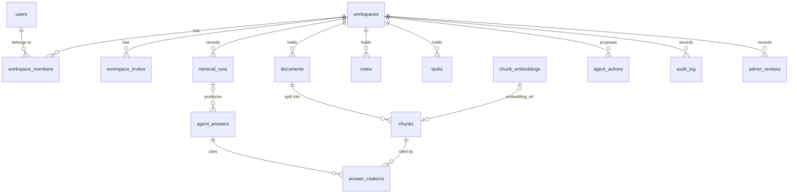

# Data model

Defined in [`supabase/migrations/20260915120000_core_schema.sql`](../../supabase/migrations/20260915120000_core_schema.sql). Row-level security is enabled on every table. Columns that go beyond the PRD are marked with the decision that added them.

## Identity and workspaces

**`users`** mirrors `auth.users`. It is created by the sign-up trigger.
`id` (= auth user id) · `email` · `full_name`, `avatar_url` ([D-011](../decisions.md#d-011)) · `created_at`

**`workspaces`**. Created only through `create_workspace(name)`, which also makes the caller Admin ([D-006](../decisions.md#d-006)).
`id` · `name` (1–80 chars) · `owner_id` · `created_at`

**`workspace_members`**. One row per person per workspace.
`id` · `workspace_id` · `user_id` · `auth_role` (`Admin` or `Member`) · `team_role` (nullable, SHOULD scope) · `joined_at`

**`workspace_invites`** ([D-007](../decisions.md#d-007)). At most one pending invite per email per workspace.
`id` · `workspace_id` · `email` · `auth_role` · `invited_by` · `created_at` · `accepted_at`

## Content

**`documents`**
`id` · `workspace_id` · `uploaded_by` · `file_path` (storage path `{workspace_id}/{document_id}/{file_name}`) · `file_name`, `mime_type`, `size_bytes`, `parse_error` ([D-011](../decisions.md#d-011)) · `parsed_status` (`pending`, `processing`, `ready`, `failed`) · `created_at`

**`chunks`**
`id` · `document_id` · `workspace_id`, `chunk_index` ([D-008](../decisions.md#d-008)) · `content` · `char_start`, `char_end` (`char_end > char_start`) · `embedding_ref` → `chunk_embeddings` · `content_tsv` (generated `tsvector`, the sparse signal, [D-005](../decisions.md#d-005)) · `created_at`

**`chunk_embeddings`** ([D-005](../decisions.md#d-005))
`id` · `workspace_id` · `model` · `embedding vector(1536)` with an HNSW cosine index · `created_at`

**`notes`**
`id` · `workspace_id` · `created_by` · `title`, `created_at` ([D-011](../decisions.md#d-011)) · `content` (jsonb block tree, must be an object) · `updated_at` (maintained by trigger)

**`tasks`**
`id` · `workspace_id` · `sprint_id` (nullable, no foreign key, [D-010](../decisions.md#d-010)) · `title` · `status` (`todo`, `in_progress`, `done`) · `assignee_id` · `due_date` · `created_by` · `source` (`manual` or `agent`) · `created_at`

## Agent, retrieval and oversight

**`retrieval_runs`**. One row per question asked.
`id` · `workspace_id` · `asked_by` ([D-011](../decisions.md#d-011)) · `question` · `candidates_json` · `rerank_scores_json` · `grade_outcome` · `retry_count` · `latency_ms` · `created_at`

**`agent_answers`**
`id` · `workspace_id` · `asked_by`, `retrieval_run_id` ([D-011](../decisions.md#d-011)) · `question` · `answer` · `confidence` (0–1, **uncalibrated**) · `groundedness_pass` · `created_at`

**`answer_citations`**
`id` · `answer_id` · `chunk_id` · `ordinal` (the `[n]` marker, [D-011](../decisions.md#d-011)) · `created_at`

**`agent_actions`**. Proposals held for approval (non-negotiable 1).
`id` · `workspace_id` · `action_type` (`create_task`) · `target_table` (`tasks`) · `target_id` (null until approved) · `proposed_payload`, `decided_by`, `decided_at` ([D-009](../decisions.md#d-009)) · `reasoning` · `before_state` · `status` (`pending`, `approved`, `rejected`) · `created_at`

**`audit_log`**. Append-only for every role ([D-012](../decisions.md#d-012)).
`id` · `workspace_id` ([D-004](../decisions.md#d-004)) · `actor_id` · `actor_type` (`user`, `agent`, `system`) · `action` · `target_type` ([D-011](../decisions.md#d-011)) · `target_id` · `timestamp` · `details`

**`admin_reviews`**
`id` · `workspace_id` ([D-004](../decisions.md#d-004)) · `review_target_type` (`agent_answer` or `agent_action`) · `review_target_id` · `reviewer_id` · `decision` (`confirmed`, `corrected`, `dismissed`) · `notes` · `reviewed_at`

## Database functions and triggers

| Name | Kind | Purpose |
| --- | --- | --- |
| `public.create_workspace(name)` | Function | Creates a workspace, makes the caller Admin and writes an audit entry, atomically |
| `private.is_member(ws)`, `private.is_admin(ws)` | Function | Role checks used by RLS policies; they only answer for the current user |
| `private.shares_workspace(user)` | Function | Lets people see profiles of co-members only |
| `on_auth_user_created` | Trigger on `auth.users` | Creates the profile and accepts pending invites |
| `tasks_member_update_guard` | Trigger | Members may change `status` only |
| `audit_log_no_update` | Trigger | Rejects updates and deletes on `audit_log` |
| `workspace_members_keep_one_admin` | Trigger | A workspace keeps at least one Admin |
| `notes_touch_updated_at` | Trigger | Maintains `notes.updated_at` |

## Storage

The `documents` bucket is private, limited to 25 MB, and accepts PDF and DOCX only. Object paths start with the workspace id. Members of that workspace can read objects; Admins can upload and delete them.
