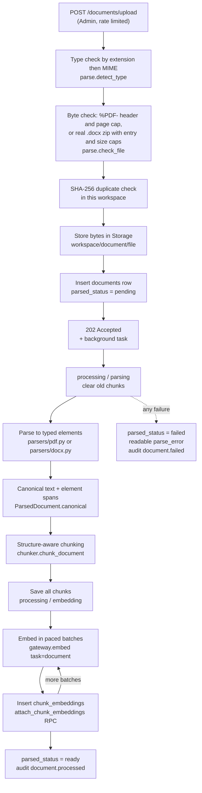

# Ingestion pipeline

How an uploaded PDF or Word file becomes searchable passages. For how those passages are searched, see [retrieval.md](retrieval.md). For weaknesses found in this code and what to do about them, see [pipeline-review.md](pipeline-review.md).

## At a glance

| Stage | Code | Runs where |
| --- | --- | --- |
| Upload checks and storage | [`api/documents.py`](../../backend/app/api/documents.py), [`rag/parse.py`](../../backend/app/rag/parse.py), [`core/storage.py`](../../backend/app/core/storage.py) | Request, as the caller |
| Orchestration and status | [`rag/ingest.py`](../../backend/app/rag/ingest.py) | FastAPI `BackgroundTasks`, service role |
| PDF parsing | [`rag/parsers/pdf.py`](../../backend/app/rag/parsers/pdf.py) | Worker thread (`anyio.to_thread`) |
| Word parsing | [`rag/parsers/docx.py`](../../backend/app/rag/parsers/docx.py) | Worker thread |
| Element model and canonical text | [`rag/documents.py`](../../backend/app/rag/documents.py) | Worker thread |
| Chunking | [`rag/chunker.py`](../../backend/app/rag/chunker.py) | Worker thread |
| Embedding | [`llm/gateway.py`](../../backend/app/llm/gateway.py) | Event loop |
| Schema | [`20260916090000_ingestion_retrieval.sql`](../../supabase/migrations/20260916090000_ingestion_retrieval.sql), [`20260916130000_ingestion_progress.sql`](../../supabase/migrations/20260916130000_ingestion_progress.sql) | Postgres |

## 1. Upload (request path)

`POST /documents/upload` requires an Admin of the workspace in `X-Workspace-Id` ([D-006](../decisions.md#d-006)) and counts against the `upload` rate limit (10 a minute, 60 an hour per user, [D-041](../decisions.md#d-041)).

1. **Name.** `storage.safe_filename` keeps the basename, replaces anything outside `A-Za-z0-9._ -` with `_`, and truncates to 120 characters.
2. **Type.** `detect_type` routes on the extension first and the MIME type second, because browsers report MIME types unreliably. Only `pdf` and `docx` are accepted; anything else is 415 ([D-022](../decisions.md#d-022)).
3. **Size.** Reads at most 25 MB + 1 byte; larger is 413, empty is 422.
4. **Bytes** (`check_file`, [D-041](../decisions.md#d-041)). The extension only says what a file claims to be:
   - PDF: `%PDF-` must appear in the first 1,024 bytes, PyMuPDF must open it, and it must have at most `MAX_PDF_PAGES` (1,500) pages.
   - DOCX: must start with the zip signature `PK\x03\x04`, contain `word/document.xml`, have at most 5,000 entries and expand to at most 200 MB. This stops zip bombs.
5. **Duplicate.** The SHA-256 of the bytes is looked up in the workspace. A match is 409 naming the existing file. A unique partial index on `(workspace_id, content_hash)` enforces the same rule in the database.
6. **Store.** Bytes go to the private `documents` bucket at `{workspace_id}/{document_id}/{file_name}`, uploaded **with the caller's token**, so bucket policies apply on top of the API's role check.
7. **Record.** A `documents` row is inserted with `parsed_status = 'pending'`. If the insert fails, the stored object is removed.
8. **Audit and hand-off.** `document.uploaded` is audit-logged, `process_document` is queued as a background task with the file bytes, and the API returns **202** with the summary row.

`POST /documents/{id}/reprocess` downloads the stored bytes and queues the same task. It refuses with 409 while the document is `pending` or `processing`. `DELETE /documents/{id}` deletes the row (chunks and embeddings cascade) and then the stored object.

## 2. Status model

The Documents page polls these columns.

| `parsed_status` | `processing_stage` | Meaning | Searchable |
| --- | --- | --- | --- |
| `pending` | null | Queued, not started | No |
| `processing` | `parsing` | Reading the file and chunking | No |
| `processing` | `embedding` | Chunks saved and previewable; `embedded_count` of `chunk_count` done | No |
| `ready` | null | Every chunk embedded | **Yes** |
| `failed` | null | `parse_error` holds a reason safe to show. Chunks saved before the failure remain for inspection | No |

Search only reads documents whose status is `ready` (both SQL search functions join `documents` and filter on it, [D-034](../decisions.md#d-034)). A half-embedded or failed document is never partly searchable.

## 3. Background processing

`process_document` opens its own service-role connection, because the request's connection is gone by the time it runs. Writes use the service role because users may not write chunks directly; the API already checked the uploader is an Admin.

1. Set `processing` / `parsing`, reset `embedded_count` and `chunk_count`, and **delete any previous chunks and embeddings** for this document (so reprocessing starts clean).
2. Run `_parse_and_chunk` in a worker thread (CPU-bound, would block the event loop otherwise). It re-runs `check_file`, parses, chunks, and refuses a document with more than `MAX_PASSAGES_PER_DOCUMENT` (3,000) chunks.
3. No chunks means failure: "looks scanned" if any page had no text layer, otherwise "No readable text".
4. Insert every chunk (batches of 200) **before embedding**, then store `content_text`, `page_count`, `chunk_count`, `parse_stats`, and move to `embedding`. The Documents viewer can now preview passages ([D-034](../decisions.md#d-034)).
5. Embed in batches of `min(EMBED_BATCH_SIZE, EMBED_REQUESTS_PER_MINUTE)`. For each batch: call the gateway, insert `chunk_embeddings` rows (batches of 40), then call `attach_chunk_embeddings`, which sets each chunk's `embedding_ref` and refreshes `embedded_count` in one statement.
6. Set `ready`, `processed_at`, and audit `document.processed` with chunk count, stats and seconds.

Any exception lands in one handler: `IngestFailure` messages are shown as written; anything else becomes "Processing failed unexpectedly. Try again." and is logged with a stack trace. The document is marked `failed` and `document.failed` is audit-logged.

Quota errors are translated for the uploader: a **daily** embedding quota says to try tomorrow or use a paid key; a **per-minute** quota says wait a minute and reprocess ([D-033](../decisions.md#d-033)).

## 4. Parsing to typed elements

Parsers never return a flat string. They return a `ParsedDocument`: an ordered list of `DocElement`s, each with a `kind` (`heading`, `paragraph`, `list`, `table`, `code`), `text`, heading `level` 1–6, and 1-based `page`, plus a `stats` counter. NUL characters are removed because Postgres `text` cannot hold them.

### PDF ([`parsers/pdf.py`](../../backend/app/rag/parsers/pdf.py), PyMuPDF, AGPL, [D-024](../decisions.md#d-024))

Per page, in this order:

1. **Tables first.** `page.find_tables()` (ruled lines). If it finds none, the whitespace strategy `find_tables(strategy="text")` is tried, kept only if `_plausible_text_table` passes: at least 3 rows and 2 columns, at least half the cells filled, and a mean cell length of 40 characters or less. A table covering more than 92% of the page or with fewer than 2 rows is discarded. Each kept table becomes Markdown, and its area is **masked** so its cells do not leak back as loose text.
2. **Lines.** Text blocks outside table masks are read line by line. Each line keeps the size and flags of its largest span: bold (flag bit 16) and monospaced (bit 8), plus its bounding box.
3. **Scanned pages.** A page with no tables and fewer than 90 characters counts as `pages_without_text`. There is no OCR ([D-022](../decisions.md#d-022)).

Across the whole document:

4. **Body size** is the font size carrying the most characters.
5. **Running headers and footers.** With 4 or more pages, the first and last line of each page are normalised (digits become `#`, so "Page 3" equals "Page 4"). Any such line of 90 characters or less that appears on at least `max(3, 60% of pages)` pages is dropped everywhere.
6. **Headings.** A line is a heading when it is at most 130 characters, is not a bullet (unless it is numbered like `2.1`), does not end in sentence punctuation (unless numbered), and is either at least 1.12 × body size, or bold, at least 0.97 × body size and at most 90 characters. Distinct heading sizes are ranked largest first into levels 1–6.
7. **Reading order.** Items are sorted top to bottom, left to right. If a page looks two-column (at least 8 lines, no line crossing the middle ±4% of the width, and at least a quarter of lines on each side), the left column is read fully before the right.
8. **Assembly.** Walking the ordered items: a table flushes pending text and is emitted; a heading flushes and is emitted; consecutive monospaced, non-heading lines at most 1.05 × body size are grouped into **one** code element ([D-043](../decisions.md#d-043)); everything else is buffered and flushed as one paragraph, re-joining words hyphenated across lines.

### Word ([`parsers/docx.py`](../../backend/app/rag/parsers/docx.py), python-docx)

`document.paragraphs` omits tables, so the parser walks the body's XML children directly and keeps paragraphs and tables in authored order.

| Source | Element |
| --- | --- |
| Paragraph styled `Heading N` | `heading`, level N + 1 (Title is level 1) |
| `Title` / `Subtitle` style | `heading`, level 1 / 2 |
| Style starting with `List` | `list` |
| Any other non-empty paragraph | `paragraph` |
| `w:tbl` | `table` as GitHub Markdown. Pipes escaped, newlines in cells flattened. A blank first row becomes `col1…colN` headers |

Word elements have no page number. Only body-level `w:p` and `w:tbl` are read: text boxes, headers, footers, footnotes, comments and content inside `w:sdt` content controls are not.

## 5. Canonical text and offsets

`ParsedDocument.canonical()` joins non-empty element texts with `"\n\n"` (`ELEMENT_SEPARATOR`) and records each element's `(start, end)` span. Empty elements get a zero-length span so indexes stay aligned. The joined string is stored as `documents.content_text`.

**The invariant ([D-023](../decisions.md#d-023)):** for every chunk, `chunks.content == documents.content_text[char_start:char_end]`. Offsets count Unicode code points, as Python `str` and Postgres `substring()` do; the frontend slices by code point ([`lib/codepoints.ts`](../../frontend/src/lib/codepoints.ts)). The separator must never change once documents are stored, or every offset breaks.

## 6. Chunking ([`chunker.py`](../../backend/app/rag/chunker.py))

Token counts are **estimated**, not tokenised: `len(text) / 4 + 1` for prose, `len(text) / 3 + 1` for tables and code ("dense").

| Setting | Default | Role |
| --- | --- | --- |
| `CHUNK_TARGET_TOKENS` | 480 | Size prose and code are split to |
| `CHUNK_MAX_TOKENS` | 800 | A prose section up to this stays whole; tables are split to this |
| `CHUNK_OVERLAP_TOKENS` | 64 | Whole trailing sentences carried into the next prose chunk |
| `CHUNK_MIN_TOKENS` | 80 | Text chunks below this are merged into a neighbour |
| `HARD_FLOOR_TOKENS` | 14 (constant) | A text chunk below this that cannot merge is **dropped** |

The chunker walks the elements with a heading stack:

- **Heading.** Flush pending prose; pop headings of the same or deeper level; push this one. The stack is the chunk's `section_path`.
- **Paragraph and list.** Buffered. A chunk never crosses a heading, so a section's prose is flushed at the next heading, table or code block.
- **Prose flush.** The span from the first to the last buffered element. At most 800 tokens: one chunk. Larger: `_prose_parts` splits on sentence boundaries (`.`, `!`, `?` followed by whitespace and a capital or digit) up to 480 tokens, carrying up to 64 tokens of whole trailing sentences forward. A single sentence over 480 tokens is split on whitespace.
- **Table.** Always emitted separately. Split by rows to fit 800 tokens. The first piece includes the header and rule rows; later pieces carry them in `table_header` so they still read as a table.
- **Code.** One chunk if at most 800 tokens. Otherwise split on blank lines, then on newlines for a block without blank lines, grouped to 480.
- **Trim.** Leading and trailing whitespace is removed by moving the span, never by editing text.
- **Merge small** (`_merge_small`). Two passes over text chunks only, and only between **adjacent chunks with the same `section_path`**: first a small chunk is folded into the previous one, then a small chunk that is still first is folded into the next one. A text chunk under 14 tokens (about 56 characters) with no same-section neighbour is removed. Tables and code are never merged.

Each chunk stores:

| Column | Content |
| --- | --- |
| `chunk_index`, `char_start`, `char_end`, `content` | Position and exact text |
| `kind` | `text`, `table` or `code` |
| `section` | `"Heading > Subheading"` |
| `page` | First page seen among the chunk's elements (null for Word) |
| `token_count` | The estimate |
| `context` | `"file name > Heading > Subheading"`, plus the header rows for a table continuation. **Embedded and shown to the model, never part of the citation** |
| `search_tsv` | Generated: `context` at weight B plus `content` at weight A, English config, GIN-indexed |

## 7. Embedding

- **Text embedded:** `context + "\n\n" + content` (`Chunk.embed_text`), so the file name and heading path help a passage match questions that name them.
- **Model:** `gemini-embedding-001` with task type `RETRIEVAL_DOCUMENT`, reduced to 1,536 dimensions and **normalised to unit length** by the gateway (the API does not normalise reduced-dimension vectors). The row records `model = "gemini-embedding-001@1536"`.
- **Pacing ([D-033](../decisions.md#d-033)):** the free tier counts every text in a batch as one request, 100 a minute. The gateway keeps a one-minute sliding window, leaves 10 of the 100 for questions while a document embeds, and sizes batches to fit. A per-minute quota error waits as long as the provider asks (up to 5 attempts); a daily quota error fails at once.
- **No model fallback:** vectors from a different model would not be comparable with stored ones.
- **Cache:** identical `(model, task, dims, text)` embeddings are served from an in-process LRU of 2,048 entries.
- **Index:** HNSW with cosine ops on `chunk_embeddings.embedding`.

About 1,000 chunks take about 10 minutes on the free tier.

## Configuration

All in [`core/config.py`](../../backend/app/core/config.py), set through environment variables of the same name in upper case.

| Variable | Default |
| --- | --- |
| `MAX_PDF_PAGES` | 1500 |
| `MAX_DOCX_ENTRIES` | 5000 |
| `MAX_DOCX_UNCOMPRESSED_BYTES` | 200 MB |
| `MAX_PASSAGES_PER_DOCUMENT` | 3000 |
| `CHUNK_TARGET_TOKENS` / `CHUNK_MAX_TOKENS` / `CHUNK_OVERLAP_TOKENS` / `CHUNK_MIN_TOKENS` | 480 / 800 / 64 / 80 |
| `GEMINI_EMBED_MODEL` | `gemini-embedding-001` |
| `EMBED_DIM` | 1536 (must match the `vector(1536)` column) |
| `EMBED_REQUESTS_PER_MINUTE` / `EMBED_BATCH_SIZE` | 100 / 100 |

## Tests

[`tests/test_ingestion.py`](../../backend/tests/test_ingestion.py) checks the offset invariant, sections, pages, repeated-footer removal and table splitting on generated PDF and Word files, scanned-page stats, word-splitting of unpunctuated prose, sentence overlap, that tables and code are never merged into prose, and NUL removal. There is no test for short-section dropping, two-column layouts or the background task's status transitions. [`tests/test_safety.py`](../../backend/tests/test_safety.py) covers the upload byte checks (zip bomb, disguised file, page and passage caps).

## Known limitations

Measured on the real test documents on 2026-09-17. Details and fixes are in [pipeline-review.md](pipeline-review.md).

- Two-column academic PDFs: the whitespace table finder claims most of the page as a "table", and one full-width line disables column detection for the whole page ([D-043](../decisions.md#d-043)).
- A very short section (under about 56 characters) with no same-section neighbour is dropped from the index.
- Word headings come only from styles; a document using bold Normal paragraphs gets no section paths.
- Ingestion runs inside the API process. A restart mid-ingestion leaves the document stuck in `processing`, and reprocess refuses it.
- No OCR, no figure captions, no page numbers for Word ([D-022](../decisions.md#d-022)).
