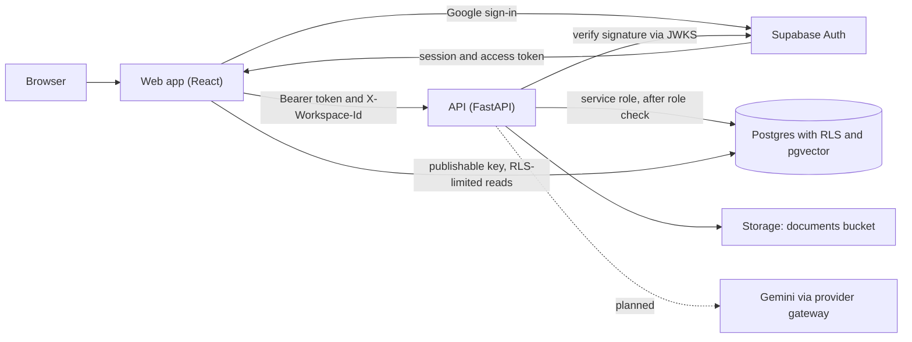

# Architecture overview

## Components

| Component | Technology | Location | Hosted on (target) |
| --- | --- | --- | --- |
| Web app | React 19, Vite, TypeScript, Tailwind v4 | `frontend/` | Vercel |
| API | FastAPI, Python 3.13 | `backend/` | Railway |
| Auth | Supabase Auth with Google OAuth | Supabase project `igzjmigtofnpnsaaxmul` | Supabase |
| Database | Postgres with row-level security, pgvector | `supabase/migrations/` | Supabase |
| File storage | Supabase Storage, private `documents` bucket | `supabase/migrations/` | Supabase |
| Model provider | Gemini, behind a swappable provider gateway | `backend/` (planned) | Google |
| Agent orchestration | LangGraph | `backend/` (planned) | Railway |

## Sign-in and request flow

1. The web app calls `supabase.auth.signInWithOAuth({ provider: 'google' })`.
2. Google redirects to Supabase's callback, `https://igzjmigtofnpnsaaxmul.supabase.co/auth/v1/callback`. Supabase then redirects back to the web app with a PKCE code, which the client exchanges for a session.
3. On a user's first sign-in, the `on_auth_user_created` trigger:
   - creates their `public.users` row;
   - accepts any pending invites ([D-007](../decisions.md#d-007)).
4. The web app calls the API with `Authorization: Bearer <access token>`, and with `X-Workspace-Id` for workspace-scoped routes.
5. The API verifies the token against the project's JWKS: ES256 signature, issuer, audience and expiry ([D-013](../decisions.md#d-013)).
6. `get_workspace_context` resolves the caller's membership and role in the requested workspace. Any failure means no data:
   - 401 for a bad or missing token;
   - 403 for someone who isn't a member;
   - 503 if the lookup cannot run. It never falls back to an unscoped query.

## Trust boundaries

| Credential | Where it lives | What it can do |
| --- | --- | --- |
| Publishable key | Frontend bundle | Nothing without a user session; every read is limited by RLS |
| User access token | Browser session | Acts as that user; RLS applies |
| Service-role key | `backend/.env` and deployment secrets only | Bypasses RLS; used only after the API's own role check |
| Gemini API key | `backend/.env` and deployment secrets only | Model calls |

The rules for keeping document content out of model instructions (non-negotiable 2) are documented in the retrieval and agent pages when those components land.
