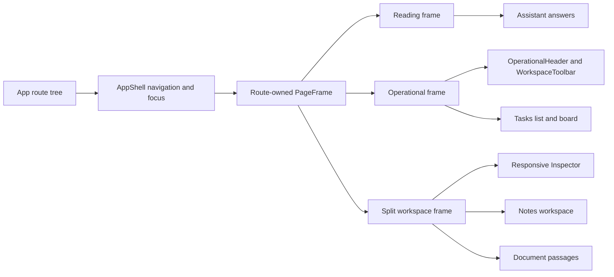

[CodeWiki](../../index.md) / [Artifacts](../index.md) / [Plans](index.md)

# Meridian UI/UX Refactor Implementation Plan

## Outcome and Boundaries

This plan delivers the approved UI/UX enhancement as a frontend-only refactor. The observable result is a professional MeridianAI workspace with persistent global navigation, route-appropriate canvas widths, shallower operational hierarchy, aligned metadata, responsive contextual detail, and purposeful motion. The application must continue to expose only real repository-backed data and actions.

The work includes the application shell, shared presentation primitives, Tasks, Assistant, Notes, Documents, Members, Review Queue, Audit Log, Pipeline Health, and supporting authentication, welcome, not-found, loading, empty, error, and destructive states where their presentation is affected. It does not change backend APIs, Supabase schemas or policies, query and mutation semantics, retrieval behavior, document ingestion rules, authentication, role enforcement, agent tool selection, or navigation destinations.

The supplied screenshots establish expectations for persistent context, dense but legible rows, layered controls, restrained dark surfaces, and contextual inspection. They do not authorize copying another product's branding, taxonomy, exact color palette, or unsupported features.

## Approval and Rollout Gate

Revision 1 is approved and execution is in progress. `approved_revision`, `approval.state`, `execution.state`, and `execution.executing_revision` reflect the approved implementation currently being staged.

The single frontend implementation step uses five internal checkpoints because the refactor shares one shell and one component system. Each checkpoint must leave the frontend buildable. The first checkpoint covering the shell, shared frames, and Tasks is the experience proof; later route migrations must not proceed if that checkpoint reveals an unresolved frame, density, inspector, accessibility, or responsive defect.

On 2026-09-18, the user explicitly directed execution to continue without the unavailable authenticated Tasks review. This authorizes staging Checkpoints C through E despite the normal sequencing gate, but it does not convert the missing browser, role, viewport, keyboard, inspector-focus-return, overflow, or reduced-motion evidence into a pass. The static implementation and documentation steps may complete, while the unavailable live evidence remains assigned to STEP-04.

## Current Architecture

`frontend/src/App.tsx` mounts authenticated product routes beneath `AppShell`, `RequireWorkspace`, `WorkspaceProvider`, and `RequireAuth`. `AppShell` owns desktop and mobile navigation, administrator-only navigation visibility, the skip link, route-change focus transfer, and page-entry motion. Each authenticated route selects a `reading`, `operational`, or `split` `PageFrame`, so the shell no longer imposes one maximum width on every destination.

Route components own their page composition and data hooks. Tasks uses `view`, `sprint`, and `task` search parameters, renders either `TaskListView` or `TaskBoardView`, and opens `TaskDrawer` through the selected task parameter. Notes and Document Viewer use split frames for list or passage navigation beside focused content. Assistant preserves an inspectable linear answer containing citations, confidence, groundedness, review signals, and retrieval details.

Shared controls establish semantic tokens, visible focus, labelled fields, accessible dialogs, pending feedback, empty and error states, and a default 44-pixel target floor. Motion comes from `motion/react`, Radix state animations, drag feedback, and global CSS. The global CSS reduced-motion rule is supplemented by `useReducedMotion` in `AppShell`, Assistant, and Document Viewer.

The frontend exposes lint, build, and non-interactive Vitest scripts. Four focused Testing Library suites cover deterministic frame, shell, Tasks, inspector, trust, motion, note-continuity, role, audit, and metric-evidence contracts.

## Proposed Change Overview

The shell retains navigation, focus, responsive drawer, and route-transition responsibilities while routes own their canvas width through a shared reading, operational, or split `PageFrame`. A composable operational header and toolbar standardize route identity, concise status, view selection, scope, filters, search, and primary actions.

Tasks proves these contracts first. A reusable Radix-backed inspector shell replaces task-specific overlay framing while leaving task fields and mutations in `TaskDrawer`. Notes, Documents, Assistant, Members, and administration use the same shared layout vocabulary without changing their hooks, endpoints, URLs, or protected behavior.

## Cross-Cutting Decisions

| Decision ID | Selected design | Rationale and compatibility constraint |
| --- | --- | --- |
| DEC-01 | Routes select a shared `PageFrame` mode while `AppShell` retains navigation, focus transfer, and transition ownership. | This removes the universal width cap without adding pathname heuristics to the shell. Every AppShell route must adopt a frame before the old wrapper constraints are removed. |
| DEC-02 | Keep `PageHeader` for reading and simple pages, and add a composable `OperationalHeader` plus `WorkspaceToolbar` for dense routes. | Tasks proves the existing header is too narrow a contract. Composition prevents a large prop-driven component and allows native controls to remain accessible. |
| DEC-03 | Extract an `Inspector` shell from `TaskDrawer` using the existing Radix Dialog foundation. | Radix preserves focus, Escape, dismissal, and normal focus restoration. Desktop uses a restrained scrim so context remains visible; narrow layouts use a full-width focused sheet. |
| DEC-04 | Extend semantic spacing, frame, density, surface, duration, and easing tokens in `index.css`; do not introduce route-specific raw colors. | This preserves light, dark, and system themes, cobalt semantics, and citation-only yellow while centralizing operational motion. |
| DEC-05 | Preserve all current route paths, redirects, URL search parameters, hooks, mutation payloads, authorization checks, and domain state. | The refactor changes presentation and interaction composition only. Existing deep links and protected behavior are compatibility interfaces. |
| DEC-06 | Increase density through alignment, fluid width, concise copy, and disclosure rather than reducing the default 44-pixel touch floor. | This reconciles the professional reference density with MeridianAI's accessibility contract. Compact operational controls remain bounded exceptions. |
| DEC-07 | Add Vitest, jsdom, React Testing Library, and user-event for deterministic component interaction coverage; retain browser and real-data behavior in the live validation matrix. | The selected harness is bounded to the existing Vite and React toolchain and does not overstate browser geometry. |

## Execution Steps

### STEP-01: Implement the Incremental Frontend UI/UX Refactor

| Field | Value |
| --- | --- |
| Owner | CodeWritingAgent |
| Container | `frontend` |
| Status | ✅ `complete` |
| Depends on | None |
| Decisions | DEC-01 through DEC-06 |
| Acceptance | AC-01 through AC-07 |
| Validation | VAL-01 and VAL-03 through VAL-07 |

#### Objective

Implement the complete frontend presentation refactor in five buildable checkpoints while leaving routing, state, permissions, and product evidence unchanged.

#### Definition of Done

Every implemented frontend surface uses an approved route frame or an intentional unauthenticated composition, Tasks establishes the new operational baseline, remaining routes use the proven primitives, protected behavior remains reachable, and lint and production build pass after every checkpoint.

#### Technical Approach

Checkpoint A creates the shared foundation without changing product data flow. Add frame, operational-header, toolbar, and inspector primitives; centralize density and motion tokens; and simplify `AppShell` only after every authenticated route has an explicit frame. Preserve the skip link, `main` landmark, route focus transfer, conditional administrator navigation, responsive navigation drawer, and theme/account controls.

Checkpoint B applies the foundation to Tasks. Consolidate its title, counts, view tabs, search, completed toggle, member guidance, sprint scope, and administrator controls into the operational header and toolbar. Keep `view`, `sprint`, and `task` parameters authoritative. Extract only the generic shell from `TaskDrawer`; retain task fields, role behavior, mutation calls, subtasks, provenance, and deletion inside the task component. The list and board may become visually denser through alignment and width, but their tree semantics, DnD sensors, announcements, shortcuts, and local board overflow remain unchanged.

Checkpoint C migrates Notes and Documents. Notes adopts the split frame and removes negative-margin shell compensation while keeping the 720-pixel editor canvas, list search, deep links, save lifecycle, deletion rules, and focused mobile return path. Documents adopts the operational frame and shared row vocabulary. Document Viewer uses the split frame for passage navigation and readable extracted text while preserving `/documents/:documentId`, `chunk`, `start`, and `end` state.

Checkpoint D migrates Assistant, Members, Review Queue, Audit Log, and Pipeline Health. Assistant remains reading-oriented and retains its semantic linear answer order. Administration keeps all role gates, review decisions, attribution, real metric counts, and bounded table overflow.

Checkpoint E performs the supporting-state and consistency pass. Align Sign In, Welcome, Not Found, feedback, dialog, field, sidebar identity, long-content behavior, and theme treatment with the finalized tokens. Remove obsolete route-level spacing workarounds and duplicated patterns only after every caller has migrated.

#### Changes

| File/component and symbol | Concrete change or resulting code shape | Integration and compatibility impact | Acceptance and validation |
| --- | --- | --- | --- |
| `frontend/src/index.css` | Add semantic frame widths and gutters, operational density, restrained surface, bounded-overflow, and quick, panel, and emphasized motion tokens. Retain all current color, typography, focus, editor, and reduced-motion rules. | Components continue consuming semantic utilities. `mark` remains citation-only. | AC-01, AC-05, AC-06, AC-07; VAL-01, VAL-04, VAL-06 |
| `frontend/src/layouts/PageFrame.tsx`; `frontend/src/layouts/AppShell.tsx` | Add typed `reading`, `operational`, and `split` frame modes. Remove the shell's universal maximum width after routes migrate. Reduce routine route entry while keeping a no-displacement reduced-motion result. | `AppShell` keeps navigation, focus, drawer, and `Outlet`; no route or provider hierarchy changes. | AC-01, AC-04, AC-05, AC-06; VAL-01, VAL-03 through VAL-06 |
| `frontend/src/components/PageHeader.tsx`; `frontend/src/components/OperationalHeader.tsx`; `frontend/src/components/WorkspaceToolbar.tsx` | Preserve the simple reading header and add composable operational regions for context, title, concise status, actions, tabs, search, filters, and scope. Toolbars wrap or scroll only within their own bounded region. | Existing simple callers migrate without losing heading semantics. Native controls remain native. | AC-01, AC-03, AC-05, AC-06; VAL-04, VAL-05 |
| `frontend/src/components/Inspector.tsx`; `frontend/src/components/Dialog.tsx`; `frontend/src/tasks/TaskDrawer.tsx` | Extract standard overlay, edge attachment, responsive width, title and description handling, close control, motion, and reduced-motion styling. Keep task editing and mutation code in `TaskDrawer`. | Radix remains responsible for focus, Escape, dismissal, and normal focus restoration. | AC-02, AC-04, AC-05, AC-06; VAL-02, VAL-04 through VAL-06 |
| `frontend/src/components/Button.tsx`; `frontend/src/components/Field.tsx`; `frontend/src/components/Feedback.tsx`; `frontend/src/components/EmptyState.tsx` | Add only compact or operational variants needed by shared headers and rows. Normalize pending, empty, error, and permission presentation without weakening alert semantics. | Current defaults remain compatible for reading and form surfaces. | AC-03, AC-06, AC-07; VAL-01, VAL-05, VAL-07 |
| `frontend/src/components/Wordmark.tsx`; `frontend/src/theme/ThemeToggle.tsx`; `frontend/src/workspace/WorkspaceSwitcher.tsx`; `frontend/src/layouts/AppShell.tsx` | Refine spacing and hierarchy without changing the wordmark, theme persistence, workspace selection, administrator visibility, reliability note, or sign-out path. | Identity and account behavior remain unchanged. | AC-04, AC-06, AC-07; VAL-03 through VAL-05 |
| `frontend/src/routes/TasksPage.tsx`; `frontend/src/tasks/SprintBar.tsx`; `frontend/src/tasks/QuickAdd.tsx`; `frontend/src/tasks/ProposalsPanel.tsx` | Apply the operational frame and shared header/toolbar. Compress control depth, make sprint context clear, and retain explicit proposal status and administrator controls. | Preserve task URL parameters, shortcuts, data hooks, proposal approval boundary, and Member guidance. | AC-02, AC-04 through AC-07; VAL-02 through VAL-07 |
| `frontend/src/tasks/TaskListView.tsx`; `frontend/src/tasks/TaskBoardView.tsx` | Harmonize selection, metadata columns, row/card density, action visibility, and board gutters. Keep tree semantics and bounded board overflow. | Preserve pointer and keyboard sensors, updates, progress, toggles, announcements, and `O` open behavior. | AC-02, AC-05, AC-06; VAL-02, VAL-04, VAL-05 |
| `frontend/src/routes/NotesPage.tsx`; `frontend/src/notes/NoteEditor.tsx` | Replace negative margins with the split frame, standardize list selection and pane controls, and retain the constrained editor canvas and visible save status. | Preserve paths, search, creation, autosave, slash commands, deletion permissions, and mobile return navigation. | AC-03 through AC-07; VAL-03 through VAL-07 |
| `frontend/src/routes/DocumentsPage.tsx`; `frontend/src/routes/DocumentViewer.tsx` | Apply operational and split frames, align document metadata and actions, keep ingestion progress prominent, and make passage navigation responsive. Use `useReducedMotion` for scrolling. | Preserve upload constraints, workspace targeting, mutations, detail paths, citation parameters, offsets, and highlighting. | AC-03 through AC-07; VAL-03 through VAL-07 |
| `frontend/src/routes/AssistantPage.tsx`; `frontend/src/agent/AnswerPanel.tsx`; `frontend/src/agent/AnswerSignals.tsx` | Use the reading frame, improve conversation hierarchy, retain the composer, and make conversation scrolling reduced-motion aware. | Preserve tool reporting, warnings, proposals, confidence, groundedness, review status, retrieval detail, and citations. | AC-03, AC-04, AC-06, AC-07; VAL-03, VAL-05 through VAL-07 |
| `frontend/src/routes/MembersPage.tsx` | Apply the operational frame, aligned row metadata, responsive actions, and clearer invitation and member hierarchy. | Preserve invitation, authorization role, team role, removal, revoke, leave, and confirmation semantics. | AC-03 through AC-07; VAL-03 through VAL-07 |
| `frontend/src/routes/admin/ReviewQueuePage.tsx`; `frontend/src/routes/admin/AuditLogPage.tsx`; `frontend/src/routes/admin/PipelineHealthPage.tsx` | Apply operational headers, toolbars, density, status, and overflow vocabulary while preserving domain-specific evidence. | Keep `AdminOnly`, decisions, attribution, recorded denominators, and bounded table overflow. | AC-03 through AC-07; VAL-03 through VAL-07 |
| `frontend/src/routes/SignIn.tsx`; `frontend/src/routes/Welcome.tsx`; `frontend/src/routes/NotFound.tsx` | Align supporting page spacing, typography, state treatment, and purposeful motion with finalized tokens. | Authentication and navigation behavior remain unchanged. | AC-03, AC-04, AC-06, AC-07; VAL-03, VAL-04, VAL-06, VAL-07 |

#### Acceptance and Validation

AC-01 through AC-07 were statically assessed at the materialized recovery boundaries using VAL-01. The complete implementation passes lint and production build. The user-authorized sequencing exception left the focused Tasks review and broader authenticated browser evidence unresolved; STEP-04 retains those checks through VAL-03 to VAL-07.

#### Recovery

Each checkpoint must be lint-clean and build-clean before proceeding. If a shared primitive fails on its first route, correct or revert that primitive rather than adding route-specific compensation. If a later route exposes a legitimate missing capability, extend the shared contract without changing previously protected behavior and rerun the earlier checkpoint smoke checks.

#### Implementation Tracker

- [x] Complete Checkpoint A by adding `PageFrame`, `OperationalHeader`, `WorkspaceToolbar`, `Inspector`, and the associated semantic frame, density, overflow, and motion tokens.
- [x] Complete Checkpoint B by migrating Tasks and extracting the task inspector shell while preserving task parameters, shortcuts, permissions, mutations, and DnD behavior.
- [x] Run VAL-01 after Checkpoint B; `npm run lint` and `npm run build` both exit successfully.
- [x] Resolve the first-slice sequencing gate through the user's instruction to continue without live review; retain the authenticated Tasks visual, keyboard, responsive, inspector-focus-return, and reduced-motion review as an explicit STEP-04 limitation.
- [x] Complete Checkpoint C by migrating Notes, Documents, and Document Viewer and removing Notes' shell-padding compensation.
- [x] Complete Checkpoint D by migrating Assistant, Members, Review Queue, Audit Log, and Pipeline Health without weakening trust or authorization evidence.
- [x] Complete Checkpoint E by aligning Sign In, Welcome, Not Found, shared feedback and controls, sidebar identity, themes, long content, and supporting states.
- [x] Run VAL-01 after materialized Checkpoints C through E and record the clean recovery point and remaining live-review limitation.

### STEP-02: Add Focused Frontend Interaction Regression Tests

| Field | Value |
| --- | --- |
| Owner | TestCodeWritingAgent |
| Container | `frontend` |
| Status | ✅ `complete` |
| Depends on | STEP-01 |
| Decision | DEC-07 |
| Acceptance | AC-02, AC-04, AC-05, AC-06, AC-08 |
| Validation | VAL-02 |

#### Objective

Add a bounded automated regression layer for the refactor's highest-risk routing, interaction, accessibility, and responsive contracts.

#### Definition of Done

The frontend has a non-interactive component test command, deterministic setup and fixtures, and passing tests for the shell/frame contract, task context, inspector focus behavior, reduced-motion scrolling, and protected trust or role presentation.

#### Technical Approach

Add Vitest, jsdom, React Testing Library, jest-dom, and user-event as development dependencies and integrate them with the existing Vite and TypeScript configuration. Use in-memory routing, mocked workspace and query data, and explicit Admin and Member fixtures. Fixtures are test-only and must never be rendered by the production application as real records.

Prioritize behavior that could regress during layout refactoring. Do not attempt to reproduce all browser geometry in jsdom. Assert responsive class or state contracts deterministically and reserve clipping, real horizontal overflow, pointer DnD geometry, and visual quality for STEP-04.

#### Changes

| File/component and symbol | Concrete change or resulting code shape | Integration and compatibility impact | Acceptance and validation |
| --- | --- | --- | --- |
| `frontend/package.json`; `frontend/package-lock.json` | Add the non-interactive test script and compatible development dependencies without changing production dependencies or runtime scripts. | CI can run tests non-interactively. | AC-08; VAL-02 |
| `frontend/vite.config.ts`; `frontend/tsconfig.app.json`; `frontend/eslint.config.js`; `frontend/src/test/setup.ts` | Configure jsdom, setup files, globals, matchers, discovery, browser API shims, and test-specific lint handling. | Production Vite behavior remains unchanged. | AC-08; VAL-01, VAL-02 |
| `frontend/src/__tests__/test_ui_foundations.tsx` | Verify route focus, skip link, navigation role visibility, mobile drawer dismissal, frame modes, and Inspector initial focus and dismissal. | Actual return to a task opener remains a browser check because the controlled Inspector has no Radix Trigger relationship. | AC-01, AC-04 through AC-06; VAL-02 |
| `frontend/src/__tests__/test_tasks_page.tsx` | Verify `view`, `sprint`, and `task` context, `/` and `N` shortcuts, Member versus Admin controls, proposal wording, and inspection state. | Protects the proving slice without mocking away permission differences. | AC-02, AC-04, AC-06; VAL-02 |
| `frontend/src/__tests__/test_trust_and_motion.tsx` | Verify citation links and highlighting, confidence and groundedness labels, injection and proposal states, and reduced-motion-aware scrolling. | Protects trust signals and motion requirements. | AC-03, AC-04, AC-06, AC-07; VAL-02 |
| `frontend/src/__tests__/test_continuity_and_admin_evidence.tsx` | Verify split selection, mobile return, save-state visibility, administrator gating, review wording, audit attribution, and recorded denominators. | Protects note continuity and administrative evidence. | AC-03, AC-04, AC-06, AC-07; VAL-02 |

#### Acceptance and Validation

VAL-02 passes in a non-interactive run: four test files and 20 behavioral tests pass. Each test asserts observable output or interaction rather than implementation-only snapshots.

#### Recovery

If the test harness changes production compilation or Vite startup behavior, isolate test configuration or revert the harness before adjusting production code. Record browser-dependent gaps explicitly for STEP-04 rather than weakening an assertion until it passes.

#### Implementation Tracker

- [x] Add the test script and Vitest, jsdom, Testing Library, jest-dom, and user-event development dependencies to `frontend/package.json`.
- [x] Configure `frontend/vite.config.ts`, `frontend/tsconfig.app.json`, and `frontend/src/test/setup.ts` without changing production runtime behavior.
- [x] Add AppShell, PageFrame, task context, shortcut, inspector, role, and focus regression tests.
- [x] Add citation, confidence, groundedness, reduced-motion scroll, note continuity, review, audit, and metric-evidence tests.
- [x] Run VAL-01 and VAL-02 and record browser-only behavior deferred to STEP-04.

### STEP-03: Synchronize the Design-System Documentation

| Field | Value |
| --- | --- |
| Owner | DocumentationAgent |
| Container | `all` |
| Status | ✅ `complete` |
| Depends on | STEP-01 |
| Decisions | DEC-01 through DEC-06 |
| Acceptance | AC-09 |
| Validation | VAL-08 |

#### Objective

Update the existing design-system document so future route work uses the implemented workspace contracts rather than reintroducing local compensations.

#### Definition of Done

`docs/design/design-system.md` accurately describes the final frame modes, operational header, toolbar, inspector, density, responsive overflow, motion, and reduced-motion behavior using current source identifiers.

#### Technical Approach

Adjust only the sections affected by the refactor. Preserve existing color, typography, identity, honest-data, component, and accessibility guidance unless implementation evidence requires a correction. Document the distinction between reading and operational controls and identify which content may scroll horizontally.

#### Changes

| File/component and symbol | Concrete change or resulting code shape | Integration and compatibility impact | Acceptance and validation |
| --- | --- | --- | --- |
| `docs/design/design-system.md` | Add the implemented frame modes, header and toolbar composition, reusable inspector behavior, density rules, overflow ownership, motion durations, programmatic reduced-motion rule, and focused regression boundary. | Establishes the source-backed contract for later UI changes without documenting unimplemented proposals. | AC-09; VAL-08 |

#### Acceptance and Validation

VAL-08 passed through direct comparison with the materialized route tree, frame, header, toolbar, inspector, token, task integration, reduced-motion, overflow, and regression-test sources. A relative-link inspection from `docs/design/` checked all 18 referenced file targets and found no missing targets. Authenticated rendering, actual inspector focus return, responsive geometry, clipping, and document-level overflow remain browser-only evidence owned by STEP-04 rather than limitations on the source-backed documentation contract.

#### Recovery

If later implementation changes any public primitive or token, reopen STEP-03 and rerun VAL-08 against the changed source. Do not retain aspirational statements for omitted behavior.

#### Implementation Tracker

- [x] Re-read the final frame, header, toolbar, inspector, token, and reduced-motion source files before editing.
- [x] Update `docs/design/design-system.md` using implemented names and behavior only.
- [x] Complete VAL-08 and retain valid relative source links.

### STEP-04: Execute Static, Interaction, Responsive, Accessibility, and State Verification

| Field | Value |
| --- | --- |
| Owner | TestExecutionAgent |
| Container | `frontend` |
| Status | ⏳ `to_do` |
| Depends on | STEP-01, STEP-02, STEP-03 |
| Decisions | DEC-01 through DEC-07 |
| Acceptance | AC-01 through AC-09 |
| Validation | VAL-01 through VAL-08 |

#### Objective

Produce final evidence that the professional UI enhancement is buildable, behavior-preserving, responsive, accessible, theme-correct, and truthful across representative states.

#### Definition of Done

Every validation ID has passing evidence, or the plan remains incomplete with the exact unavailable runtime check and safe resume point recorded.

#### Technical Approach

Run static and component checks first. Only after they pass, start the frontend through its existing development command in a correctly configured authenticated environment. Use representative Admin and Member workspaces and cover sparse, dense, long-name, processing, failure, and permission states without injecting sample content into production.

At each viewport, verify the application document itself does not scroll horizontally. The task board and pipeline table may scroll only inside visibly bounded regions. Test both task list and board before and after opening the inspector. Confirm mobile navigation and inspectors are focused overlays with a clear return path.

Complete the keyboard matrix without a pointer and repeat motion-sensitive workflows with reduced motion enabled. Verify role boundaries through both visible controls and route outcomes; visual hiding alone is not passing evidence.

#### Validation Sequence

| Order | Validation | Required evidence |
| --- | --- | --- |
| 1 | VAL-01 | Clean lint output and successful TypeScript and Vite production build. |
| 2 | VAL-02 | Passing non-interactive component test report. |
| 3 | VAL-03 | Route, redirect, deep-link, workspace, Admin, and Member behavior matrix. |
| 4 | VAL-04 | Light and dark screenshots at 1440, 1024, 768, and 360 pixels, including open inspector and bounded overflow examples. |
| 5 | VAL-05 | Completed keyboard and focus checklist, including task DnD announcements. |
| 6 | VAL-06 | Reduced-motion checklist covering CSS, `motion/react`, Radix, DnD, loading indicators, and programmatic scroll. |
| 7 | VAL-07 | Representative state matrix confirming explicit feedback and no fabricated data. |
| 8 | VAL-08 | Source-to-document comparison and relative-link result. |

#### Acceptance and Validation

All acceptance criteria are resolved through the matrix below. A static build alone cannot close responsive, contrast, clipping, role, or comprehension criteria. STEP-03 supplies passing VAL-08 evidence, while STEP-04 retains responsibility for the full integrated verification outcome.

#### Recovery

When an automated check fails, return the defect to the owning implementation or test step and rerun VAL-01 and VAL-02 before resuming the live sequence. If no authenticated runtime is available, complete the deterministic checks, leave VAL-03 through VAL-07 open as applicable, and record the exact route and viewport where verification must resume.

#### Implementation Tracker

- [ ] Run VAL-01 and save clean lint and production-build evidence.
- [ ] Run VAL-02 and save the complete interaction-test result.
- [ ] Complete VAL-03 for every authenticated destination, redirect, deep link, and Admin or Member boundary.
- [ ] Complete VAL-04 at 1440, 1024, 768, and 360 pixels in light and dark themes with sparse, dense, and long-name content.
- [ ] Complete VAL-05 and VAL-06 for keyboard, focus, announcements, inspector adaptation, and reduced motion.
- [ ] Complete VAL-07 for explicit states and honest data.
- [x] Retain STEP-03's passing VAL-08 source comparison and 18-target relative-link result.
- [ ] Update the execution record with outcomes, deviations, unresolved checks, and the exact safe resume point.

## Acceptance and Verification Matrix

| Acceptance ID | Observable result | Validation ID | Method or command | Expected evidence |
| --- | --- | --- | --- | --- |
| AC-01 | Reading content remains constrained while operational and split routes use intentional canvases. | VAL-01, VAL-03, VAL-04 | Run lint and build, inspect every frame, and capture responsive screenshots. | Clean checks and no operational route confined by the old universal content cap. |
| AC-02 | Tasks uses the new workspace hierarchy without losing context or interactions. | VAL-02, VAL-03, VAL-04, VAL-05 | Run task tests and exercise list, board, scopes, shortcuts, DnD, proposals, and inspector. | Passing tests plus URL, role, keyboard, and screenshot evidence. |
| AC-03 | Every implemented route adopts the approved visual system. | VAL-01, VAL-03, VAL-04, VAL-06, VAL-07 | Build, inspect all routes and states, and repeat motion-sensitive paths with reduced motion. | Consistent route evidence with domain-specific behavior retained. |
| AC-04 | Routes, roles, trust signals, destructive actions, and data behavior remain protected. | VAL-02, VAL-03, VAL-05, VAL-07 | Run interaction tests and the Admin and Member route/state matrices. | No lost path, redirect, parameter, permission, citation, review, or confirmation. |
| AC-05 | Responsive layouts work at all required widths with bounded overflow. | VAL-02, VAL-04 | Assert responsive contracts and inspect at 1440, 1024, 768, and 360 pixels. | No document-level horizontal overflow; board and table overflow remains local. |
| AC-06 | Accessibility and reduced-motion behavior remain first-class. | VAL-02, VAL-05, VAL-06 | Run focus tests, keyboard checklist, announcement checks, and reduced-motion workflow. | Visible focus, meaningful focus return, usable controls, announcements, and no unnecessary displacement. |
| AC-07 | Themes, semantic colors, and all honest states remain coherent. | VAL-04, VAL-07 | Inspect all themes and representative state fixtures. | Yellow appears only on citations, semantic colors retain meaning, and no fake records or metrics appear. |
| AC-08 | Frontend quality gates pass. | VAL-01, VAL-02 | From `frontend/`, run `npm run lint`, `npm run build`, and `npm run test`. | All commands exit successfully in non-interactive mode. |
| AC-09 | Design-system documentation matches the implementation. | VAL-08 | Compare `docs/design/design-system.md` with final sources and check relative links. | Current component and token names, accurate behavior, and valid links. |

## Risks and Open Decisions

| Risk ID | Concrete failure mode | Mitigation or recovery | Affected steps |
| --- | --- | --- | --- |
| RISK-01 | Removing the universal shell wrapper leaves an unmigrated route without padding or readable width. | Require every authenticated route to adopt a frame and verify routes through static and live checks. | STEP-01, STEP-04 |
| RISK-02 | Increased visual density hides controls from keyboard or touch users. | Preserve the default 44-pixel floor and keep compact controls bounded to operational contexts. | STEP-01, STEP-02, STEP-04 |
| RISK-03 | Inspector extraction changes task mutation behavior, URL state, focus return, or nested confirmation handling. | Extract only structural Radix framing, leave domain logic in `TaskDrawer`, and retain task and focus regression coverage. | STEP-01, STEP-02, STEP-04 |
| RISK-04 | No configured authenticated runtime is available for screenshots, real-data density, role checks, browser overflow, or task completion testing. | Complete deterministic gates and leave live validation IDs open with an exact safe resume point. | STEP-04 |
| RISK-05 | Broad route migration creates one-off styling exceptions that undermine the shared system. | Use the synchronized design-system guide and reject negative-margin or raw-color compensation. | STEP-01, STEP-03 |
| RISK-06 | Wide-screen citation or document inspection removes source information from mobile or semantic reading order. | Retain citation cards, source metadata, deep links, and complete linear small-screen content. | STEP-01, STEP-02, STEP-04 |
| RISK-07 | Automated tests overstate browser behavior that jsdom cannot model. | Test deterministic state and accessibility contracts in Vitest and reserve geometry, pointer DnD, clipping, and overflow for live validation. | STEP-02, STEP-04 |

There are no unresolved architectural decisions in revision 1. Runtime availability is a verification prerequisite rather than a design choice and does not block implementation, testing, or documentation, but it does block declaring the full refactor complete.

## Execution Record

### 2026-09-18 — STEP-01 Checkpoints A and B staged

- **Progress:** Staged the route-owned `PageFrame` foundation, operational header and toolbar, reusable Radix inspector, semantic frame, density, overflow and motion tokens, AppShell canvas simplification, and the Tasks proving-slice migration.
- **Remaining work:** Materialize the staged overlay, run lint and build, and complete the first-slice browser review.
- **Validation evidence:** Source inspection confirmed explicit route frames and unchanged frontend API usage. Filesystem and live checks remained open at this point.
- **Discoveries and decisions:** Revision 1 approval was reconciled. No dependency, backend, Supabase, route, or data-contract changes were introduced.
- **Recovery and next safe resume point:** Correct or revert only staged Checkpoints A and B if approval or static validation fails.

### 2026-09-18 — STEP-01 Checkpoints A and B static gate passed

- **Progress:** Ran the materialized frontend gate and inspected Tasks list, board, inspector, frame, and global reduced-motion contracts.
- **Remaining work:** Complete authenticated Tasks browser review, including keyboard operation, focus return, overflow, and reduced motion.
- **Validation evidence:** `npm run lint` and `npm run build` exited successfully. Vite emitted only its non-blocking bundle-size warning.
- **Discoveries and decisions:** Source inspection cannot substitute for rendered geometry or focus restoration.
- **Recovery and next safe resume point:** Resume with authenticated Admin and Member Tasks workspaces.

### 2026-09-18 — STEP-01 Checkpoints C through E staged without live Tasks review

- **Progress:** Following the user's instruction to continue without live review, staged Notes, Documents, Document Viewer, Assistant, Members, Review Queue, Audit Log, Pipeline Health, Sign In, Welcome, and Not Found presentation changes.
- **Remaining work:** Materialize and run the static gate. Authenticated review remains required for all supported widths and roles.
- **Validation evidence:** Source inspection confirmed route frames, reduced-motion scrolling, preserved role gates, real denominators, and bounded table overflow.
- **Discoveries and decisions:** The user instruction is a sequencing exception, not successful live validation.
- **Recovery and next safe resume point:** Correct or revert only Checkpoints C through E if their materialized gate fails.

### 2026-09-18 — STEP-01 complete after full materialized static gate

- **Progress:** Validated the complete materialized frontend presentation refactor and synchronized STEP-01 as complete.
- **Remaining work:** STEP-04 must execute VAL-03 through VAL-07 for authenticated Admin and Member routes, supported viewports and themes, representative states, keyboard operation, focus return, overflow, and reduced motion.
- **Validation evidence:** `npm run lint` and `npm run build` exited successfully. Vite reported only the existing non-blocking main-bundle warning.
- **Discoveries and decisions:** The gates were rerun separately for unambiguous exit-code evidence.
- **Recovery and next safe resume point:** Route any later presentation defect to STEP-01 and rerun VAL-01 after correction.

### 2026-09-18 — STEP-02 focused interaction regressions complete

- **Progress:** Added the non-interactive Vitest and jsdom harness and four React Testing Library suites covering shell, frame, Tasks, inspector, trust, motion, Notes, roles, review, audit, and metric evidence.
- **Remaining work:** Browser validation remains required for actual task-opener focus return, rendered geometry and clipping, responsive overflow, pointer DnD, and visual behavior.
- **Validation evidence:** `npm run test` passed four files and all 20 tests. Final lint and build also passed with only the existing bundle-size warning.
- **Discoveries and decisions:** Tests use test-only fixtures. Inspector tests assert deterministic initial focus and dismissal without overstating automatic return focus.
- **Recovery and next safe resume point:** Retain the harness as the STEP-02 recovery boundary and proceed to documentation synchronization.

### 2026-09-18 — STEP-03 design-system synchronization complete

- **Progress:** Updated `docs/design/design-system.md` to describe the materialized `reading`, `operational`, and `split` `PageFrame` contracts; route-owned frame selection; reading and operational header responsibilities; locally bounded workspace toolbars; the responsive Radix `Inspector`; density and overflow ownership; current motion durations; layered reduced-motion behavior; and the four focused regression suites.
- **Remaining work:** STEP-04 remains `to_do`. It must retain the passing source-backed VAL-08 result while completing authenticated Admin and Member route checks, viewport and theme captures, actual inspector focus return, rendered geometry and clipping, document-level and locally bounded overflow, pointer drag-and-drop, keyboard behavior, and representative application states through VAL-03 to VAL-07.
- **Validation evidence:** Compared every new guide statement against the materialized route, component, token, task integration, motion, and test sources. A relative-link inspection from `docs/design/` checked all 18 referenced file targets and reported `missing=0`. The guide retains one H1 and a valid H2/H3 hierarchy.
- **Discoveries and decisions:** The old 350 ms and 8 px route-entry description was stale; the implementation uses a 180 ms, 4 px route transition. Reduced motion uses complementary CSS, `motion/react`, and programmatic-scroll mechanisms. The guide records the 42 px row rhythm separately from default 44 px touch-oriented controls.
- **Recovery and next safe resume point:** No source-code or plan-contract revision was required. If public primitives or tokens change, reopen STEP-03 and rerun VAL-08. Otherwise begin STEP-04 with VAL-01, VAL-02, and VAL-08 retained and resume authenticated browser evidence at VAL-03.
