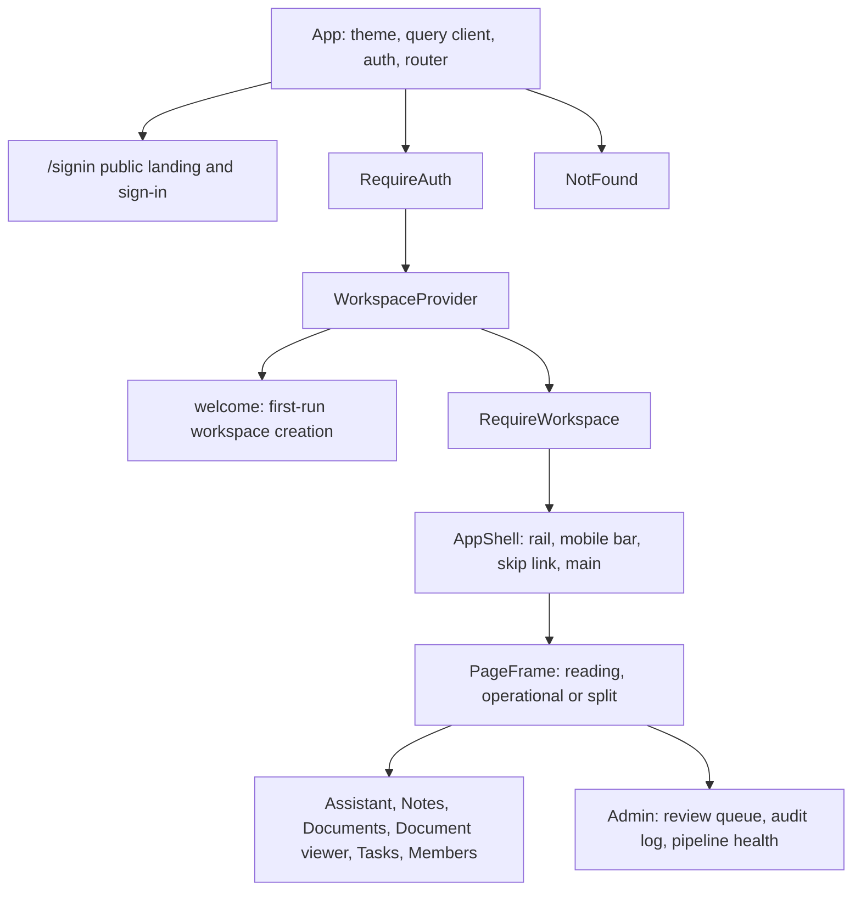

[CodeWiki](../index.md) / [Architecture](index.md)

# Frontend UI Architecture

## Scope

This page describes the MeridianAI browser application as it exists in `frontend/` today, after the UI/UX refactor and the subsequent UI redesign. It covers how the application is composed, how the shell and the page frames divide responsibility, which design tokens govern the visual system, what the public landing page claims, and which interaction contracts are protected by automated tests. It is written from the source rather than from the plans; the plans and their remaining steps are summarised in [Plans](../Artifacts/Plans/index.md).

The application is built with React 19, TypeScript, Vite, and Tailwind CSS v4. Data fetching uses TanStack Query, routing uses React Router, authentication uses the Supabase JavaScript client, animation uses Motion, iconography uses Phosphor, notifications use Sonner, the note editor uses Tiptap, and drag and drop on the task board uses dnd-kit. Typography is loaded locally through Fontsource: Bricolage Grotesque for display text, Geist for body text, and Geist Mono for code and numeric detail.

## Application Composition

`frontend/src/App.tsx` composes the provider stack and the route table. Providers nest from the outside in as the theme provider, the TanStack Query client provider, the authentication provider, and then the router. Inside the router, `/signin` is the only public route. Everything else sits behind `RequireAuth`, then inside a `WorkspaceProvider`, and then behind `RequireWorkspace`, so that a signed-in user without a workspace is sent to the `welcome` route before any workspace-scoped screen renders. A themed Sonner toaster is mounted once beside the router and inherits the resolved light or dark theme.

Authenticated routes render inside `AppShell`, which owns global navigation, and each route element is individually wrapped in a `PageFrame` that declares how wide that route's canvas should be. The index route redirects to `/tasks`. The historical `/ask` route redirects to `/assistant`, because the separate Ask page was merged into the Assistant, and `/admin/members` redirects to `/members`.

## The Application Shell

`frontend/src/layouts/AppShell.tsx` provides the skip link, the collapsible desktop navigation rail, the mobile top bar and drawer, and the focusable `main` region that hosts the routed outlet. The rail lists the ordinary workspace destinations, which are Tasks, Assistant, Notes, Documents, and Members, and then a separate administrator group containing the review queue, the audit log, and pipeline health. The administrator group is shown only to Admins, and the same rule is enforced independently by the pages and by the API, so hiding the links is a convenience rather than the access control.

The rail has two widths, expanded and collapsed, driven by the `--rail-expanded` and `--rail-collapsed` tokens. Because a Tailwind utility class cannot interpolate a runtime value, the width is applied through an inline grid template so that the grid column and the aside element cannot drift apart. The collapse choice is persisted through `frontend/src/layouts/railPreference.ts` and restored on load, with the expanded state as the default, and both states continue to expose every destination under its existing accessible name. The rail also carries the workspace switcher with its role badge, the theme control, the standing reliability note, and the account controls.

`frontend/src/layouts/PageFrame.tsx` is deliberately small. It applies a centered canvas with a responsive gutter and one of three maximum widths, selected by a `mode` prop and recorded on the element as a `data-page-frame` attribute so tests can assert the mode a route asked for.

| Frame mode | Maximum width token | Routes using it |
| --- | --- | --- |
| `reading` | `--frame-reading`, 1080 pixels | Assistant |
| `split` | `--frame-split`, 1600 pixels | Notes, note detail, document viewer |
| `operational` | `--frame-operational`, 1440 pixels | Documents, Tasks, Members, review queue, audit log, pipeline health |

This replaces the earlier arrangement in which every route shared one centered maximum width. Reading surfaces keep a comfortable measure, operational surfaces use the available viewport, and split workflows can place a list or an inspector beside the primary content.

## Design Tokens and Material

All visual constants are declared once in the `@theme` block of `frontend/src/index.css` and redefined for dark mode under a `[data-theme='dark']` selector, with a custom Tailwind variant so that component code can opt into dark values without duplicating colour literals. The palette separates page, surface, and sunken backgrounds from a four-step ink scale and two rule strengths, with cobalt as the single accent, and named semantic colours for grounded, flagged, and dangerous states.

Two token groups deserve particular note. The highlight pair `--color-mark` and `--color-mark-edge` is reserved for citation highlighting, so that the yellow wash in the document viewer always means "this is the cited passage" and is never reused as decoration. The glass group, comprising `--glass-surface`, `--glass-raised`, `--glass-edge`, and `--glass-blur`, backs the `liquid-glass` utility class used by the navigation rail, the floating landing navigation, and the landing flow diagram; components are not permitted to invent their own opacity and blur values for that material.

Motion is tokenised as three durations, `--duration-quick`, `--duration-panel`, and `--duration-emphasized`, together with an easing curve, and the stylesheet defines a small set of named keyframes for fades, pops, slides, a scanning indicator, the animated flow dashes, and the slow glass drift. A `prefers-reduced-motion` block neutralises the decorative animations, and components that animate in JavaScript read Motion's `useReducedMotion` hook and resolve immediately to the end state instead of animating.

## The Public Landing Page

`frontend/src/routes/SignIn.tsx` is both the marketing surface and the authentication entry point. It renders a floating glass in-page navigation with anchors for how it works, what you get, who it helps, and limits; there is no second public route, so the navigation is anchor-only. The sections themselves live in `frontend/src/routes/landing/LandingSections.tsx`, and the animated pipeline illustration lives in `frontend/src/routes/landing/FlowDiagram.tsx`.

The flow diagram advances through its stages on a timer so that the pipeline explains itself without interaction, and it pauses on pointer hover, on keyboard focus, and on explicit selection. When reduced motion is requested it renders as a static chart with every stage still reachable by keyboard. The stages describe the real pipeline: documents are ingested into workspace-scoped passages, a question retrieves passages, an answer is drafted only from those passages and carries citations with an uncalibrated confidence value, and the person decides what to do next, with weak answers going to a reviewer and agent-suggested tasks waiting for an Admin.

The landing copy is constrained by an explicit rule recorded in the source: every claim must describe behavior that exists in this repository. There are no invented metrics, customer logos, or unbuilt features. The sign-in path itself handles its failure states visibly, including a missing Supabase configuration, an explicit authentication error under the button, a stalled redirect that was blocked by an embedding context, and restoration from the back-forward cache so that returning with the browser Back button does not leave the button permanently busy.

## Shared Components and Page Furniture

Routes share a small component vocabulary rather than styling themselves individually. `PageHeader` and `OperationalHeader` provide the two header shapes, the first for reading and editing surfaces and the second for dense operational screens with counters and controls. `WorkspaceToolbar` and `Inspector` provide the toolbar and the contextual side panel used by split layouts. `EmptyState` and `Feedback` standardise the honest empty and error states, `Field` and `Button` standardise form controls, `Dialog` wraps the Radix dialog primitive, and `Avatar` and `Wordmark` cover identity marks.

Three components carry trust meaning rather than presentation. `ConfidenceLabel` renders the confidence value and always labels it as uncalibrated, never as a bare number. `ReliabilityNote` states the standing caveat in the rail. `CitationSpecimen` shows a worked citation example on the landing page, built from real project text. On the Assistant route, `frontend/src/agent/AnswerPanel.tsx` and its companions render the checked answer with its citation links, groundedness result, flag reasons in plain language, and the retrieval details read from the recorded run.

The Tasks route consolidates its controls into a single sticky command bar of at most two rows, which keeps route identity, the workspace name, the open and done counters, the view tabs, the filter field, the completed toggle, and the sprint scope on screen while a long list scrolls. Agent proposals are rendered in a bounded area that shows a small number of rows before an explicit reveal control, keeps each proposal's description and reasoning behind a per-row disclosure wired through `aria-expanded` and `aria-controls`, shows Approve and Reject on the collapsed row to Admins only, and isolates the pending state of each proposal so that acting on one does not disable the others.

## Interaction Contracts Under Test

`frontend/src/__tests__/` holds Vitest and Testing Library suites that protect the behavior the UI/UX targets declared untouchable. `test_ui_foundations.tsx` covers the shell, the frame contract, and the shared foundations. `test_tasks_page.tsx` covers the task surfaces, including the keyboard shortcuts and their guards. `test_proposals_panel.tsx` covers the bounded proposal area, the disclosure wiring, the Admin-only controls, the empty array case, and per-proposal pending isolation. `test_continuity_and_admin_evidence.tsx` covers navigation continuity and the administrator evidence surfaces. `test_trust_and_motion.tsx` covers the trust signals and the reduced-motion behavior.

The frontend scripts are `npm run build`, which runs the TypeScript project build before the Vite production build, `npm run lint` for ESLint, and `npm test`, which runs Vitest once in non-interactive mode. The live gates named in the redesign plan, which require an authenticated session with both an Admin and a Member workspace, several pending proposals, and a browser at four viewport widths, have not been executed; that runtime was unavailable.

## Data Access From the Browser

`frontend/src/lib/api.ts` is the single API entry point. It reads the current Supabase access token, sends it as a bearer credential, and sends the selected workspace in the `X-Workspace-Id` header. The browser supplies the workspace identifier but never decides authorization; the backend resolves membership and role on every scoped request, as described in [System Architecture and RAG Pipeline](system-architecture-and-rag-pipeline.md). Server state is cached and invalidated through the shared TanStack Query client in `frontend/src/lib/queryClient.ts`, and feature-specific hooks such as `documents/useDocuments.ts`, `notes/useNotes.ts`, `admin/useAdmin.ts`, and `agent/useAgentChat.ts` wrap the endpoints their routes need.

Assistant conversation history is held in browser state and sent with each message rather than stored as a server-side session, so a reload starts a new conversation while the persisted answers remain available through the recent-answers list.

## Primary Source Files

| Group | Files |
| --- | --- |
| Composition and shell | `frontend/src/App.tsx`, `frontend/src/layouts/AppShell.tsx`, `frontend/src/layouts/PageFrame.tsx`, `frontend/src/layouts/railPreference.ts` |
| Visual system | `frontend/src/index.css`, `frontend/package.json` |
| Public landing and sign-in | `frontend/src/routes/SignIn.tsx`, `frontend/src/routes/landing/LandingSections.tsx`, `frontend/src/routes/landing/FlowDiagram.tsx` |
| Shared components | `frontend/src/components/PageHeader.tsx`, `frontend/src/components/OperationalHeader.tsx`, `frontend/src/components/WorkspaceToolbar.tsx`, `frontend/src/components/Inspector.tsx`, `frontend/src/components/EmptyState.tsx`, `frontend/src/components/Feedback.tsx`, `frontend/src/components/ConfidenceLabel.tsx`, `frontend/src/components/ReliabilityNote.tsx`, `frontend/src/components/CitationSpecimen.tsx` |
| Routes | `frontend/src/routes/AssistantPage.tsx`, `frontend/src/routes/TasksPage.tsx`, `frontend/src/routes/NotesPage.tsx`, `frontend/src/routes/DocumentsPage.tsx`, `frontend/src/routes/DocumentViewer.tsx`, `frontend/src/routes/MembersPage.tsx`, `frontend/src/routes/Welcome.tsx`, `frontend/src/routes/NotFound.tsx`, `frontend/src/routes/admin/ReviewQueuePage.tsx`, `frontend/src/routes/admin/AuditLogPage.tsx`, `frontend/src/routes/admin/PipelineHealthPage.tsx` |
| Data access | `frontend/src/lib/api.ts`, `frontend/src/lib/queryClient.ts`, `frontend/src/lib/types.ts`, `frontend/src/agent/AnswerPanel.tsx` |
| Regression suites | `frontend/src/__tests__/test_ui_foundations.tsx`, `frontend/src/__tests__/test_tasks_page.tsx`, `frontend/src/__tests__/test_proposals_panel.tsx`, `frontend/src/__tests__/test_continuity_and_admin_evidence.tsx`, `frontend/src/__tests__/test_trust_and_motion.tsx` |
