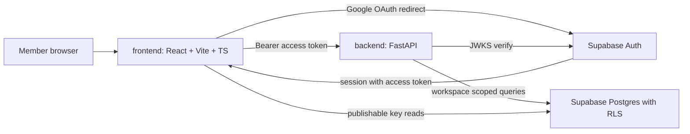

[CodeWiki](../../index.md) / [Forward-looking](../../Forward-looking/index.md) / [Artifacts](../index.md) / [Plans](index.md)

# Confirm Integrations and Scaffold the MeridianAI Repository

## Outcome and Boundaries

The intended observable result is a two-container MeridianAI repository that a developer can clone, configure from committed `.env.example` files, and run locally: a React frontend that signs a user in through Supabase Auth with Google, and a FastAPI backend that accepts that session token and answers workspace-scoped requests. The repository is connected to `https://github.com/esanduo-dt3/MeridianAI.git` with `main` and `dev` branches in place and a documented per-feature branch and commit-message convention, so subsequent PRD work items can each land on their own branch.

Included scope is integration confirmation, git baseline and branch setup, the frontend and backend scaffolds, the shared Supabase auth wiring between them, and onboarding documentation. Non-goals for this plan are every MUST-tier capability described in the [PRD summary](../../Specs/Other/meridian-prd-v2-summary.md): the block-tree note editor, document upload and chunking, hybrid retrieval, the LangGraph agent loop, propose-then-approve write handling, the audit log, the admin review queue, the injection red-team suite, and the pipeline health dashboard. This plan creates the places those features will live, not the features. Schema migrations beyond the workspace and membership tables needed to prove workspace-scoped RLS are also out of scope.

Two invariants must hold from the first commit, both carried forward from the PRD guardrails. Row-level security is workspace-scoped by `workspace_id` on every table, so the scaffold must not introduce any table or client query path that bypasses it. And no secret is committed: the Supabase publishable key may appear in frontend runtime configuration, but service-role credentials exist only in untracked `.env` files and deployment secret stores.

## Current Architecture

There is no application architecture to describe yet. The working tree at `/Users/esanduobadaarachchi/Downloads/DT3/MeridianAI` currently contains `Meridian_PRD_v2.pdf`, an empty `assets/` directory, and `kavia-docs/` holding the CodeWiki with the PRD summary and its index pages. Two facts materially constrained STEP-01: `git remote -v` and `git branch -a` both returned nothing, meaning the directory was **not** a git working tree despite the user's intent to clone the repository, and the remote repository held a single GitHub-generated `Initial commit` (`bcaebb0`) containing a stub `README.md`. The scaffold therefore initializes the repository in place, attaches the existing remote, and bases local `main` on the existing remote commit rather than cloning into a fresh directory, because the PRD and CodeWiki content already living here must be preserved and the user's existing root commit must not be discarded.

The factual integration context supplied for this work item is the Supabase project reference `igzjmigtofnpnsaaxmul`, which yields the API base URL `https://igzjmigtofnpnsaaxmul.supabase.co`, together with a publishable (anon) key. That key is safe for browser use precisely because RLS is enforced server-side, which is why AC-05 and the RLS invariant are coupled.

## Proposed Change Overview

The end state is a monorepo with two independently runnable containers and one shared identity contract. The frontend never talks to Postgres for privileged operations; it authenticates against Supabase Auth, holds the resulting session, and sends the access token as a bearer token to FastAPI. The backend verifies that token against the Supabase project's JWKS, derives the caller's user id, resolves the caller's active workspace from `workspace_members`, and from that point forward every request carries a workspace scope. This shape is chosen now, before any feature code exists, because retrofitting workspace scoping onto handlers written without it is the most likely way to breach the RLS invariant later.

The cross-cutting decisions made here are few but shape every later step.

| Decision ID | Decision | Rationale |
| --- | --- | --- |
| DEC-01 | Monorepo with `frontend/` and `backend/` at the repository root | Both containers ship from one PRD-scoped week; a single repository keeps the auth contract and `.env.example` files reviewable in one pull request |
| DEC-02 | Initialize git in place and attach the existing remote instead of cloning, basing local `main` on the remote's existing root commit | The working tree already holds the PRD and CodeWiki content that must survive into the first commit, and the remote already carried an `Initial commit` that must not be discarded |
| DEC-03 | React with TypeScript on Vite | The PRD names React on Vercel; Vite keeps the dev loop fast and TypeScript lets the Supabase table types be generated later from the schema |
| DEC-04 | Backend verifies Supabase JWTs against the project JWKS rather than trusting a shared secret in code | Keeps the only privileged credential out of request-handling logic and matches the workspace-scoped authorization model on `workspace_members` |
| DEC-05 | Branches are `main` (protected, release), `dev` (integration default), and `feature/<slug>` per feature, with Conventional Commits messages | The user asked for main, dev and per-feature branches with proper commit messages when tasks and subtasks complete |

## Execution Steps

### STEP-01 — Confirm integrations and establish the git baseline with main and dev branches

**Owner:** GeneralistAgent · **Container:** all · **Depends on:** none · **Status:** ✅ complete

**Objective.** Prove that GitHub and Supabase are actually reachable from this environment, then turn the existing directory into a git repository attached to the user's remote with `main` and `dev` in place and secrets excluded.

**Definition of done.** `git ls-remote origin` succeeds against `https://github.com/esanduo-dt3/MeridianAI.git`, `main` and `dev` both exist locally and on the remote containing the preserved PRD and CodeWiki content, a Supabase health response for project `igzjmigtofnpnsaaxmul` is recorded, and `.gitignore` excludes every `.env` file.

**Technical approach.** Integration confirmation comes first and is evidence-based, not assumed: an unauthenticated `git ls-remote` confirms the remote exists, a push of the baseline commit confirms write access, and an HTTP status from `https://igzjmigtofnpnsaaxmul.supabase.co/auth/v1/health` confirms the project is live. Per DEC-02 the repository is initialized in place and local `main` is based on `origin/main`. The baseline commit is made on `main` and contains the PRD, the CodeWiki, `.gitignore`, and this plan, so that `main` has meaningful content before `dev` branches from it. `dev` is then created from `main` and both are pushed with upstream tracking. If Supabase confirmation fails, STEP-02 and STEP-03 may still proceed because the scaffolds read their configuration from `.env`, but STEP-04 is blocked and that must be recorded as a blocker rather than silently skipped.

| File/component and symbol | Concrete change or resulting code shape | Integration/compatibility impact | Acceptance/validation |
| --- | --- | --- | --- |
| `.gitignore` (new) | Ignores `.env`, `.env.*` (with a `!.env.example` negation), `**/.env`, `node_modules/`, `dist/`, `__pycache__/`, `.venv/`, `.pytest_cache/`, `.DS_Store` | Enforces the no-secrets invariant before the first `git add`, so a key can never enter history | AC-05 / VAL-04 |
| `README.md` (updated) | Project name, one-paragraph description sourced from the PRD summary, container layout, and the PRD reliability note required by the PRD (answers may be wrong; every answer carries a chunk-level citation and a stated, uncalibrated confidence) | Replaces the remote's stub README; entry point later expanded by STEP-05 | AC-07 |
| `assets/.gitkeep` (new) | Empty placeholder preserving the otherwise-empty `assets/` directory in version control | Git does not track empty directories; without this the directory would vanish on clone | AC-01 |
| Git refs `main`, `dev` | `main` holds the baseline commit layered on the pre-existing remote root commit; `dev` is created from `main` and is the default working branch for feature branches | All later feature branches take `dev` as their base | AC-01 / VAL-01 |

**Recovery.** Every command here is idempotent or re-runnable. If the remote turns out to contain commits, fetch and rebase the local commit onto it instead of force-pushing. `main` must never be force-pushed.

#### Implementation Tracker

- [x] Record the output of `git ls-remote https://github.com/esanduo-dt3/MeridianAI.git` as evidence for AC-02
- [x] Record the HTTP status from `https://igzjmigtofnpnsaaxmul.supabase.co/auth/v1/health` as evidence for AC-02, or log a blocker if it fails
- [x] Create `.gitignore` covering `.env`, dependency and build directories before staging anything (AC-05)
- [x] Create `README.md` with the container layout and the PRD reliability note
- [x] `git init`, attach `origin`, commit the existing PRD, `assets/` and `kavia-docs/` content on `main`, and push with upstream tracking
- [x] Branch `dev` from `main`, push it, and confirm with `git branch -a` (AC-01 / VAL-01)
- [x] Confirm `git ls-files` reports no tracked `.env` file (VAL-04)

### STEP-02 — Scaffold the React frontend wired to Supabase Auth

**Owner:** CodeWritingAgent · **Container:** frontend · **Depends on:** STEP-01 · **Status:** ⏳ to_do

**Objective.** Produce a building React + TypeScript + Vite application with a single Supabase browser client, Google OAuth sign-in, a session-aware route guard, and an authenticated placeholder shell that later PRD features slot into.

**Definition of done.** `npm install && npm run build` succeeds in `frontend/`, and running the dev server presents a sign-in screen that redirects to Google and returns to an authenticated shell showing the signed-in user's email.

**Technical approach.** The Supabase client is created exactly once in `frontend/src/lib/supabaseClient.ts` from `import.meta.env.VITE_SUPABASE_URL` and `VITE_SUPABASE_PUBLISHABLE_KEY`, because multiple client instances cause duplicate session listeners and inconsistent token refresh. Session state lives in one `AuthProvider` context subscribed to `supabase.auth.onAuthStateChange`, so every component reads one source of truth and the backend call helper can attach the current access token without prop drilling. API calls go through `frontend/src/lib/api.ts`, which reads `VITE_API_BASE_URL` and sets `Authorization: Bearer <access_token>` — this is the frontend half of DEC-04 and the reason STEP-04 can be a thin verification step. The placeholder shell renders navigation regions matching the PRD's MUST surfaces (notes, tasks, ask-the-agent, admin) as empty, clearly-labelled placeholders; it must not fake retrieval, citations or approvals, since nothing behind them exists yet.

Work begins on a `feature/frontend-scaffold` branch cut from `dev` at commit `0b2fa27`, per DEC-05.

| File/component and symbol | Concrete change or resulting code shape | Integration/compatibility impact | Acceptance/validation |
| --- | --- | --- | --- |
| `frontend/package.json` (new) | Vite React-TS app with dependencies `react`, `react-dom`, `react-router-dom`, `@supabase/supabase-js`; scripts `dev`, `build`, `preview`, `lint` | Defines the build validated by VAL-02 | AC-03 / VAL-02 |
| `frontend/.env.example` (new) | `VITE_SUPABASE_URL=https://igzjmigtofnpnsaaxmul.supabase.co`, `VITE_SUPABASE_PUBLISHABLE_KEY=`, `VITE_API_BASE_URL=http://localhost:8000` with empty key value | Documents required configuration without committing a secret | AC-05 / VAL-04 |
| `frontend/src/lib/supabaseClient.ts` (new) | Exports a single `supabase` client built via `createClient(url, key)`; throws a clear startup error when either variable is missing | Sole Supabase entry point for the frontend | AC-03 |
| `frontend/src/auth/AuthProvider.tsx` (new) | Exports `AuthProvider` and a `useAuth()` hook returning `{ session, user, loading, signInWithGoogle, signOut }`; `signInWithGoogle` calls `supabase.auth.signInWithOAuth({ provider: 'google' })` | Single session source consumed by the router guard and the API helper | AC-03 |
| `frontend/src/lib/api.ts` (new) | Exports `apiFetch(path, init)` that injects the bearer token from the current session and throws on non-2xx responses | Frontend half of the DEC-04 auth contract exercised in STEP-04 | AC-06 |
| `frontend/src/routes/SignIn.tsx`, `frontend/src/routes/WorkspaceShell.tsx`, `frontend/src/App.tsx` (new) | `App.tsx` wires `react-router-dom` with `/signin` public and `/` guarded by session presence; the shell shows the user email, a sign-out control, and labelled empty regions for the PRD MUST surfaces | Establishes the layout later features extend rather than replace | AC-03 |

**Recovery.** Remove `frontend/node_modules` and `frontend/package-lock.json` and reinstall if dependency resolution fails; the scaffold carries no state and can be regenerated.

#### Implementation Tracker

- [ ] Create the Vite React-TS project under `frontend/` with the dependency set and scripts in `frontend/package.json`
- [ ] Add `frontend/.env.example` with the project URL and empty key placeholders (AC-05)
- [ ] Implement the single-instance client in `frontend/src/lib/supabaseClient.ts` with explicit missing-variable errors
- [ ] Implement `AuthProvider` and `useAuth()` including Google OAuth sign-in and sign-out
- [ ] Implement `frontend/src/lib/api.ts` bearer-token helper (supports AC-06)
- [ ] Implement the sign-in route, the guarded workspace shell with labelled PRD-surface placeholders, and router wiring in `App.tsx`
- [ ] Run `npm install && npm run build` and confirm a clean build (VAL-02)

### STEP-03 — Scaffold the FastAPI backend with Supabase JWT verification and workspace scoping

**Owner:** CodeWritingAgent · **Container:** backend · **Depends on:** STEP-01 · **Status:** ⏳ to_do

**Objective.** Produce a running FastAPI application with configuration loading, CORS for the frontend origin, a health endpoint, Supabase JWT verification, and a reusable workspace-scoped request dependency.

**Definition of done.** `uvicorn app.main:app` starts without error, `GET /health` returns `{"status": "ok"}`, `GET /me` returns 401 without a token and returns the authenticated user id and resolved workspace id with a valid Supabase access token.

**Technical approach.** Settings are a single pydantic-settings `Settings` object in `backend/app/core/config.py` reading `SUPABASE_URL`, `SUPABASE_PUBLISHABLE_KEY`, `SUPABASE_SERVICE_ROLE_KEY`, `SUPABASE_JWT_ISSUER`, `FRONTEND_ORIGIN` and `ENVIRONMENT`, so no module reads `os.environ` directly and misconfiguration surfaces at startup rather than mid-request. Token verification implements DEC-04: `backend/app/core/security.py` fetches and caches the project JWKS from `{SUPABASE_URL}/auth/v1/.well-known/jwks.json` and validates signature, issuer, audience and expiry, returning the `sub` claim as the user id. `get_current_user` and `get_workspace_context` are FastAPI dependencies rather than middleware, so every future router must declare its scope explicitly and a handler cannot accidentally run unscoped. The router layout under `backend/app/api/` is created with only `health` and `me` implemented; empty placeholder modules are deliberately **not** created for unbuilt PRD endpoints, because empty routers invite accidental unscoped handlers. `SUPABASE_SERVICE_ROLE_KEY` is referenced in configuration and `.env.example` but left unset, which is the practical form of OQ-01.

Work begins on a `feature/backend-scaffold` branch cut from `dev` at commit `0b2fa27`, per DEC-05.

| File/component and symbol | Concrete change or resulting code shape | Integration/compatibility impact | Acceptance/validation |
| --- | --- | --- | --- |
| `backend/requirements.txt` (new) | `fastapi`, `uvicorn[standard]`, `pydantic-settings`, `python-jose[cryptography]`, `httpx`, `supabase`, `pytest` | Defines the runtime validated by VAL-03 | AC-04 / VAL-03 |
| `backend/.env.example` (new) | `SUPABASE_URL=https://igzjmigtofnpnsaaxmul.supabase.co`, `SUPABASE_PUBLISHABLE_KEY=`, `SUPABASE_SERVICE_ROLE_KEY=`, `FRONTEND_ORIGIN=http://localhost:5173`, `ENVIRONMENT=local`, all secret values empty | Documents configuration without committing credentials | AC-05 / VAL-04 |
| `backend/app/core/config.py` (new) | `Settings(BaseSettings)` plus a cached `get_settings()`; raises on missing required values at import time | Sole configuration source for all routers | AC-04 |
| `backend/app/core/security.py` (new) | `get_current_user(credentials) -> AuthenticatedUser` verifying the bearer JWT against cached JWKS; raises `HTTPException(401)` on any failure | The backend half of DEC-04; consumed by every protected route | AC-04, AC-06 |
| `backend/app/core/workspace.py` (new) | `get_workspace_context(user) -> WorkspaceContext` carrying `user_id`, `workspace_id` and `auth_role` resolved from `workspace_members`; raises `HTTPException(403)` when the user has no membership | Enforces the workspace-scoping invariant for all future handlers | AC-04 |
| `backend/app/api/health.py`, `backend/app/api/me.py` (new) | `GET /health` returning `{"status": "ok"}` with no auth; `GET /me` depending on `get_workspace_context` and returning user id, email and workspace id | The two endpoints exercised by VAL-03 and VAL-05 | AC-04, AC-06 |
| `backend/app/main.py` (new) | Creates the app, adds `CORSMiddleware` allowing `settings.FRONTEND_ORIGIN` with credentials, and includes the health and me routers | Without the CORS origin the STEP-04 browser check fails | AC-06 |
| `backend/tests/test_health.py` (new) | `TestClient` test asserting `GET /health` is 200 and `GET /me` without a token is 401 | Makes the auth boundary regression-visible from the first commit | AC-04 / VAL-03 |

**Recovery.** Recreate `backend/.venv` from `backend/requirements.txt`; this step mutates no external state.

#### Implementation Tracker

- [ ] Create `backend/requirements.txt` and `backend/.env.example` with empty secret placeholders (AC-05)
- [ ] Implement `Settings` and `get_settings()` in `backend/app/core/config.py` with startup validation
- [ ] Implement JWKS-based token verification in `backend/app/core/security.py` per DEC-04 (verify signature, issuer, audience, expiry)
- [ ] Implement `get_workspace_context` in `backend/app/core/workspace.py` resolving membership and `auth_role` from `workspace_members`
- [ ] Implement `GET /health` and the protected `GET /me`, and wire CORS for `FRONTEND_ORIGIN` in `backend/app/main.py`
- [ ] Add `backend/tests/test_health.py` asserting 200 on health and 401 on unauthenticated `/me`
- [ ] Start the app and confirm the health response (VAL-03)

### STEP-04 — Verify the cross-container Supabase auth contract end to end

**Owner:** TestExecutionAgent · **Container:** all · **Depends on:** STEP-02, STEP-03 · **Status:** ⏳ to_do

**Objective.** Prove that a session minted by the frontend through Supabase Google OAuth is accepted by the FastAPI backend and resolves to a workspace scope.

**Definition of done.** With both services running against the same Supabase project, a browser sign-in produces an access token that returns 200 from `GET /me` containing the signed-in user id, and an absent or tampered token returns 401.

**Technical approach.** This step verifies the DEC-04 contract rather than writing feature code, which is why it is a separate scheduler step: it is the first point where a configuration mismatch between the two containers (wrong project URL, missing CORS origin, Google provider not enabled in the Supabase dashboard, or a missing `workspace_members` row) becomes visible. The expected failure modes are enumerated deliberately so the executor can attribute a 401 or a CORS error to the right cause instead of re-editing the scaffolds. A 403 from `GET /me` is a *pass* for token verification and a legitimate finding about missing membership seed data; it must be recorded as a discovery, not patched by weakening `get_workspace_context`.

Per the STEP-01 execution record, OQ-01 is still open, so a 403 outcome is the currently expected result rather than an exception.

#### Implementation Tracker

- [ ] Start `backend` on port 8000 and `frontend` on its Vite port with matching `SUPABASE_URL` and `VITE_SUPABASE_URL` values
- [ ] Complete a browser Google sign-in and capture the resulting access token
- [ ] Call `GET /me` with the token and record the 200 response body as evidence for AC-06 (VAL-05)
- [ ] Call `GET /me` with no token and with a tampered token and confirm 401 in both cases
- [ ] Record any 403, CORS or OAuth-provider failure as an execution-record discovery with its attributed cause

### STEP-05 — Document branch, commit and setup conventions for the scaffolded repository

**Owner:** DocumentationAgent · **Container:** all · **Depends on:** STEP-04 · **Status:** ⏳ to_do

**Objective.** Capture the working agreement the user asked for — main, dev and per-feature branches with proper commit messages — plus the verified local setup commands for both containers.

**Definition of done.** `README.md` and a CodeWiki onboarding page state the branch model, the commit-message convention, the per-container setup and run commands as actually verified in STEP-02 through STEP-04, and the environment variables each container requires.

**Technical approach.** Documentation is written after STEP-04 so the commands recorded are the ones that were observed to work rather than the ones that were planned. The branch model follows DEC-05: `main` holds releasable state and is never force-pushed, `dev` is the integration branch and the base for all feature work, and each PRD feature gets a `feature/<slug>` branch merged into `dev` when its task or subtask completes. Commit messages use Conventional Commits with a scope naming the container or plane, for example `feat(frontend): add Supabase Google sign-in` and `chore(repo): establish repository baseline`. The onboarding page belongs in the Historical plane because it describes the repository as it then exists.

STEP-01 already seeded `README.md` with the branch and commit conventions and the container layout; this step expands rather than introduces that content.

| File/component and symbol | Concrete change or resulting code shape | Integration/compatibility impact | Acceptance/validation |
| --- | --- | --- | --- |
| `README.md` (updated) | Adds verified setup and run commands and required environment variables by container, expanding the STEP-01 baseline content | Builds on the STEP-01 README rather than replacing it | AC-07 / VAL-06 |
| `kavia-docs/CodeWiki/Onboarding/index.md` (new) | Onboarding page with breadcrumb, describing the current repository state, the two containers, the Supabase auth contract and the contribution workflow | New CodeWiki plane page; must be linked from the CodeWiki root index to stay discoverable | AC-07 / VAL-06 |
| `kavia-docs/CodeWiki/index.md` (updated) | Adds a Historical section linking the Onboarding index | Keeps the new page reachable from the CodeWiki entry point | AC-07 |

#### Implementation Tracker

- [ ] Expand `README.md` with the verified per-container setup and run commands and required environment variables
- [ ] Confirm the `main` / `dev` / `feature/<slug>` model and the Conventional Commits convention per DEC-05 are documented and accurate
- [ ] Create `kavia-docs/CodeWiki/Onboarding/index.md` with a breadcrumb and the current two-container reality
- [ ] Link the Onboarding index from `kavia-docs/CodeWiki/index.md` (AC-07)
- [ ] Confirm no document references a file that does not exist in the repository (VAL-06)

## Acceptance and Verification Matrix

| Acceptance ID | Observable result | Validation ID | Method or command | Expected evidence |
| --- | --- | --- | --- | --- |
| AC-01 | Repository attached to the user's remote with `main` and `dev` pushed | VAL-01 | `git remote -v`; `git branch -a`; `git ls-remote origin` | `origin` points at `MeridianAI.git`; `main` and `dev` listed locally and as `remotes/origin/*` |
| AC-02 | GitHub and Supabase confirmed live | VAL-01 | `git ls-remote origin`; `curl -s -o /dev/null -w '%{http_code}' https://igzjmigtofnpnsaaxmul.supabase.co/auth/v1/health` | Remote ref listing returned and a push accepted; HTTP 401 with a `No API key found in request` JSON body from the Supabase health path, which proves the project host is live and serving GoTrue |
| AC-03 | Frontend builds and signs in with Google | VAL-02 | `cd frontend && npm install && npm run build` | Build completes with no errors; dev server shows sign-in then the authenticated shell |
| AC-04 | Backend starts and enforces auth | VAL-03 | `cd backend && uvicorn app.main:app --port 8000`; `curl -s localhost:8000/health`; `pytest` | `{"status":"ok"}`; `/me` returns 401 unauthenticated; tests pass |
| AC-05 | No secrets committed | VAL-04 | `git check-ignore -v frontend/.env backend/.env`; `git ls-files \| grep -E '(^\|/)\.env$'` | Both `.env` paths reported as ignored; grep returns no tracked `.env` |
| AC-06 | Cross-container token acceptance | VAL-05 | Browser sign-in, then `GET /me` with the access token | HTTP 200 containing the signed-in user id and resolved workspace id |
| AC-07 | Conventions documented | VAL-06 | Inspect `README.md` and `kavia-docs/CodeWiki/Onboarding/index.md` | Branch model, commit convention and verified setup commands present and linked from the CodeWiki index |

## Risks and Open Decisions

| Risk ID | Concrete failure mode | Mitigation or recovery | Affected steps |
| --- | --- | --- | --- |
| RISK-01 | Google OAuth is not yet enabled for project `igzjmigtofnpnsaaxmul`, so sign-in fails at the provider redirect and AC-03 and AC-06 cannot be met | Confirm the provider and redirect URLs in the Supabase dashboard during STEP-02; if unavailable, record the blocker and verify STEP-04 with an email-based test session instead of weakening verification | STEP-02, STEP-04 |
| RISK-02 | The service-role key is absent (OQ-01), so no migration can create `workspace_members` and `GET /me` returns 403 for a valid token | Treat 403 as a passing token verification and a membership-data gap; seed the workspace row once the credential is supplied rather than removing the scope dependency | STEP-03, STEP-04 |
| RISK-03 | A `.env` file is committed before `.gitignore` exists, permanently placing a key in history | Retired at STEP-01: `.gitignore` was created and verified with `git check-ignore` before the first `git add`, and VAL-04 confirmed no tracked `.env` before the push | STEP-01 |
| RISK-04 | A remote commit appearing between planning and execution turns the push into a non-fast-forward, tempting a force-push over the user's history | Materialized and handled at STEP-01: the remote already held `bcaebb0`, so local `main` was based on `origin/main` and the baseline commit fast-forwarded. `main` was never force-pushed | STEP-01 |
| RISK-05 | `FRONTEND_ORIGIN` does not match the actual Vite dev port, so the browser call in STEP-04 fails CORS and is misread as an auth failure | STEP-04 explicitly attributes CORS errors separately from 401 responses before any code change | STEP-03, STEP-04 |

| Open decision | Owner | Impact if unresolved | Required before |
| --- | --- | --- | --- |
| OQ-01 — Supabase service-role key and database password are not available in the workspace | User | Privileged backend access and RLS-enabled schema migrations cannot be applied, limiting STEP-04 to token verification only | STEP-04 full pass and any subsequent schema work |

## Execution Record

### 2026-09-15 — STEP-01 complete (GeneralistAgent)

**Progress.** STEP-01 is complete. The working tree at `/Users/esanduobadaarachchi/Downloads/DT3/MeridianAI` is now a git repository attached to `https://github.com/esanduo-dt3/MeridianAI.git`, with `main` and `dev` both pushed and tracking their upstreams. `dev` is the checked-out working branch. Remaining work in this plan is STEP-02 through STEP-05.

**Validation evidence.**

- VAL-01 `git remote -v` → `origin https://github.com/esanduo-dt3/MeridianAI.git (fetch)` and `(push)`.
- VAL-01 `git branch -a -vv` → `* dev 0b2fa27 [origin/dev]`, `main 0b2fa27 [origin/main]`, `remotes/origin/dev 0b2fa27`, `remotes/origin/main 0b2fa27`.
- VAL-01 `git ls-remote origin` → `0b2fa27d1dc1994ef11a94078be9655ad71aeb38` for `HEAD`, `refs/heads/dev` and `refs/heads/main`.
- VAL-01 GitHub write access confirmed by an accepted non-forced push: `bcaebb0..0b2fa27 main -> main` and `* [new branch] dev -> dev`.
- VAL-01 Supabase `curl -s -o /dev/null -w '%{http_code}' https://igzjmigtofnpnsaaxmul.supabase.co/auth/v1/health` → `401`, body `{"message":"No API key found in request","hint":"No apikey request header or url param was found."}`. `/auth/v1/settings` and `/rest/v1/` also returned `401`. The project host resolves and GoTrue is serving, so reachability for `igzjmigtofnpnsaaxmul` is confirmed.
- VAL-04 `git ls-files | grep -E '(^|/)\.env$'` → no output, printed as `PASS: no tracked .env` before the commit.
- VAL-04 `git check-ignore -v frontend/.env backend/.env` → both matched by `.gitignore:5:**/.env`. Also verified for a root-level `.env`.

**Material discoveries and deviations.**

- The remote was **not** empty, contrary to the planning assumption in the original Current Architecture section. It already held a GitHub-generated `Initial commit` (`bcaebb0`) containing a stub `README.md` with the single line `# MeridianAI`. Per RISK-04 and the step recovery guidance, local `main` was created from `origin/main` and the baseline commit was layered on top as a fast-forward. Nothing was force-pushed and the user's root commit is preserved. Current Architecture, DEC-02, the STEP-01 file table and RISK-04 have been reconciled to match; no scope, interface or acceptance change resulted, so this is a revision-2 factual correction rather than a material redesign requiring reapproval.
- The Supabase auth health endpoint returns `401`, not the `200` the plan anticipated, because it requires an `apikey` header. This is a correct-and-live response, not a failure. VAL-01 now carries a `note` and the AC-02 matrix row records the corrected expected evidence, so a future executor does not misread a 401 as a blocker.
- `assets/` was empty and git does not track empty directories, so `assets/.gitkeep` was added to preserve it. This file was not in the original plan and has been added to the STEP-01 file table.
- `README.md` was an update rather than a creation because the remote stub already existed. Its committed content carries the project description, the PRD reliability note (answers may be wrong; chunk-level citations; uncalibrated confidence), the container layout table, the DEC-05 branch and commit conventions, and a configuration note. STEP-05 expands it with verified setup commands rather than introducing this content.

**Commits produced.** `0b2fa27` on `main` and `dev`: `chore(repo): establish repository baseline with PRD, CodeWiki and ignore rules`. Tracked files are `.gitignore`, `README.md`, `Meridian_PRD_v2.pdf`, `assets/.gitkeep`, `kavia-docs/projectContext.md`, `kavia-docs/CodeWiki/Specs/Other/meridian-prd-v2-summary.md` and `kavia-docs/CodeWiki/Artifacts/Plans/meridian-repo-scaffold-plan.md`.

**Blockers carried forward.** OQ-01 is unchanged: no Supabase service-role key or database password is available, so no migration can create `workspace_members`. Per RISK-02 this does not block STEP-02 or STEP-03, but STEP-04 can only verify token acceptance and must treat a `403` from `GET /me` as a passing verification plus a membership-data gap. RISK-01 (Google provider enablement for the project) is unverified and must be checked in the Supabase dashboard during STEP-02.

**Recovery or cleanup actions.** Temporary `.env` probe files under `frontend/` and `backend/` were created solely to exercise `git check-ignore`, then removed along with their then-empty parent directories before any `git add`. No secret value was written to disk at any point and no `.env` file exists in the working tree.

**Next safe resume point.** STEP-02 (frontend scaffold) and STEP-03 (backend scaffold) are both unblocked and may run in parallel from `dev` at commit `0b2fa27`, on `feature/frontend-scaffold` and `feature/backend-scaffold` branches per DEC-05. This revision-2 plan update itself still needs to be committed to `dev`.
