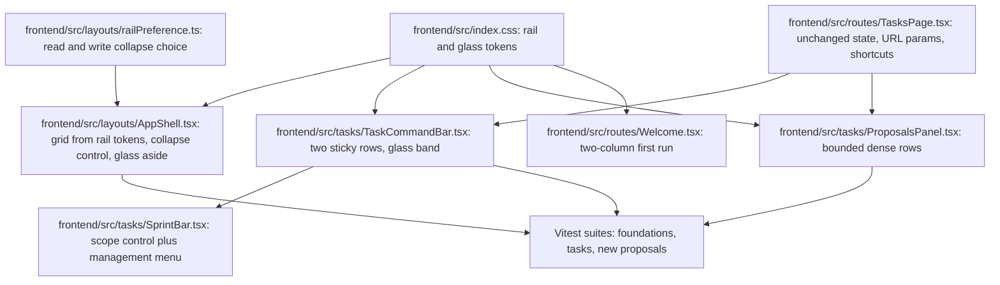

[CodeWiki](../../index.md) / [Artifacts](../index.md) / [Plans](index.md)

# Meridian UI Redesign Implementation Plan: Collapsible Glass Rail, Task Command Bar, Compact Proposals, First-Run Landing

## Outcome and Boundaries

This plan implements the approved target in [Meridian UI Redesign Target and Guardrails](../UIUX/meridian-ui-redesign-target-and-guardrails.md). When it is done the desktop navigation rail collapses to an icon rail and expands again from a labelled control whose choice survives reload, both rail states are painted with a theme-aware glass material built from named tokens, the Tasks route presents one sticky command bar instead of four stacked bands so that the first task row is visible without scrolling, the agent-proposal area is bounded in height with its reasoning behind disclosure while Approve and Reject stay on the row for Admins, and the authenticated first-run page uses its whole canvas to explain Meridian with claims that are traceable to implemented behavior.

The work is confined to the `frontend` container and to the presentation layer. Included are the token block in `frontend/src/index.css`, the shell in `frontend/src/layouts/AppShell.tsx`, the Tasks composition in `frontend/src/routes/TasksPage.tsx` and `frontend/src/tasks/SprintBar.tsx`, the proposal panel in `frontend/src/tasks/ProposalsPanel.tsx`, the first-run page in `frontend/src/routes/Welcome.tsx`, two new presentational modules, and the three affected Vitest suites.

Non-goals are everything behind the presentation layer. No backend endpoint, Supabase migration, policy, query key, mutation payload, retrieval rule or agent behavior changes. No route is added, removed or renamed and no redirect changes, so `frontend/src/App.tsx` is read-only for this plan. The Assistant, Notes, Documents, Document Viewer, Members, Review Queue, Audit Log and Pipeline Health routes are not redesigned; they are touched only through the shared rail, and `OperationalHeader` and `WorkspaceToolbar` must keep rendering exactly as they do today for those routes. No sample data, placeholder metric, fabricated claim or decorative animation is in scope.

Two invariants deserve restating because they are easy to break silently. Density must come from consolidation and disclosure rather than from shrinking controls, so the 44-pixel effective touch target and the existing `min-h-10` usage stay. The highlighter token `--color-mark` remains reserved for cited source passages and must not appear on the rail, the command bar, the proposal rows or the landing page.

## Current Architecture

The authenticated tree is `ThemeProvider` wrapping `QueryClientProvider`, `AuthProvider` and `BrowserRouter` in `frontend/src/App.tsx`. Authenticated routes sit inside `RequireAuth`, then `WorkspaceProvider`, then `RequireWorkspace`, then `AppShell`, and each route element wraps its page in `PageFrame` with an explicit mode. `/tasks` uses `mode="operational"`, so the canvas is `max-w-[var(--frame-operational)]` with `px-[var(--frame-gutter)] py-8 lg:py-10` applied outside `TasksPage`. `Welcome` is mounted at `welcome` inside `WorkspaceProvider` but outside `RequireWorkspace` and outside `AppShell`, which is why it owns its own header and background.

`AppShell` is a `min-h-dvh lg:grid lg:grid-cols-[248px_minmax(0,1fr)]` container holding a skip link to `#main`, a sticky opaque `aside` painted `bg-paper` for the desktop rail, a `lg:hidden` sticky top bar at `h-14` with `z-30`, an `AnimatePresence` drawer at `z-40`, and a `main` element with `tabIndex={-1}` that receives focus in a `useEffect` keyed on `location.pathname`. Both the desktop `aside` and the drawer render the same `Sidebar` component with different `layoutGroup` values, and the active-destination marker is a `motion.span` with `layoutId={`nav-meridian-${layoutGroup}`}`. `Sidebar` is a flex column of `WorkspaceSwitcher`, a `nav` with the `Workspace` group and the Admin-only group, and a footer of `ReliabilityNote compact`, `ThemeToggle` and `UserMenu`. There is no collapse state and no width preference anywhere in the file.

Stacking order is already established by existing components and constrains any new sticky surface: the mobile top bar is `z-30`, the mobile drawer container is `z-40`, the inspector overlay in `frontend/src/components/Inspector.tsx` is `z-40` with its content at `z-50`, and the Radix dropdown content in `frontend/src/workspace/WorkspaceSwitcher.tsx` is `z-50`.

`TasksPage` owns all Tasks state and returns a bare `flex flex-col gap-5` column with five stacked children: `OperationalHeader`, `WorkspaceToolbar` holding the filter field and the completed toggle, `SprintBar`, then either a skeleton, an error state, or `ProposalsPanel` followed by the list or board, and finally `TaskDrawer`. View, sprint scope and the open task live in the URL through `useSearchParams`, with `setParam` using `{ replace: key === 'view' }`. Derived values come from `scopeTasks`, `filterTasks` and `buildTree`, and `openCount` and `doneCount` are computed from the scoped set. The `/` handler focuses `searchRef` and bails out when the event target matches `input, textarea, select, [contenteditable=true], [role=dialog]`.

`SprintBar` renders a wrapping tab row of scope tabs plus an Admin `New sprint` button, and conditionally renders a second bordered `SprintControls` band whenever an Admin has selected a specific sprint. That band holds the sprint name, dates, status, the start or complete action, and a delete control whose accessible name is `Delete {sprint.name}` with a `ConfirmDialog`.

`ProposalsPanel` returns `null` for an empty array, then renders an accent-washed `section` with `aria-labelledby="proposals-heading"`, a heading reading `Proposed by the agent · {proposals.length}`, a role-specific sentence, and one fully expanded card per proposal containing the title, optional description and an unabbreviated `Why:` paragraph. Decision buttons render only when `isAdmin`, and pending state is scoped per row through `approve.variables === proposal.id` and the equivalent reject check.

`ThemeProvider` establishes the persistence pattern the rail must copy: a module-level `STORAGE_KEY`, a `readPreference` function with `try`/`catch` used directly as the `useState` initializer, and `try`/`catch` around the write so private-browsing failures degrade to an in-memory choice.

Test coverage is asymmetric and that asymmetry drives several decisions below. `frontend/src/__tests__/test_ui_foundations.tsx` renders the real `AppShell` with `WorkspaceSwitcher`, `ThemeToggle`, `Wordmark`, `ReliabilityNote` and `Avatar` mocked, and asserts the skip link, post-navigation focus on `main`, the Admin destination names, and drawer dismissal. `frontend/src/__tests__/test_tasks_page.tsx` renders the real `TasksPage` but mocks `../tasks/ProposalsPanel` to a stub paragraph and mocks `../tasks/SprintBar` to a stub that renders a `Sprint context` region, a `Scope: {scope}` string, a `Sprint controls available` or `Sprint controls protected` string, and a `Focus September` button. Nothing covers `ProposalsPanel` itself.

## Proposed Change Overview

The end state keeps every piece of state and every handler where it is today and changes only composition and material. `index.css` gains four glass tokens and two rail-width tokens, declared once in `@theme` and redefined under `[data-theme='dark']`, so that `AppShell` and the new command bar consume the same material without either one inventing opacity utilities. `AppShell` gains a boolean collapse state seeded from a new `railPreference` module and drives its grid column from the rail tokens through an inline style, because a Tailwind class cannot be composed from a runtime value. `TasksPage` keeps all of its state and hands it to a new `TaskCommandBar` that renders the two sticky rows and receives `SprintBar` as its scope control, which lets the existing Tasks suite keep working through its `SprintBar` mock. `ProposalsPanel` becomes a bounded list of dense rows with per-row disclosure. `Welcome` becomes a two-column grid whose secondary column is written from `ReliabilityNote` and other implemented behavior.



The ordering is deliberate. STEP-01 lands the tokens first because the other four presentation steps consume them and would otherwise each invent a local material. STEP-02 through STEP-05 are independent of each other and touch disjoint files, so they can be scheduled in parallel once the tokens exist. STEP-06 follows all four because the suites assert the finished markup, STEP-07 runs the deterministic gates once the suites are in place, and STEP-08 handles the live gates and the documentation sync.

## Execution Steps

### STEP-01 - Add rail-width and glass material tokens to the design system

Owner CodeWritingAgent. Container `frontend`. Depends on nothing. ✅ Status: complete.

**Objective.** Declare the redesign's material and geometry once as semantic tokens so no component reaches for ad-hoc opacity or blur utilities.

**Definition of done.** `frontend/src/index.css` declares `--rail-expanded`, `--rail-collapsed`, `--glass-surface`, `--glass-raised`, `--glass-edge` and `--glass-blur` in the existing `@theme` block with dark redefinitions under `[data-theme='dark']`, and no existing color, radius, frame, density, duration or shadow value changes.

**Technical approach.** The file already defines light values in `@theme` and redefines only the variables that differ under `[data-theme='dark']`, and `@custom-variant dark` is already wired to that attribute, so the redesign follows the same shape rather than introducing a second mechanism. `--rail-expanded` keeps today's `248px` so an existing user who has never collapsed the rail sees the current layout. `--rail-collapsed` is `72px`, which is the value resolved in the target: with the existing 18-pixel Phosphor icons it leaves a centered hit area of at least 44 pixels inside the rail's `px-3` padding and keeps the 3-pixel cobalt marker visible at the left edge. The blur radius is a token rather than a literal so `backdrop-blur-[var(--glass-blur)]` reads the same in the rail and the command bar.

The glass values are chosen to be a tinted translucent base rather than a thin wash, because the rail sits over scrolling content and a low-alpha layer would drop label contrast. `--glass-raised` exists for the small raised chips inside a glass surface, such as the collapse control hover state, and `--glass-edge` replaces a hard `border-rule` line where the material needs a softer boundary.

```css
/* Additions to the existing @theme block in frontend/src/index.css. */
--rail-expanded: 248px;
--rail-collapsed: 72px;
--glass-surface: rgb(244 245 242 / 0.72);
--glass-raised: rgb(255 255 255 / 0.55);
--glass-edge: rgb(17 20 24 / 0.08);
--glass-blur: 14px;
```

```css
/* Additions to the existing [data-theme='dark'] block. */
--glass-surface: rgb(13 15 18 / 0.66);
--glass-raised: rgb(255 255 255 / 0.05);
--glass-edge: rgb(255 255 255 / 0.06);
```

**Changes.**

| File/component and symbol | Concrete change or resulting code shape | Integration/compatibility impact | Acceptance/validation |
| --- | --- | --- | --- |
| `frontend/src/index.css`, `@theme` block | Append the two rail-width tokens and the four glass tokens shown above after `--density-row`, leaving every existing declaration byte-identical | Additive only; Tailwind v4 exposes them as CSS variables, so `bg-[var(--glass-surface)]` and `backdrop-blur-[var(--glass-blur)]` resolve without config changes | AC-02, VAL-01, VAL-02 |
| `frontend/src/index.css`, `[data-theme='dark']` block | Redefine `--glass-surface`, `--glass-raised` and `--glass-edge` only; rail widths are theme-independent and must not be duplicated | Dark values apply through the existing attribute set before first paint by the inline script in `index.html` | AC-02, VAL-07 |

**Acceptance and validation.** AC-02 (material declared once as tokens). Verified by VAL-01 (`npm run lint`) and VAL-02 (`npm run build`); the measured contrast check is VAL-07 in STEP-08.

**Recovery.** Not applicable; the change is purely additive to a stylesheet.

#### Implementation Tracker

- [x] Append `--rail-expanded` and `--rail-collapsed` to the `@theme` block in `frontend/src/index.css` without altering neighbouring declarations.
- [x] Append `--glass-surface`, `--glass-raised`, `--glass-edge` and `--glass-blur` to the same block.
- [x] Redefine the three theme-dependent glass tokens under `[data-theme='dark']` and confirm the rail widths are not redefined there.
- [x] Confirm by inspection that no existing token value, including `--color-mark` and `--color-mark-edge`, is modified.
- [x] Run VAL-01 and VAL-02 and confirm both succeed before handing the tokens to the dependent steps.

### STEP-02 - Make the desktop rail collapsible with a persisted preference and glass material

Owner CodeWritingAgent. Container `frontend`. Depends on STEP-01. ✅ Status: complete.

**Objective.** Give the desktop rail two width states, a labelled collapse control, a persisted choice and the glass material, without disturbing the shell's accessibility infrastructure.

**Definition of done.** At and above the large breakpoint the rail renders at `var(--rail-expanded)` or `var(--rail-collapsed)` according to a persisted boolean that defaults to expanded, the collapse control exposes a stable accessible name and a correct `aria-expanded`, every destination keeps its current accessible name in both states, and `test_ui_foundations.tsx` still passes unchanged before it is extended in STEP-06.

**Technical approach.** The collapse preference gets its own tiny module rather than a context provider, because `AppShell` is the only consumer and the shell already owns layout state such as `drawerOpen`. The module mirrors `readPreference` in `frontend/src/theme/ThemeProvider.tsx` exactly, including the `try`/`catch` on both read and write, so private-browsing failures degrade to an in-memory choice for the visit. This is DEC-01 - copy the ThemeProvider persistence pattern instead of inventing a second one. No change to the pre-paint inline script in `index.html` is required, because the rail lives inside the React tree rather than on a document attribute, and the synchronous initializer means the first React paint already reflects the stored value.

```tsx
// frontend/src/layouts/railPreference.ts
const RAIL_KEY = 'meridian-rail'

export function readRailCollapsed(): boolean {
  try {
    return localStorage.getItem(RAIL_KEY) === 'collapsed'
  } catch {
    return false
  }
}

export function writeRailCollapsed(collapsed: boolean): void {
  try {
    if (collapsed) localStorage.setItem(RAIL_KEY, 'collapsed')
    else localStorage.removeItem(RAIL_KEY)
  } catch {
    // Storage can be unavailable (private mode); the choice still applies for this visit.
  }
}
```

The grid template moves from a static Tailwind class to an inline style, which is DEC-02 - drive geometry from the tokens because a utility class cannot interpolate a runtime value, and duplicating the widths in two class strings would let the column and the `aside` disagree. The `lg:grid` class stays so the single-column mobile layout is unaffected, and the inline `gridTemplateColumns` is harmless below the breakpoint where `display: grid` is not applied.

```tsx
// frontend/src/layouts/AppShell.tsx - illustrative shape.
const [railCollapsed, setRailCollapsed] = useState(readRailCollapsed)

const toggleRail = () => {
  setRailCollapsed((current) => {
    writeRailCollapsed(!current)
    return !current
  })
}

<div
  className="min-h-dvh lg:grid"
  style={{ gridTemplateColumns: `${railCollapsed ? 'var(--rail-collapsed)' : 'var(--rail-expanded)'} minmax(0,1fr)` }}
>
  <aside className="sticky top-0 hidden h-dvh border-r border-[var(--glass-edge)] bg-[var(--glass-surface)] backdrop-blur-[var(--glass-blur)] lg:block">
    <Sidebar layoutGroup="desktop" collapsed={railCollapsed} onToggleCollapse={toggleRail} />
  </aside>
```

Label handling is DEC-03 - keep the label in the accessibility tree as `sr-only` text plus a native `title` tooltip when collapsed, rather than swapping to `aria-label`. This is the safest option because `test_ui_foundations.tsx` queries `getByRole('link', { name: 'Review queue' })` and its siblings, and an `sr-only` span produces the identical accessible name with no risk of an `aria-label` and visible text disagreeing. `NavGroup` therefore renders `{collapsed ? <span className="sr-only">{item.label}</span> : item.label}` and adds `title={collapsed ? item.label : undefined}`, and the group heading paragraph is replaced by a short hairline separator when collapsed so the rail does not show truncated `Workspace` and `Admin` words.

The drawer keeps passing `collapsed={false}`, which preserves the mobile experience exactly and satisfies the target's rule that the collapse preference has no effect below the large breakpoint. The `layoutId={`nav-meridian-${layoutGroup}`}` template is untouched, so the `desktop` and `mobile` markers stay independent even though a collapsed rail is still the `desktop` group.

Motion is handled by an existing mechanism rather than a new one. The `aside` gets a CSS width transition at `--duration-panel` with `--ease-out-quint`, and the global `prefers-reduced-motion` rule in `index.css` already forces `transition-duration: 0.01ms`, so the reduced-motion result is an immediate width change with no extra branching. The `useReducedMotion` hook already present in the file remains used only for the drawer and route transitions.

Inside the rail, `WorkspaceSwitcher` and `UserMenu` must not overflow a 72-pixel column. The switcher trigger already has `min-w-0 flex-1` and `truncate` on its name, so the collapsed treatment hides the name and count block and the caret, leaving the `Monogram` centered while the trigger keeps its existing `aria-label={`Workspace: ${active.name}. Switch workspace`}`. `Sidebar`'s footer collapses to the icon-only sign-out control and the theme toggle, and `ReliabilityNote compact` is hidden when collapsed because a 72-pixel column cannot render a sentence; the same text remains available on the Assistant route through the full `ReliabilityNote`.

**Changes.**

| File/component and symbol | Concrete change or resulting code shape | Integration/compatibility impact | Acceptance/validation |
| --- | --- | --- | --- |
| `frontend/src/layouts/railPreference.ts` (new) | Module-level `RAIL_KEY = 'meridian-rail'` plus exported `readRailCollapsed` and `writeRailCollapsed` with `try`/`catch` on both sides | New file with no imports; mirrors `ThemeProvider` so there is one persistence idiom in the codebase | AC-01, VAL-05 |
| `frontend/src/layouts/AppShell.tsx`, `AppShell` | Add `railCollapsed` state seeded by `readRailCollapsed`, a `toggleRail` writer, and the inline `gridTemplateColumns`; repaint the desktop `aside` with the glass tokens; keep the skip link, the `mainRef` focus effect, the Escape listener and the drawer untouched | Desktop-only visual change; `main` keeps `id="main"` and `tabIndex={-1}` so both asserted accessibility behaviors are preserved | AC-01, AC-02, AC-06 |
| `frontend/src/layouts/AppShell.tsx`, `SidebarProps` and `Sidebar` | Add optional `collapsed?: boolean` and `onToggleCollapse?: () => void`; render the collapse control only when `onToggleCollapse` is supplied, with `aria-label="Collapse navigation"` or `"Expand navigation"` and `aria-expanded={!collapsed}`; switch the container to `px-2` when collapsed | The drawer instance passes neither prop, so no collapse control appears on mobile and the drawer markup is unchanged | AC-01, AC-06, VAL-03 |
| `frontend/src/layouts/AppShell.tsx`, `NavGroup` | Accept `collapsed`; center the icon and wrap the label in `sr-only` when collapsed; add `title={collapsed ? item.label : undefined}`; replace the group label paragraph with an `aria-hidden` hairline rule when collapsed; keep the `motion.span` `layoutId` template and the 40-pixel minimum row height | Accessible names and the `NavLink` `to` values are unchanged, so every name-based query in `test_ui_foundations.tsx` continues to resolve to exactly one link | AC-01, AC-06 |
| `frontend/src/layouts/AppShell.tsx`, `UserMenu` and footer | When collapsed, render the avatar and the existing `aria-label="Sign out"` control only, hide the name, email and `ReliabilityNote compact`, and keep the `role="alert"` sign-out error paragraph reachable | Sign-out behavior and its error path are unchanged | AC-01, AC-06 |
| `frontend/src/workspace/WorkspaceSwitcher.tsx`, `WorkspaceSwitcher` | Add an optional `collapsed?: boolean` that renders the monogram-only trigger while keeping the existing `aria-label` and the whole dropdown content unchanged | The switcher is mocked in `test_ui_foundations.tsx`, so this change is verified by build and live gates rather than that suite | AC-01, VAL-02 |

**Acceptance and validation.** AC-01 (collapse, persistence, names, `aria-expanded`), AC-02 (token-driven material), AC-06 (protected shell contracts), AC-08 (reduced motion). Verified by VAL-02, VAL-03, and live gates VAL-05, VAL-07 and VAL-08.

**Recovery.** Reverting `frontend/src/layouts/AppShell.tsx` and deleting `frontend/src/layouts/railPreference.ts` restores the fixed 248-pixel column. The only persisted artifact is the `meridian-rail` key, which is safe to delete and is absent for users who never collapsed the rail.

#### Implementation Tracker

- [x] Create `frontend/src/layouts/railPreference.ts` with `readRailCollapsed` and `writeRailCollapsed` following the `ThemeProvider` `try`/`catch` pattern (DEC-01).
- [x] Wire `railCollapsed` state and the inline `gridTemplateColumns` in `AppShell`, leaving the skip link, `mainRef` focus effect and drawer logic byte-identical (DEC-02).
- [x] Repaint the desktop `aside` with `--glass-surface`, `--glass-edge` and `--glass-blur`, and add the `--duration-panel` width transition.
- [x] Add the collapse control with `aria-expanded` and both accessible names, rendered only for the desktop instance.
- [x] Add the collapsed presentation to `Sidebar`, `NavGroup`, `UserMenu` and `WorkspaceSwitcher`, keeping every label in the accessibility tree via `sr-only` plus `title` (DEC-03).
- [x] Confirm the `layoutId={`nav-meridian-${layoutGroup}`}` template and the 40-pixel row minimum are unchanged.
- [x] Run VAL-03 against the current `test_ui_foundations.tsx` before it is extended, to prove the collapsed-rail work did not break an existing assertion.

### STEP-03 - Consolidate the Tasks prelude into one sticky two-row command bar

Owner CodeWritingAgent. Container `frontend`. Depends on STEP-01. ✅ Status: complete.

**Objective.** Replace the four stacked bands above the task list with one sticky command bar of at most two rows that keeps working context on screen and brings the first task row inside the budget.

**Definition of done.** `/tasks` renders exactly one sticky container holding route identity, the workspace name, the open and done counters, the view tabs, the filter field, the completed toggle and the sprint scope in at most two rows; the bar stays visible while the list scrolls; no third row appears when an Admin selects a sprint; and every URL parameter, shortcut and role-gated string asserted by `test_tasks_page.tsx` behaves as before.

**Technical approach.** All state stays in `TasksPage`. A new presentational `TaskCommandBar` receives the already-derived values and the existing setters as props and owns only layout, which keeps `filterTasks`, `buildTree`, `setParam` and the two keyboard effects exactly where the current suite exercises them. This is DEC-04 - move markup, not state.

The most important compatibility decision is DEC-05 - keep `SprintBar` at its current module path with its current named export and prop contract (`board`, `tasks`, `scope`, `onScope`, `canManage`), and render it inside the command bar's second row. `test_tasks_page.tsx` mocks `../tasks/SprintBar` and asserts the strings its stub renders, so extracting a differently named scope component would silently bypass the mock, render the real sprint code, and fail the `Scope: sprint-1` and `Sprint controls protected` assertions. Keeping the module boundary preserves that coverage while the internals change.

Inside `SprintBar`, the wrapping tab row is compressed to a single non-wrapping scope strip inside the existing `bounded-overflow` treatment, and the conditional `SprintControls` band is moved behind a disclosure attached to the scope strip so it can never add a third row to the sticky bar. As built, that disclosure is a `Manage sprint` trigger carrying `aria-haspopup="dialog"` and `aria-expanded` which opens the management surface in the existing `Dialog`, rather than an inline expanding panel: the scope strip's ancestor is a `bounded-overflow` element with `overflow-x: auto`, so an inline panel would either be clipped by it or force the third row this step exists to eliminate. The management surface keeps its start, complete and delete actions, the `aria-label={`Delete ${sprint.name}`}` control and the `ConfirmDialog` with its unchanged copy, because the delete confirmation is a destructive-action contract.

Stickiness is DEC-06 - the bar is `sticky top-14 lg:top-0 z-20`, bleeding to the frame edge with `-mx-[var(--frame-gutter)] px-[var(--frame-gutter)]`. The `z-20` value sits below every existing overlay, so the bar cannot cover the mobile top bar at `z-30`, the drawer at `z-40`, the inspector overlay at `z-40`, the inspector content at `z-50` or the Radix menus at `z-50`. The `top-14` offset below the large breakpoint matches the `h-14` mobile top bar so the two sticky surfaces do not overlap. The negative inline margin is required because `TasksPage` does not own its gutter; `PageFrame` applies `px-[var(--frame-gutter)]` outside the component, so a plain sticky child would leave the gutter transparent while rows scrolled through it.

Information that the removed bands carried must be relocated rather than dropped. DEC-07 places the workspace name in the first row as a secondary label beside the title, replacing the `OperationalHeader` description sentence that is the only place the page states its scope today. The Member sentence `You can change task status. Admins add and edit tasks.` is asserted verbatim and must keep rendering as visible text in the second row, so it stays a plain string rather than becoming a tooltip. `OperationalHeader` and `WorkspaceToolbar` remain in the repository unchanged and keep serving Documents, Members and the three Admin routes; Tasks simply stops importing them.

```tsx
// frontend/src/tasks/TaskCommandBar.tsx - illustrative shape; state stays in TasksPage.
<div className="sticky top-14 z-20 -mx-[var(--frame-gutter)] border-b border-[var(--glass-edge)] bg-[var(--glass-surface)] px-[var(--frame-gutter)] py-2.5 backdrop-blur-[var(--glass-blur)] lg:top-0">
  <div className="flex flex-wrap items-center gap-3">
    <h1 className="font-display text-[22px] leading-none font-semibold tracking-[-0.03em] text-ink">Tasks</h1>
    <span className="truncate text-sm text-ink-3">{workspaceName}</span>
    <span className="text-sm text-ink-2">
      <span className="font-medium text-ink tabular">{openCount}</span> open &middot;{' '}
      <span className="font-medium text-ink tabular">{doneCount}</span> done
    </span>
    <div className="ml-auto flex items-center gap-2">{viewTabs}</div>
  </div>
  <div className="bounded-overflow mt-2 flex items-center gap-3">
    {filterField}
    {completedToggle}
    {sortControl}
    {sprintScope}
    {permissionHint && <p className="ml-auto shrink-0 text-sm text-ink-3">{permissionHint}</p>}
  </div>
</div>
```

The request also asked for a more capable workspace, and DEC-08 limits that capability to presentation over already-loaded data: a grouping or sort selector applied to the `filterTasks` output before `buildTree`, a visible match count while the filter is non-empty, and a clearer split between "no tasks in this scope" and "no tasks match this filter" in the existing empty-state branches. No new query, query key, mutation or server field is introduced, and the reclaimed horizontal band is used for these controls rather than left empty.

**Changes.**

| File/component and symbol | Concrete change or resulting code shape | Integration/compatibility impact | Acceptance/validation |
| --- | --- | --- | --- |
| `frontend/src/tasks/TaskCommandBar.tsx` (new) | Presentational component taking `workspaceName`, `openCount`, `doneCount`, `viewTabs`, `filterField`, `completedToggle`, `sortControl`, `sprintScope` and `permissionHint` as nodes or primitives and rendering the two sticky rows shown above | Owns no state, so the Tasks suite continues to exercise all behavior through `TasksPage` | AC-03, VAL-03 |
| `frontend/src/routes/TasksPage.tsx`, `TasksPage` | Drop the `OperationalHeader` and `WorkspaceToolbar` imports and their JSX, pass the existing `viewTabs` element, the filter field, the completed toggle and `<SprintBar ... />` into `TaskCommandBar`, and keep `setParam`, the `/` effect, `scopeTasks`, `filterTasks`, `buildTree`, `openCount`, `doneCount`, `openTask` and `TaskDrawer` exactly as they are; reduce the outer column to `flex flex-col gap-4` | The `view`, `sprint` and `task` parameters, the `{ replace: key === 'view' }` semantics, the `Filter tasks` label, the `List` and `Board` tab names and the Member sentence are all preserved, which is what the existing suite asserts | AC-03, AC-06, VAL-03 |
| `frontend/src/routes/TasksPage.tsx`, sort and match-count additions | Add a `sort` selector state and a derived match count applied between `filterTasks` and `buildTree`, and differentiate the two empty branches | Client-side only over `board.data.tasks`; no query key or payload change (DEC-08) | AC-03, VAL-10 |
| `frontend/src/tasks/SprintBar.tsx`, `SprintBar` | Keep the export name, module path and prop contract; render a single non-wrapping scope strip inside `bounded-overflow` and move `SprintControls` behind a disclosure so no second band is added | The `test_tasks_page.tsx` mock of `../tasks/SprintBar` still intercepts the import, preserving the `Scope:` and `Sprint controls protected` assertions (DEC-05) | AC-03, AC-06, VAL-03 |
| `frontend/src/tasks/SprintBar.tsx`, `SprintControls` and `NewSprintDialog` | Relocate into the disclosure surface with the start, complete and delete actions, the `Delete {sprint.name}` accessible name and the `ConfirmDialog` copy unchanged; the Admin `New sprint` trigger stays Admin-only | Destructive-action confirmation and Member gating are unchanged | AC-06 |

**Acceptance and validation.** AC-03 (single sticky two-row bar and no overlap), AC-06 (URL state, shortcuts, Member sentence). Verified by VAL-02, VAL-03, VAL-10 and the measured gate VAL-06.

**Recovery.** `TasksPage.tsx`, `TaskCommandBar.tsx` and `SprintBar.tsx` form one composition and must be reverted together; reverting only one leaves the scope control rendering outside a container that no longer exists.

#### Implementation Tracker

- [x] Add `frontend/src/tasks/TaskCommandBar.tsx` as a stateless two-row sticky container using the glass tokens and `z-20` with the `top-14 lg:top-0` offset (DEC-06).
- [x] Rewire `TasksPage` to compose the command bar while leaving `setParam`, both keyboard effects and every derived value untouched (DEC-04).
- [x] Relocate the workspace name into the first command-bar row and keep the Member sentence as verbatim visible text in the second row (DEC-07).
- [x] Compress `SprintBar` to one scope strip and move `SprintControls` behind a disclosure, preserving its module path, export name and prop contract (DEC-05).
- [x] Add the sort selector, the active-filter match count and the two distinct empty-state messages over already-loaded data (DEC-08).
- [x] Confirm `OperationalHeader` and `WorkspaceToolbar` are unmodified and still used by Documents, Members and the Admin routes.
- [x] Run VAL-03 and confirm the four existing Tasks contracts still pass before STEP-06 extends them.

### STEP-04 - Compact the agent-proposal area to bounded rows with on-demand reasoning

Owner CodeWritingAgent. Container `frontend`. Depends on STEP-01. ✅ Status: complete.

**Objective.** Bound the height of the proposal area so tasks are visible immediately, without weakening the approval boundary.

**Definition of done.** `ProposalsPanel` renders at most three dense rows before an explicit reveal control, description and reasoning appear only when a row is expanded through `aria-expanded` and `aria-controls`, Reject and Approve remain on the collapsed row for Admins only, an empty array still renders nothing, and per-proposal pending isolation is intact.

**Technical approach.** The section keeps its `aria-labelledby="proposals-heading"` association and a heading that still names the agent and the count, and it keeps its accent wash so the area still reads as agent output rather than as workspace data. Each card becomes one row with the priority glyph, the truncated title, the formatted due date, a `Why` disclosure and, for Admins, the two decision buttons. The `PriorityIcon` and `formatDue` imports are unchanged.

DEC-09 caps visibility by count at three rows with an explicit `Show all {n}` toggle, which is what the target resolved. A count cap is deterministic and directly assertable, whereas a height cap depends on rendered text height and real proposal volume that cannot be established from source. With three rows at roughly 44 pixels each plus the heading and padding, the panel lands inside the 140-pixel budget and stops growing regardless of how many proposals the agent produces.

Disclosure state is local `useState<string | null>` for the expanded proposal identifier, so at most one reasoning block is open and the panel cannot grow without an explicit action. The disclosure uses a plain button with `aria-expanded` and `aria-controls={`proposal-why-${proposal.id}`}` targeting a region that carries the matching `id`, and the collapsed state simply does not render that region.

The decision controls stay on the collapsed row rather than inside the disclosure. This is a consent requirement, not a layout preference: hiding Approve behind a disclosure would make the decision less visible than the suggestion. `Button` keeps `min-h-10` so the target floor holds, and the existing `disabled={deciding}` plus `loading={approve.isPending && approve.variables === proposal.id}` expressions are preserved verbatim so deciding one proposal never appears to disable the others.

The two role-specific sentences stay as text. `Nothing is added until you approve it.` and `Waiting for an Admin to approve or reject.` move into the heading row as a single compact line rather than being deleted or turned into a tooltip, which keeps them in the accessibility tree for the new suite to assert.

**Changes.**

| File/component and symbol | Concrete change or resulting code shape | Integration/compatibility impact | Acceptance/validation |
| --- | --- | --- | --- |
| `frontend/src/tasks/ProposalsPanel.tsx`, `ProposalsPanel` | Keep `if (proposals.length === 0) return null`, the section wrapper and the `proposals-heading` association; add `const [expandedId, setExpandedId] = useState<string | null>(null)` and a `showAll` boolean; slice to three rows unless `showAll` | Empty-array behavior and the labelled section are unchanged; `useTaskMutations` and `useWorkspace` usage is untouched | AC-04, VAL-04 |
| `frontend/src/tasks/ProposalsPanel.tsx`, proposal row | Replace the stacked card with a `min-h-11` flex row holding `PriorityIcon`, a truncated title, the `formatDue` date, the `Why` button with `aria-expanded` and `aria-controls`, and the Admin decision buttons; render the description and the `Why:` reasoning inside a conditionally mounted region carrying the referenced `id` | Reasoning text is retained, not removed; `Button` keeps `min-h-10` so the target floor holds | AC-04, AC-06 |
| `frontend/src/tasks/ProposalsPanel.tsx`, reveal control | Add a trailing `Show all {proposals.length}` and `Show fewer` toggle rendered only when more than three proposals exist; as built, the revealed list is additionally capped with `max-h-72 overflow-y-auto` so even the deliberately expanded state cannot push the task list off screen | Bounds panel height by count rather than by measurement (DEC-09) | AC-04, VAL-06 |
| `frontend/src/tasks/ProposalsPanel.tsx`, role sentences | Keep both strings rendered as text in the heading row | Required so the new suite can assert them and so Members still learn why they cannot decide | AC-04, VAL-04 |

**Acceptance and validation.** AC-04 (bounded rows, disclosure wiring, Admin-only decisions, null on empty, pending isolation), AC-06, AC-08. Verified by VAL-02, VAL-04 and the measured gate VAL-06.

**Recovery.** Reverting `frontend/src/tasks/ProposalsPanel.tsx` is sufficient. The approve and reject mutations are untouched, so no proposal can be left in an inconsistent state by a partial change.

#### Implementation Tracker

- [x] Preserve `return null` for an empty array and the `aria-labelledby="proposals-heading"` section, including a heading that still names the agent and the count.
- [x] Convert each proposal to a single `min-h-11` row with priority, truncated title and formatted due date.
- [x] Add the per-row `Why` disclosure wired through `aria-expanded` and `aria-controls` to a conditionally mounted reasoning region.
- [x] Add the three-row cap with the `Show all {n}` reveal control (DEC-09).
- [x] Keep Reject and Approve on the collapsed row, Admin-only, with the existing `approve.variables` and `reject.variables` pending checks copied verbatim.
- [x] Keep both role-specific sentences as visible text in the heading row.

### STEP-05 - Rebuild the first-run landing surface as an evidence-backed two-column page

Owner CodeWritingAgent. Container `frontend`. Depends on STEP-01. ✅ Status: complete.

**Objective.** Make the authenticated first-run page use its canvas and explain Meridian, while keeping its single behavior and all of its states.

**Definition of done.** `Welcome` renders a two-column grid at and above the large breakpoint with the creation form in the primary column and an evidence column beside it, stacks with the form first below that breakpoint, and retains the membership redirect, the `role="status"` loading branch with its `Loading your workspaces` label and three skeletons, the theme toggle, the sign-out control, the named-email invite hint and the `autoFocus` on the workspace-name field.

**Technical approach.** The page keeps its own header and `bg-paper` background because it is mounted outside `AppShell`. The `max-w-md` centered column becomes `mx-auto grid w-full max-w-5xl gap-10 lg:grid-cols-[minmax(0,26rem)_minmax(0,1fr)] lg:items-start`, which aligns the main column with the `max-w-5xl` header that already exists in the file. Source order puts the form section first so the stacked mobile layout is unchanged and the autofocused field is still the first interactive element after the header.

The redirect guard `if (!loading && workspaces.length > 0) return <Navigate to="/tasks" replace />` and the loading branch stay exactly as written, and the loading branch keeps replacing only the primary column so a person waiting on `useWorkspace()` does not see a half-built two-column page.

DEC-10 fixes the evidence column contents so implementation does not have to invent copy, and every item is traceable to implemented behavior rather than chosen for effect. The four items are: answers cite the exact passage they used, which is the citation behavior `ReliabilityNote` describes and the reason `--color-mark` exists; confidence is shown and explicitly labelled uncalibrated, which is the wording already in `frontend/src/components/ReliabilityNote.tsx`; low-confidence or ungrounded answers are routed to a person for review, which is the same note plus the `/admin/review` route in `frontend/src/App.tsx`; and agent-proposed tasks wait for an Admin's explicit approval, which is the `ProposalsPanel` behavior this plan preserves in STEP-04. The column is a static list of short statements with no metric, logo, testimonial, screenshot or preview of unbuilt work, and it must not use `--color-mark`, because that token is reserved for real cited passages.

The column is `aria-label`led and marked `hidden lg:block` so screen-reader users on narrow viewports are not given a decorative detour before the form; the same claims remain available inside the product through `ReliabilityNote`. Any new motion is limited to a single entrance fade within the existing `--duration-panel` vocabulary, which the global reduced-motion rule already neutralizes.

**Changes.**

| File/component and symbol | Concrete change or resulting code shape | Integration/compatibility impact | Acceptance/validation |
| --- | --- | --- | --- |
| `frontend/src/routes/Welcome.tsx`, `Welcome` | Replace `main className="mx-auto my-auto w-full max-w-md py-12"` with the `max-w-5xl` two-column grid; keep the redirect guard, the loading branch, the heading, the paragraph, `CreateWorkspaceForm autoFocus` inside its panel, and the invite hint naming `user?.email`. As built the element is a `motion.main` with `initial={reduce ? false : { opacity: 0, y: 12 }}` at `0.2s` and the `--ease-out-quint` curve, copying the `SignIn` idiom so reduced motion resolves the entrance immediately | Behavior is unchanged; only layout, one entrance fade and added static copy | AC-05, AC-08, VAL-09 |
| `frontend/src/routes/Welcome.tsx`, evidence column | Add an `aside` with `aria-label="What a workspace gives you"` and `hidden lg:block`, containing the four source-verifiable statements from DEC-10, painted with `--glass-surface` and `--glass-edge`. Each statement is a title plus a sentence led by an `aria-hidden` icon chip painted from `--glass-raised`, drawn from the icon set already imported elsewhere in the app (`SealCheck`, `Pulse`, `Tray`, `Robot`) | Additive; no claim may exceed implemented behavior and `--color-mark` is not used | AC-05, AC-06 |
| `frontend/src/routes/Welcome.tsx`, ambient wash | Add one `aria-hidden` static `radial-gradient` layer at `-z-10` built from `--color-cobalt-wash` so the page is not a bare sheet | Static paint only, no animation and no new token; the surface is `isolate overflow-hidden` so the layer cannot escape the page | AC-05 |
| `frontend/src/routes/Welcome.tsx`, header | Keep the existing `max-w-5xl` header with `Wordmark`, `ThemeToggle` and the sign-out button unchanged so the header and the new grid share one measure | No change to sign-out behavior | AC-05 |

**Acceptance and validation.** AC-05 (two-column evidence-backed first run with all states retained), AC-06. Verified by VAL-02 and the live gate VAL-09.

**Recovery.** Not applicable; the change is local to one route component with no persisted state.

#### Implementation Tracker

- [x] Convert the `main` element to the `max-w-5xl` two-column grid with the form section first in source order.
- [x] Keep the `!loading && workspaces.length > 0` redirect and the `role="status"` loading branch with its label and three skeletons byte-identical.
- [x] Add the evidence `aside` with the four statements from DEC-10, each traceable to `ReliabilityNote`, the review route or the preserved proposal approval behavior.
- [x] Confirm `CreateWorkspaceForm autoFocus` and the invite hint naming `user?.email` are retained.
- [x] Confirm no fabricated metric, logo, testimonial or screenshot is introduced and that `--color-mark` is not used on this surface.

### STEP-06 - Extend the regression suites and add the missing ProposalsPanel coverage

Owner TestCodeWritingAgent. Container `frontend`. Depends on STEP-02, STEP-03, STEP-04, STEP-05. Status ⏳.

**Objective.** Convert the redesign's most fragile contracts into deterministic assertions, starting with the approval boundary that has no coverage at all today.

**Definition of done.** A new `frontend/src/__tests__/test_proposals_panel.tsx` asserts the panel's five product semantics, `test_ui_foundations.tsx` covers both rail states and the collapse control, `test_tasks_page.tsx` covers the consolidated command bar, and the full suite passes through `npm run test`.

**Technical approach.** The new proposal suite follows the mocking convention already used by `test_tasks_page.tsx`: `vi.mock('../workspace/WorkspaceProvider', ...)` to drive `isAdmin` from a `vi.hoisted` state object, and `vi.mock('../tasks/useTasks', ...)` to supply `approve` and `reject` objects with controllable `isPending` and `variables` fields. Driving `variables` directly is what makes per-row pending isolation assertable without a real mutation: with `approve.isPending` true and `approve.variables` set to the first proposal identifier, the first row's controls must be disabled while the second row's stay enabled.

The foundations suite gains rail coverage. Because the collapse default is expanded, the existing assertions keep passing untouched; the new cases click the collapse control, assert `aria-expanded` flips, and assert that `getByRole('link', { name: 'Review queue' })` and its siblings still resolve in the collapsed state, which is precisely the regression that hiding labels would cause. Persistence gets a deterministic case as well: `localStorage.setItem('meridian-rail', 'collapsed')` before render must produce a collapsed rail whose control reports `aria-expanded="false"`, and the key must be cleared between cases so the default-expanded assertions stay independent.

The Tasks suite keeps its existing four contracts as the primary guard, since they already cover the URL round-trip, both shortcuts and the Member sentence. Its `SprintBar` and `ProposalsPanel` mocks stay, which is why STEP-03 preserved those module paths. New assertions confirm the counters, the view tabs and the filter field are siblings inside one labelled command-bar region, so a future change cannot quietly re-split the prelude.

**Changes.**

| File/component and symbol | Concrete change or resulting code shape | Integration/compatibility impact | Acceptance/validation |
| --- | --- | --- | --- |
| `frontend/src/__tests__/test_proposals_panel.tsx` (new) | Suite asserting the empty-array null result, the Admin-only decision controls, the collapsed-row reachability of Reject and Approve, the `Why` disclosure wiring, both role sentences, the three-row cap with its reveal control, and per-row pending isolation driven through mocked `approve.variables` | Closes the coverage gap the target identified; no production file changes | AC-04, AC-07, VAL-04 |
| `frontend/src/__tests__/test_ui_foundations.tsx` | Add collapse-control cases for `aria-expanded`, destination names in the collapsed state, and a seeded `meridian-rail` value producing a collapsed initial render, with the key cleared between cases; leave the skip link, focus, Admin-visibility and drawer cases unchanged | The existing mocks for `WorkspaceSwitcher`, `ThemeToggle`, `Wordmark`, `ReliabilityNote` and `Avatar` remain valid | AC-01, AC-07, VAL-03 |
| `frontend/src/__tests__/test_tasks_page.tsx` | Add assertions that the counters, the view tabs and the `Filter tasks` searchbox render inside one command-bar region and that the Member sentence renders there verbatim; keep the four existing contracts and both module mocks | Verifies the consolidation without re-testing task domain behavior | AC-03, AC-06, VAL-03 |

**Acceptance and validation.** AC-01, AC-04, AC-06, AC-07. Verified by VAL-03 and VAL-04.

**Recovery.** Not applicable; test files carry no runtime risk.

#### Implementation Tracker

- [ ] Create `frontend/src/__tests__/test_proposals_panel.tsx` with the `vi.hoisted` plus `vi.mock` convention copied from `test_tasks_page.tsx`.
- [ ] Assert the empty-array null result and the Admin-versus-Member visibility of Reject and Approve.
- [ ] Assert the `Why` disclosure `aria-expanded` and `aria-controls` wiring, the three-row cap and its reveal control.
- [ ] Assert per-row pending isolation by setting `approve.isPending` and `approve.variables` for one proposal only.
- [ ] Extend `test_ui_foundations.tsx` with collapse-control, collapsed-name and seeded-`meridian-rail` cases, clearing the key between cases.
- [ ] Extend `test_tasks_page.tsx` with the single-command-bar region assertions while keeping its four existing contracts and both mocks.

### STEP-07 - Execute the deterministic gates and confirm the protected-contract diff

Owner TestExecutionAgent. Container `frontend`. Depends on STEP-06. Status ⏳.

**Objective.** Prove the redesign compiles, lints and passes every deterministic contract, and prove by inspection that nothing outside the presentation layer moved.

**Definition of done.** `npm run lint`, `npm run build` and `npm run test` all succeed in `frontend`, the targeted proposal suite passes, and the diff review records that no route element, query key, mutation payload, Supabase artifact or `--color-mark` usage changed.

**Technical approach.** The gates are the scripts already defined in `frontend/package.json`, so no new tooling is introduced: `lint` runs `eslint .`, `build` runs `tsc -b && vite build` and therefore doubles as the type gate, and `test` runs `vitest run --passWithNoTests`, which is non-interactive and CI-safe by default. The targeted run uses `npx vitest run src/__tests__/test_proposals_panel.tsx` so a failure in the new suite is attributable without reading the whole output.

The inspection gate is deliberate rather than incidental, because the largest risk in this plan is not a failing test but a silent behavior change that no test covers. The reviewer confirms `frontend/src/App.tsx` is unmodified, that `frontend/src/tasks/useTasks.ts` and `frontend/src/tasks/useSprints.ts` are unmodified, that no file under `backend/` or `supabase/` appears in the diff, and that `--color-mark` appears only where it appeared before.

**Changes.** No production or test files change in this step unless a gate fails. If one does, the fix is applied in the owning step and the gate is rerun, and both the failure and the final passing run are recorded in the execution record.

**Acceptance and validation.** AC-02, AC-06, AC-07. Verified by VAL-01, VAL-02, VAL-03, VAL-04 and VAL-10.

**Recovery.** All five gates are read-only and idempotent, so any gate can be rerun after a fix with no cleanup.

#### Implementation Tracker

- [ ] Run `cd frontend && npm run lint` and record the result (VAL-01).
- [ ] Run `cd frontend && npm run build` and record the result, treating it as the TypeScript gate (VAL-02).
- [ ] Run `cd frontend && npm run test` and record pass counts for all suites (VAL-03).
- [ ] Run `cd frontend && npx vitest run src/__tests__/test_proposals_panel.tsx` and record the result (VAL-04).
- [ ] Inspect the diff and confirm `App.tsx`, the task and sprint hooks, `backend/`, `supabase/` and `--color-mark` usage are untouched (VAL-10).

### STEP-08 - Run the live measured gates or record them as blocked, then sync the design-system and artifact records

Owner DocumentationAgent. Container `all`. Depends on STEP-07. Status ⏳.

**Objective.** Close the loop on the measured claims and leave the repository's documentation consistent with the shipped presentation layer.

**Definition of done.** Each of VAL-05 through VAL-09 is recorded either with a measured result or as blocked with the missing dependency named, `docs/design/design-system.md` documents the new rail and glass tokens and the collapsed-rail rule, the plan's execution record and step statuses reflect the outcome, and a safe resume point is recorded if any live gate remains outstanding.

**Technical approach.** The live gates need an authenticated session with representative Admin and Member workspaces and at least three pending proposals, which was unavailable for the previous refactor and for both redesign audits. This step therefore treats "blocked" as a first-class, recordable outcome: the previous plan already carries `VAL-03` as its safe resume point for the same reason, and reporting an unmeasured pass here would repeat exactly the error the redesign baseline warned about. The measurement method for VAL-06 is the offset from the top of the `data-page-frame="operational"` element to the top of the first task row, taken at 1440 and 1024 pixels with the same dataset in both cases, compared against the 320-pixel and 380-pixel budgets in the target.

Documentation work is limited to keeping the design system and the artifact indexes truthful. `docs/design/design-system.md` gains the rail and glass tokens alongside the existing token documentation and a short statement that density comes from consolidation and disclosure rather than from smaller targets, and that the collapsed rail keeps labels in the accessibility tree.

**Changes.**

| File/component and symbol | Concrete change or resulting code shape | Integration/compatibility impact | Acceptance/validation |
| --- | --- | --- | --- |
| `docs/design/design-system.md` | Document `--rail-expanded`, `--rail-collapsed`, `--glass-surface`, `--glass-raised`, `--glass-edge` and `--glass-blur`, the collapsed-rail accessible-name rule, and the sticky-band stacking rule of `z-20` below existing overlays | Keeps the authored design-system document aligned with the token block it describes | AC-09 |
| `kavia-docs/CodeWiki/Artifacts/Plans/meridian-ui-redesign-implementation-plan.md` | Update step statuses, the execution record and, if applicable, the blocked live gates and safe resume point | Progress-only updates are revision-neutral under the plan lifecycle rules | AC-09 |

**Acceptance and validation.** AC-09. Verified by VAL-05, VAL-06, VAL-07, VAL-08 and VAL-09, each either measured or explicitly recorded as blocked.

**Recovery.** If no authenticated runtime is available, record each live gate as blocked with the missing dependency and set the safe resume point rather than reporting an unmeasured pass.

#### Implementation Tracker

- [ ] Attempt VAL-05 and record whether the collapse preference survives reload and defaults to expanded.
- [ ] Attempt VAL-06 and record the measured offset at 1440 and 1024 pixels plus the proposal panel height at three and ten proposals.
- [ ] Attempt VAL-07 and record sampled contrast for rail labels, rail icons and command-bar text in light, dark and system themes.
- [ ] Attempt VAL-08 and VAL-09 and record keyboard, reduced-motion and responsive results for the rail, proposals and first-run page.
- [ ] Update `docs/design/design-system.md` with the rail and glass tokens, the collapsed-rail accessible-name rule and the sticky stacking rule.
- [ ] Update this plan's step statuses and execution record, naming the safe resume point for any gate that remains blocked.

## Acceptance and Verification Matrix

| Acceptance ID | Observable result | Validation ID | Method or command | Expected evidence |
| --- | --- | --- | --- | --- |
| AC-01 | Rail collapses and expands from a labelled control, choice persists, default expanded, names present in both states | VAL-03, VAL-05 | `cd frontend && npm run test`; live collapse then reload | Extended foundations suite passes, including the seeded `meridian-rail` case; reload preserves the collapsed rail |
| AC-02 | Glass material declared once as tokens with dark redefinitions and no ad-hoc opacity utilities | VAL-01, VAL-07 | `cd frontend && npm run lint`; live contrast sampling | Lint clean; rail label contrast at or above 4.5:1 and icon and edge contrast at or above 3:1 in light, dark and system |
| AC-03 | One sticky two-row command bar retains identity, workspace name, counters, view, filter and sprint scope, with no overlap | VAL-03, VAL-06 | `cd frontend && npm run test`; live measurement | Command-bar region assertions pass; offset to the first task row at or below 320 px at 1440 and 380 px at 1024 |
| AC-04 | Proposals bounded at three rows with disclosure, Admin-only decisions on the row, null on empty, per-row pending isolation | VAL-04, VAL-06 | `cd frontend && npx vitest run src/__tests__/test_proposals_panel.tsx`; live measurement | New suite passes; panel height at or below 140 px with three proposals and unchanged with ten |
| AC-05 | Two-column first-run page with honest evidence column, mobile form first, all states retained | VAL-02, VAL-09 | `cd frontend && npm run build`; live pass at four widths | Build clean; redirect, loading status, autofocus and stacked order verified at 1440, 1024, 768 and 360 px |
| AC-06 | Every protected contract in the target survives | VAL-03, VAL-10 | `cd frontend && npm run test`; diff inspection | Four existing Tasks contracts and four existing foundations contracts pass; diff shows no change to routes, hooks, backend, Supabase or `--color-mark` usage |
| AC-07 | New proposal suite plus extended suites pass with lint and build | VAL-01, VAL-02, VAL-03, VAL-04 | The four commands above | All four commands exit zero, with the new suite reported by name |
| AC-08 | Reduced motion resolves rail collapse, proposal disclosure and landing motion immediately | VAL-08 | Live with `prefers-reduced-motion: reduce` | State changes apply without animation and no looping animation is present |
| AC-09 | Live results recorded or explicitly blocked, and documentation synced | VAL-05, VAL-06, VAL-07, VAL-08, VAL-09 | Execution-record entries plus the design-system update | Each gate carries a measured result or a blocked entry naming the missing authenticated runtime |

## Risks and Open Decisions

| Risk ID | Concrete failure mode | Mitigation or recovery | Affected steps |
| --- | --- | --- | --- |
| RISK-01 | The collapsed rail hides labels as visible text and an `aria-label` swap changes accessible names, breaking `getByRole('link', { name: 'Review queue' })` and screen-reader use | Keep labels as `sr-only` text plus `title` (DEC-03) and assert collapsed-state names in STEP-06 | STEP-02, STEP-06 |
| RISK-02 | Extracting the sprint scope into a new module bypasses the `../tasks/SprintBar` mock in `test_tasks_page.tsx`, so the real sprint code renders and the `Scope:` assertions fail | Keep the `SprintBar` module path, export name and prop contract (DEC-05) and rerun VAL-03 during STEP-03 | STEP-03 |
| RISK-03 | The sticky command bar covers the mobile top bar or sits above the inspector or a dialog | Use `z-20` with `top-14 lg:top-0` (DEC-06), below the `z-30` top bar and the `z-40` and `z-50` overlays, and verify with a task open | STEP-03 |
| RISK-04 | The per-route `motion.div` in `AppShell` animates `y: 4` on navigation, visibly offsetting the sticky bar for the first frames | Verify the entry transition with the bar in place during VAL-08 and, if visible, exclude the sticky band from the animated wrapper rather than removing the route transition | STEP-03, STEP-08 |
| RISK-05 | Translucent glass over dense scrolled content drops label contrast in one theme | Use a tinted base with per-theme redefinitions (STEP-01) and measure rather than eyeball in VAL-07 | STEP-01, STEP-08 |
| RISK-06 | Compaction moves Approve behind disclosure or drops a role sentence, weakening the approval boundary with no test to catch it | Keep decisions on the collapsed row and both sentences as text, and land the new suite in the same change (STEP-06) | STEP-04, STEP-06 |
| RISK-07 | Consolidation silently deletes the workspace name or the verbatim Member sentence | Relocate both explicitly (DEC-07); the Member string is asserted verbatim by VAL-03 | STEP-03 |
| RISK-08 | The evidence column on the first-run page overstates product behavior | Restrict copy to the four source-traceable statements in DEC-10 and reject any metric, logo or screenshot | STEP-05 |
| RISK-09 | Live gates are reported as passing without an authenticated runtime, repeating the unverified-geometry problem the baseline warned about | Treat blocked as a recordable outcome in STEP-08 and name the safe resume point | STEP-08 |

| Open decision | Owner | Impact if unresolved | Required before |
| --- | --- | --- | --- |
| None. The collapsed rail width, the persistence pattern, the proposal cap, the relocated workspace name and the landing evidence contents are resolved as DEC-01 through DEC-10. | - | - | - |

## Execution Record

| Record | Current state |
| --- | --- |
| Progress | All five implementation steps are complete: STEP-01 (tokens), STEP-02 (collapsible glass rail), STEP-03 (task command bar), STEP-04 (compact proposals) and STEP-05 (first-run landing). Resume at STEP-06, which owns the new `test_proposals_panel.tsx` suite and the collapse-control and command-bar region assertions, and is the last dependency of STEP-07. The three evidence rows below describe STEP-01; per-step evidence for STEP-02 onward lives in the dated entries. |
| Discoveries/deviations | One discovery, no design change. Tailwind v4 emits an `@theme` variable into the built stylesheet only when something references it, so the six new light-mode tokens are currently tree-shaken out of `dist`. Confirmed by correlation against existing tokens: `--radius-control` (22 refs), `--shadow-hairline` (11 refs), `--color-flag-wash`, `--color-grounded-wash` and `--color-mark` are all emitted, while `--duration-emphasized`, which no utility references, is not. The three `[data-theme='dark']` glass overrides are emitted unconditionally because that block is plain CSS rather than `@theme`. This is expected framework behaviour with no runtime effect while the tokens are unreferenced, and it resolves itself in STEP-02 onward as soon as `bg-[var(--glass-surface)]`, `backdrop-blur-[var(--glass-blur)]` and the rail-width `gridTemplateColumns` values appear. Dependent steps must therefore reference the tokens through arbitrary utility values or inline `var()` and must not conclude from an early `dist` inspection that a token is missing or misdeclared. |
| Validation evidence | VAL-01 `cd frontend && npm run lint` (`eslint .`) exit 0, no findings. VAL-02 `cd frontend && npm run build` (`tsc -b && vite build`) exit 0, 5255 modules transformed, built in 877ms; the pre-existing >500 kB chunk-size advisory is unrelated to this step and unchanged. Source inspection of `frontend/src/index.css` confirms `--rail-expanded: 248px` and `--rail-collapsed: 72px` at lines 65-66, the four light glass tokens at lines 76-79 directly after `--density-row: 42px` (line 56), and the three dark glass overrides at lines 127-129 with no rail-width duplication in that block. `--color-mark`/`--color-mark-edge` remain `#ffe27a`/`#e7c23a` light (lines 39-40) and `#5b4a0f`/`#8c7422` dark (lines 112-113), and no colour, radius, frame, density, duration or shadow value was altered. |
| Outcomes | AC-02's token half is satisfied: the glass material and rail geometry are declared once in the `@theme` block with dark redefinitions, giving the dependent steps a single material source so none of them needs a local opacity or blur value. The no-ad-hoc-utility half of AC-02 remains verifiable only after STEP-02 and STEP-03 consume the tokens, and the measured contrast gate VAL-07 stays deferred to STEP-08 as planned. No live gate was attempted in this step and none was required. Recovery was not needed; the change is purely additive to a stylesheet. |

### 2026-09-30 - STEP-01

Added the two rail-width tokens and four glass-material tokens to `frontend/src/index.css` as an additive change, with the three theme-dependent glass values redefined under `[data-theme='dark']` and the theme-independent rail widths deliberately declared once. Each token carries a short comment recording why the value was chosen, so STEP-02 and STEP-03 inherit the rationale for the 72-pixel collapsed width and the tinted rather than thin translucent base. Both deterministic gates for the step passed on the materialized file. The single discovery, recorded above, is a Tailwind v4 emission detail that changes nothing about the planned design but would be easy for a later step to misread as a broken token. Next safe resume point: STEP-02, creating `frontend/src/layouts/railPreference.ts` and wiring the collapse state in `frontend/src/layouts/AppShell.tsx`.

### 2026-09-30 - STEP-02

**Progress.** Complete, with no remaining work in this step. Created `frontend/src/layouts/railPreference.ts` exporting `readRailCollapsed` and `writeRailCollapsed` over the `meridian-rail` key, mirroring the `ThemeProvider` idiom exactly (module-level key, synchronous `try`/`catch` reader usable as a `useState` initializer, `try`/`catch` write, key removed rather than set to a falsy string when expanded) so the codebase keeps one persistence pattern (DEC-01). Wired `railCollapsed` into `AppShell` seeded by `readRailCollapsed`, added `toggleRail` which persists on the same tick as the state update, and drove the grid from `var(--rail-collapsed)`/`var(--rail-expanded)` through inline `gridTemplateColumns` (DEC-02). Repainted the desktop `aside` with `border-[var(--glass-edge)] bg-[var(--glass-surface)] backdrop-blur-[var(--glass-blur)]`, and added the collapse control with `aria-expanded={!collapsed}` and the two accessible names `Collapse navigation` and `Expand navigation`, gated on the presence of `onToggleCollapse` so the mobile drawer renders no control and its `Sidebar` invocation is unchanged. Added collapsed presentations to `Sidebar` (`px-2`, stacked header, hairline group separators, `ReliabilityNote compact` hidden), `NavGroup` (centered icon plus `sr-only` label and `title`), `UserMenu` (monogram and the existing `Sign out` control only) and `WorkspaceSwitcher` (new optional `collapsed` prop rendering a monogram-only trigger while keeping `aria-label={`Workspace: ${active.name}. Switch workspace`}` and the entire dropdown content untouched).

**Validation evidence.** VAL-01 `cd frontend && npm run lint` (`eslint .`) exit 0, no findings. VAL-02 `cd frontend && npm run build` (`tsc -b && vite build`) exit 0, built in 731ms; the pre-existing >500 kB chunk advisory is unchanged and unrelated. VAL-03 `cd frontend && CI=true npm run test` (`vitest run --passWithNoTests`) exit 0: 4 files, 20 tests, all passing, including the 8 cases in the unmodified `src/__tests__/test_ui_foundations.tsx` and the 4 in `test_tasks_page.tsx`, which is the tracker's requirement that the collapsed-rail work broke no existing assertion. The STEP-01 tree-shaking discovery resolved itself exactly as predicted: `grep` over `dist/assets/index-*.css` now finds definitions for `--rail-expanded` (1), `--rail-collapsed` (1), `--glass-surface` (2, light plus dark), `--glass-raised` (2), `--glass-edge` (2) and `--glass-blur` (1), and `--color-mark` remains at its prior 2 definitions with no new usage.

**Discoveries, deviations and decisions.** One deviation from the written technical approach, made for correctness rather than preference. The plan put the `--duration-panel` width transition on the `aside`; a transition on the `aside`'s own `width` cannot animate anything here, because the `aside` is a grid item whose width is dictated by the track, so the transition was placed on the grid container as `transition-[grid-template-columns] duration-[var(--duration-panel)] ease-[var(--ease-out-quint)]`. This keeps the promised token vocabulary and the AC-08 outcome unchanged, since the global `prefers-reduced-motion` rule in `index.css` forces `transition-duration: 0.01ms` and therefore resolves the collapse immediately with no extra React branching. `overflow-hidden` was added to the `aside` so footer and switcher content cannot spill during the width change. No new motion primitive, hook or `useReducedMotion` call was introduced. Confirmed by inspection that the `layoutId={`nav-meridian-${layoutGroup}`}` template, the `min-h-10` row floor, the `#main` skip link, the `mainRef` focus effect, the drawer Escape listener and the drawer's `Sidebar layoutGroup="mobile"` invocation are all functionally unchanged, and that no ad-hoc opacity or blur value was introduced for the glass material. The mobile top bar keeps its pre-existing `bg-paper/90 backdrop-blur`, which is outside this step's scope and was deliberately left alone.

**Recovery and cleanup.** None needed; no gate failed and no intermediate state was left behind. The documented recovery still holds: revert `AppShell.tsx` and `WorkspaceSwitcher.tsx` and delete `railPreference.ts` to restore the fixed 248-pixel column, with the `meridian-rail` key safe to delete and absent for anyone who never collapsed the rail.

**Next safe resume point.** STEP-03, adding `frontend/src/tasks/TaskCommandBar.tsx` and rewiring `frontend/src/routes/TasksPage.tsx`, which is independent of this step's files. Two live gates for AC-01 stay deferred as planned: VAL-05 (collapse, reload, default-expanded) and VAL-08 (keyboard traversal of both rail states under `prefers-reduced-motion`), both owned by STEP-08. Deterministic collapsed-state coverage — the `aria-expanded` flip, destination names resolving while collapsed, and a seeded `meridian-rail` value producing a collapsed first render — remains owned by STEP-06 and is the assertion that would catch RISK-01; the `sr-only`-plus-`title` mechanism that prevents it was verified here by source inspection only.

### 2026-09-30 - STEP-03

**Progress.** Complete, with no remaining work in this step. Added `frontend/src/tasks/TaskCommandBar.tsx` as a stateless `section` with `aria-label="Task command bar"`, rendering exactly two rows inside one `sticky top-14 z-20 ... lg:top-0` container that bleeds to the frame edge with `-mx-[var(--frame-gutter)] px-[var(--frame-gutter)]` and is painted from `--glass-surface`, `--glass-edge` and `--glass-blur` with no local opacity or blur value (DEC-06). Row one carries the `Tasks` heading, the workspace name as a truncating secondary label, the open and done counters and the view tabs; row two carries the filter field, the completed toggle, the sort selector, a hairline divider, the sprint scope strip and the trailing match summary and permission hint. Rewired `frontend/src/routes/TasksPage.tsx` to compose that bar and dropped its `OperationalHeader` and `WorkspaceToolbar` imports, while `setParam` with its `{ replace: key === 'view' }` semantics, the `/` filter-focus effect with its `input, textarea, select, [contenteditable=true], [role=dialog]` guard, `scopeTasks`, `filterTasks`, `openCount`, `doneCount`, `openTask`, `onOpen` and `TaskDrawer` are carried over unchanged (DEC-04). The workspace name moved into row one and the Member sentence `You can change task status. Admins add and edit tasks.` stays verbatim visible text in row two (DEC-07). Compressed `frontend/src/tasks/SprintBar.tsx` to one non-wrapping scope strip keeping its module path, its `SprintBar` export name and its `board`, `tasks`, `scope`, `onScope`, `canManage` prop contract, and moved sprint lifecycle and deletion behind a `Manage sprint` disclosure (DEC-05). Added the DEC-08 capability set over already-loaded data: a `Sort tasks` selector with manual, priority, due-date and recently-updated orders applied to the top level of the `buildTree` output, a `Showing n of m` summary while the filter is non-empty, and four distinct empty branches replacing the previous two.

**Validation evidence.** VAL-01 `cd frontend && npm run lint` (`eslint .`) exit 0, no findings. VAL-02 `cd frontend && npm run build` (`tsc -b && vite build`) exit 0, built in 884ms; the pre-existing >500 kB chunk advisory is unchanged and unrelated. VAL-03 `cd frontend && CI=true npm run test` (`vitest run --passWithNoTests`) exit 0: 4 files, 20 tests, all passing, including the 4 unmodified contracts in `src/__tests__/test_tasks_page.tsx`, which is the tracker's requirement and the direct check on RISK-02 and RISK-07 — the `../tasks/SprintBar` mock still intercepts, so `Scope: sprint-1`, `Sprint controls protected`, the `view`/`sprint`/`task` URL round-trip, both shortcuts and the verbatim Member sentence all still resolve. Token emission in `dist/assets/index-*.css` after this step: `--glass-surface` 2, `--glass-raised` 2, `--glass-edge` 2, `--glass-blur` 1, `--rail-expanded` 1, `--rail-collapsed` 1, and `--color-mark` unchanged at 2, so the command bar introduced no new highlighter usage. `git diff --stat` on `frontend/src/components/OperationalHeader.tsx` and `frontend/src/components/WorkspaceToolbar.tsx` is empty, and `grep` confirms they are still imported by Documents, Document Viewer, Members, Audit Log, Pipeline Health and Review Queue, so only Tasks stopped consuming them.

**Discoveries, deviations and decisions.** Three deviations, each for correctness rather than preference. First, the plan put `SprintControls` behind a disclosure "attached to the scope strip"; as built the disclosure is a `Manage sprint` trigger with `aria-haspopup="dialog"` and `aria-expanded` that opens the existing `Dialog`, because the scope strip's ancestor is a `bounded-overflow` element with `overflow-x: auto` and an inline expanding panel would either be clipped by it or force the third row this step exists to eliminate. The start, complete and delete actions, the `aria-label={`Delete ${sprint.name}`}` control and the `ConfirmDialog` copy `Its tasks are not deleted: they go back to the backlog.` are all preserved, and the delete control was raised from `size-9` to `size-11` because it no longer sits in a density-constrained band. The step's technical approach was reconciled in place to describe this mechanism. Second, `TaskCommandBar` is a labelled `section` rather than the illustrative `div`, which is what lets STEP-06 assert that the counters, the view tabs and the `Filter tasks` searchbox are siblings inside one command-bar region. Third, the sort selector renders only in the list view, since `TaskBoardView` owns its own column ordering through `positionBetween` and a client-side override there would misrepresent where a dragged card lands; `buildTree` still orders subtasks by position so the sort reorders only top-level nodes and cannot flatten hierarchy. Two consolidation details worth recording: the `OperationalHeader` eyebrow `Workspace tasks` was dropped because the heading plus the workspace name now carry route identity in less vertical space, and row two never wraps — it scrolls inside `bounded-overflow`, which is the mechanism that makes the two-row cap structural rather than incidental. The `min-h-10` floor on the filter field, the completed toggle, the sort selector and the view tabs, and `Button`'s `min-h-11`, are all retained, so density came from consolidation and disclosure rather than from smaller targets. RISK-04 (the route `motion.div` animating `y: 4` over the sticky bar) could not be settled deterministically and stays with VAL-08 in STEP-08; no transform was added to the bar itself, so the only candidate offset is the pre-existing shared route wrapper.

**Recovery and cleanup.** None needed; no gate failed and no intermediate state was left behind. The documented recovery still holds and is unchanged: `frontend/src/routes/TasksPage.tsx`, `frontend/src/tasks/TaskCommandBar.tsx` and `frontend/src/tasks/SprintBar.tsx` are one composition and must be reverted together, since reverting only `TasksPage.tsx` would leave the scope strip rendering outside the container it now assumes.

**Next safe resume point.** STEP-04, compacting `frontend/src/tasks/ProposalsPanel.tsx`, which is independent of this step's three files and is the remaining half of the user's "proposals take too much space" complaint; STEP-05 on `frontend/src/routes/Welcome.tsx` is equally unblocked and disjoint. Deferred from this step as planned: the measured vertical budget VAL-06 (offset from the top of the `data-page-frame="operational"` element to the first task row at 1440 and 1024 pixels) and the keyboard and reduced-motion traversal VAL-08, both owned by STEP-08 and both still blocked on the authenticated runtime; and the deterministic single-command-bar region assertions, owned by STEP-06, which will pin the `Task command bar` label this step introduced.

### 2026-09-30 - STEP-04

**Progress.** Complete, with no remaining work in this step. `frontend/src/tasks/ProposalsPanel.tsx` is now a bounded, dense list. `if (proposals.length === 0) return null` is the first statement after the hooks, so an empty array still renders nothing; the `section` keeps `aria-labelledby="proposals-heading"` and its `border-cobalt/25 bg-cobalt-wash/50` accent wash so the area still reads as agent output rather than as workspace data, and the heading still reads `Proposed by the agent · {proposals.length}`. A module-level `VISIBLE_ROWS = 3` plus `useState` for `showAll` caps the list at three rows with a trailing `Show all {n}` / `Show fewer` toggle rendered only when more than three proposals exist (DEC-09). Each proposal is one `min-h-11` flex row carrying `PriorityIcon`, a truncated title, the `formatDue` date, the `Why` disclosure and, for Admins only, Reject and Approve. Disclosure state is a single `useState<string | null>` holding the expanded proposal id, so at most one reasoning block can be open; the trigger carries `aria-expanded` and `aria-controls={`proposal-why-${proposal.id}`}` and the target region is mounted only while expanded, carrying the matching `id`, a `role="region"` and an `aria-label` naming the proposal. Both the optional description and the `Why:` reasoning live inside that region, so no reasoning text was deleted — only deferred. The two role sentences `Nothing is added until you approve it.` and `Waiting for an Admin to approve or reject.` stay as visible text in the heading row. Vertical padding dropped from `p-4 sm:p-5` to `px-3 py-2.5 sm:px-3.5` and the heading is now `text-sm`, which is where the remaining reclaimed height comes from.

**Validation evidence.** VAL-01 `cd frontend && npm run lint` (`eslint .`) exit 0, no findings. VAL-02 `cd frontend && npm run build` (`tsc -b && vite build`) exit 0, built in 830ms, `dist/assets/index-CUOgPCf9.css` 55.14 kB; the pre-existing >500 kB chunk advisory is unchanged and unrelated. VAL-03 `cd frontend && CI=true npm run test` (`vitest run --passWithNoTests`) exit 0: 4 files, 20 tests, all passing, which confirms the compaction broke no existing contract — `test_tasks_page.tsx` mocks `../tasks/ProposalsPanel` to a stub paragraph, so that suite proves the module path and export name survived rather than the new markup. Token emission in `dist/assets/index-*.css` after this step: `--glass-surface` 2, `--glass-raised` 2, `--glass-edge` 2, `--glass-blur` 1, and `--color-mark` unchanged at 2, so the proposal rows introduced no new highlighter usage and AC-06's citation-only reservation holds. Source inspection confirms `useTaskMutations` and `useWorkspace` usage, the `approve`/`reject` mutation calls and the `PriorityIcon` and `formatDue` imports are unchanged, and that `frontend/src/routes/TasksPage.tsx` still renders `<ProposalsPanel proposals={board.data.proposals} />` at the same position with no prop change.

**Discoveries, deviations and decisions.** Three deviations, each for correctness rather than preference, and one reconciled into the step above. First, the `min-h-11` floor sits on an inner flex `div` rather than on the `li` itself, because the disclosure region has to be a sibling of the row inside the same list item; putting the minimum height on the `li` would have added it to the expanded height as well. The row is still a single visual row and the 44-pixel floor still applies to it, and the `Why` trigger is itself `min-h-11` while both decision buttons keep the existing `min-h-10` class over `Button`'s own `min-h-11` base, so density came from padding and type scale rather than from smaller targets. Second, the revealed list is capped with `max-h-72 overflow-y-auto`, applied only when `showAll` is true; this was not in the written approach and has been reconciled into the changes table. It matters for VAL-06's second half: with the cap off by default, ten proposals render exactly three rows so the panel height is genuinely unchanged as the proposal count grows, and after an explicit reveal the panel still cannot push the task list off screen. Third, each row is painted with `border-[var(--glass-edge)] bg-[var(--glass-raised)]` instead of the previous `border-rule bg-surface`, which is what `--glass-raised` was declared for in STEP-01 — a raised chip inside a tinted surface — and introduces no local opacity or blur value. Motion is one `rotate-180` caret transform at `duration-150 ease-out`, matching the vocabulary already used by `StatusCircle` and `Button`; the global `prefers-reduced-motion` rule in `index.css` forces `transition-duration: 0.01ms`, so AC-08 resolves the disclosure immediately with no React branching and no looping animation was added. The decision controls were deliberately left on the collapsed row rather than moved into the disclosure, which is the direct mitigation for RISK-06: hiding Approve behind a disclosure would make the decision less visible than the suggestion it acts on.

**Recovery and cleanup.** None needed; no gate failed and no intermediate state was left behind. The documented recovery is unchanged and remains sufficient on its own: revert `frontend/src/tasks/ProposalsPanel.tsx`. The approve and reject mutations in `frontend/src/tasks/useTasks.ts` were not touched, so no proposal can be left in an inconsistent state by a partial revert, and the panel holds no persisted preference.

**Next safe resume point.** STEP-05, rebuilding `frontend/src/routes/Welcome.tsx` as the two-column first-run surface, which is the last implementation step and is disjoint from every file touched so far. Two gates are deferred from this step by the plan's own dependency ordering rather than by obstruction. VAL-04 cannot run yet because `frontend/src/__tests__/test_proposals_panel.tsx` does not exist: STEP-06 owns it and depends on this step, so the panel's five product semantics — the empty-array null result, Admin-versus-Member decision visibility, the `aria-expanded` and `aria-controls` wiring, the three-row cap with its reveal control, and per-row pending isolation driven through mocked `approve.variables` — are currently verified by source inspection and the type gate only. That suite is the assertion that would catch RISK-06. VAL-06's measured panel height at three and at ten proposals stays with STEP-08 and is still blocked on the authenticated runtime with at least three pending proposals.

### 2026-09-30 - STEP-05

**Progress.** Complete, with no remaining work in this step. `frontend/src/routes/Welcome.tsx` is now a two-column first-run surface. The `main` element became `mx-auto my-auto grid w-full max-w-5xl gap-10 py-12 lg:grid-cols-[minmax(0,26rem)_minmax(0,1fr)] lg:items-start lg:gap-14`, so it shares the `max-w-5xl` measure with the header that was already in the file. The form `section` is first in source order, which means the stacked layout below the large breakpoint is unchanged and the autofocused workspace-name field is still the first interactive element after the header. The redirect guard `if (!loading && workspaces.length > 0) return <Navigate to="/tasks" replace />` is carried over verbatim, as is the `role="status"` branch with `aria-label="Loading your workspaces"` and its three `Skeleton` elements; that branch still replaces only the primary column, so nobody waiting on `useWorkspace()` sees a half-built two-column page. The heading, the workspace-scope paragraph, `CreateWorkspaceForm autoFocus` inside its `--radius-panel` panel, and the invite hint naming `user?.email ?? 'your email'` are all unchanged, and the header keeps `Wordmark size="md"`, `ThemeToggle` and the sign-out button with its existing `min-h-10` and `void signOut()` handler. The new `aside` carries `aria-label="What a workspace gives you"` and `hidden lg:block` and holds the four DEC-10 statements, each traceable to implemented behaviour: citation of the exact passage and the explicitly uncalibrated confidence value come from `frontend/src/components/ReliabilityNote.tsx`, the routing of low-confidence or ungrounded answers to a person comes from that same note plus the `/admin/review` route, and the Admin approval gate on agent-proposed tasks is the `ProposalsPanel` behaviour preserved in STEP-04. The column closes with the compact `ReliabilityNote` sentence about checking the cited passage, so the surface states the caveat rather than only the capability.

**Validation evidence.** VAL-02 `cd frontend && npm run build` (`tsc -b && vite build`) exit 0, built in 818ms, `dist/assets/index-D_KQN4nQ.css` 55.85 kB; the pre-existing >500 kB JS chunk advisory is unchanged and unrelated. Two gates were run beyond the step's requirement, both clean: VAL-01 `cd frontend && npm run lint` (`eslint .`) exit 0 with no findings, and VAL-03 `cd frontend && CI=true npm run test` (`vitest run --passWithNoTests`) exit 0 with 4 files and 20 tests passing, which confirms the landing rewrite broke no existing contract. AC-06's citation reservation was checked directly: `grep -c color-mark src/routes/Welcome.tsx` returns 0 and `--color-mark:` still has exactly 2 definitions in the built stylesheet, unchanged from STEP-04. Glass and rail token emission in `dist/assets/index-*.css` is also unchanged at `--glass-surface` 2, `--glass-raised` 2, `--glass-edge` 2, `--glass-blur` 1, `--rail-expanded` 1 and `--rail-collapsed` 1. `git status --porcelain` shows `frontend/src/routes/Welcome.tsx` as the only file this step modified.

**Discoveries, deviations and decisions.** Three additions beyond the written approach, each reconciled into the step's changes table above. First, the entrance fade is a `motion.main` from `motion/react` with `initial={reduce ? false : { opacity: 0, y: 12 }}` and `transition={{ duration: 0.2, ease: [0.22, 1, 0.36, 1] }}` rather than a CSS transition. The duration is `--duration-panel` expressed in seconds and the curve is `--ease-out-quint`, so the promised vocabulary holds, and routing it through `useReducedMotion` is stricter than relying on the global `prefers-reduced-motion` rule because the element then never receives an initial offset at all. This copies the idiom already in `frontend/src/routes/SignIn.tsx`, the sibling full-page surface, so the codebase keeps one entrance-animation pattern. Second, each evidence statement is led by an `aria-hidden` icon chip painted `border-[var(--glass-edge)] bg-[var(--glass-raised)] text-cobalt`, which is exactly what `--glass-raised` was declared for in STEP-01 — a raised chip inside a tinted surface — and introduces no local opacity or blur value; the icons are `SealCheck`, `Pulse`, `Tray` and `Robot`, all already imported elsewhere in the app, so no unverified Phosphor export was introduced. Third, one `aria-hidden` static `radial-gradient` wash built from `--color-cobalt-wash` sits at `-z-10` behind the content, with `isolate overflow-hidden` on the page container so it cannot escape; it is paint only, with no animation, no new token and no effect on layout or the accessibility tree. The evidence column deliberately contains no metric, logo, testimonial, screenshot or preview of unbuilt work, which is the mitigation for RISK-08, and a small `Getting started` eyebrow was added above the heading for hierarchy rather than as a claim. The `aside` remains `hidden lg:block` as designed, so narrow-viewport screen-reader users are not given a decorative detour before the form.

**Recovery and cleanup.** None needed; no gate failed and no intermediate state was left behind. Recovery stays not applicable as written: the change is local to one route component, holds no persisted state and touches no query, mutation or route definition, so reverting `frontend/src/routes/Welcome.tsx` alone is a complete undo.

**Next safe resume point.** STEP-06, which is now unblocked because all four of its dependencies are complete. It owns the new `frontend/src/__tests__/test_proposals_panel.tsx` suite, the collapse-control and collapsed-destination-name cases plus the seeded `meridian-rail` case in `test_ui_foundations.tsx`, and the single-command-bar region assertions in `test_tasks_page.tsx` that will pin the `Task command bar` label STEP-03 introduced. One gate is deferred from this step and is not obstructed by it: VAL-09, the live pass over the first-run page at 1440, 1024, 768 and 360 pixels in its loading, no-membership and post-creation redirect states, is owned by STEP-08 and remains blocked on the authenticated runtime named in the plan's dependencies. AC-05 is therefore satisfied deterministically by the type gate and source inspection, with its measured responsive half still outstanding.