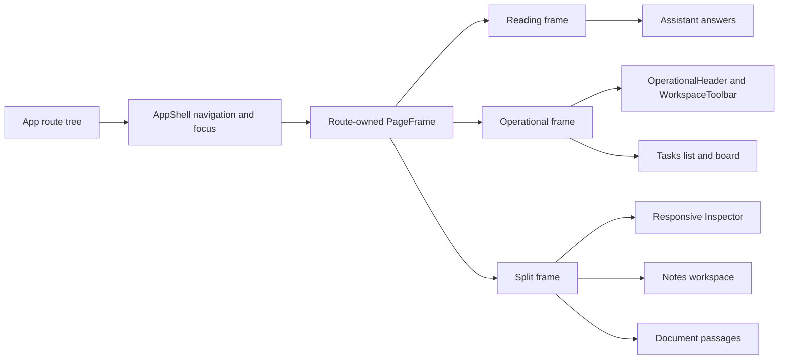

[CodeWiki](../../index.md) / [Artifacts](../index.md) / [Plans](index.md)

# Meridian UI/UX Refactor Implementation Plan

## Outcome and Boundaries

This plan delivered the approved frontend-only UI/UX refactor across the application shell, shared presentation primitives, Tasks, Assistant, Notes, Documents, Members, Review Queue, Audit Log, Pipeline Health, and supporting authentication and application states. Backend APIs, Supabase schemas and policies, query and mutation semantics, retrieval behavior, document ingestion rules, authentication, role enforcement, agent behavior, and navigation destinations remained outside the change.

Revision 2 closes implementation scheduling at the user's explicit direction. It does not declare the authenticated live-browser scope complete. VAL-01, VAL-02, and VAL-08 passed, while VAL-03 through VAL-07 and the corresponding live evidence for AC-01 through AC-07 remain outstanding and not passed.

## Approval and Closure Gate

Revision 2 is approved and execution is complete. The user first authorized implementation to continue without the unavailable authenticated Tasks review and subsequently directed the workflow to close with authenticated live-browser verification outstanding.

This closure is a workflow disposition rather than a validation waiver. It preserves VAL-03 as the safe resume point and does not infer responsive geometry, visual quality, authenticated role behavior, focus restoration, drag-and-drop behavior, keyboard completeness, reduced-motion behavior, theme contrast, or representative state behavior from static source inspection or jsdom tests.

## Current Architecture

`frontend/src/App.tsx` mounts authenticated product routes beneath `AppShell`, `RequireWorkspace`, `WorkspaceProvider`, and `RequireAuth`. `AppShell` retains navigation, route focus transfer, the mobile drawer, theme and account controls, and page-entry motion. Authenticated routes select a `reading`, `operational`, or `split` `PageFrame`, avoiding a universal content-width cap.

Tasks preserves URL-backed `view`, `sprint`, and `task` state and renders list or board compositions with `TaskDrawer` in the shared `Inspector`. Notes and Document Viewer use split frames, while Assistant retains a reading-oriented semantic answer sequence. Shared tokens and components provide semantic colors, focus treatment, responsive frames, bounded overflow, reduced-motion behavior, and a default 44-pixel control floor.

The frontend provides lint, TypeScript and Vite production build, and non-interactive Vitest commands. Four Testing Library suites cover deterministic frame, shell, task, inspector, trust, motion, note-continuity, role, audit, and metric-evidence contracts.

## Implemented Change Overview

Routes now own their canvas width through the shared `PageFrame`. `OperationalHeader` and `WorkspaceToolbar` standardize dense workspace hierarchy, and `Inspector` supplies responsive Radix Dialog framing while callers retain domain state, permissions, and mutations.

Tasks established the operational baseline before the same vocabulary was applied to Notes, Documents, Assistant, Members, and administration. The refactor retained existing paths, URL parameters, hooks, mutation payloads, authorization checks, trust evidence, ingestion states, and honest-data rules.

## Cross-Cutting Decisions

| Decision ID | Selected design | Compatibility constraint |
| --- | --- | --- |
| DEC-01 | Routes select a shared frame while `AppShell` retains navigation and focus ownership. | Paths and provider hierarchy remain unchanged. |
| DEC-02 | `PageHeader` serves simple and reading pages; `OperationalHeader` and `WorkspaceToolbar` serve dense routes. | Native control and heading semantics remain available. |
| DEC-03 | A shared Radix-backed `Inspector` owns edge-sheet framing. | Domain fields, permissions, mutations, and destructive confirmations remain with callers. |
| DEC-04 | Semantic frame, density, surface, overflow, duration, and easing tokens live in `index.css`. | Components do not introduce route-specific raw colors. |
| DEC-05 | Existing routes, redirects, URL parameters, hooks, payloads, role checks, and domain state are compatibility interfaces. | The refactor changes presentation and composition only. |
| DEC-06 | Density comes from alignment, fluid width, concise copy, and disclosure. | The default 44-pixel touch floor remains intact. |
| DEC-07 | Vitest and Testing Library cover deterministic behavior, while browser geometry and authenticated behavior remain live checks. | Automated evidence must not overstate jsdom capabilities. |

## Execution Steps

### STEP-01: Implement the Incremental Frontend UI/UX Refactor

✅ Status: complete

#### Objective

Implement the frontend presentation refactor through buildable checkpoints while leaving routing, state, permissions, and product evidence unchanged.

#### Definition of Done

Every affected frontend surface uses an approved frame or intentional unauthenticated composition, Tasks establishes the operational baseline, and the completed implementation passes lint and production build.

#### Technical Approach

The implementation introduced the shared frame, operational header, toolbar, inspector, semantic density, bounded overflow, and motion foundation before applying it to Tasks. It then migrated Notes, Documents, Document Viewer, Assistant, Members, Review Queue, Audit Log, Pipeline Health, Sign In, Welcome, and Not Found without changing domain behavior.

#### Changes

| File or component area | Resulting code shape | Compatibility impact |
| --- | --- | --- |
| `PageFrame`, `AppShell`, and `index.css` | Reading, operational, and split route canvases with semantic gutters, density, overflow, and motion. | Navigation, focus transfer, providers, and routes remain unchanged. |
| Shared headers, toolbar, controls, and `Inspector` | Composable operational hierarchy and responsive contextual edge sheets. | Native semantics and Radix focus behavior remain in place. |
| Tasks | Operational header, toolbar, list, board, sprint, proposal, quick-add, and inspector composition. | URL state, shortcuts, role boundaries, mutations, and DnD contracts remain intact. |
| Notes, Documents, and Assistant | Reading and split compositions with reduced-motion-aware programmatic scrolling. | Deep links, save lifecycle, citations, trust signals, and ingestion behavior remain intact. |
| Members and administration | Operational density, status, actions, evidence, and bounded table overflow. | Role gates, review decisions, attribution, and real denominators remain intact. |
| Supporting states | Consistent tokens, hierarchy, feedback, dialog, field, theme, and long-content treatment. | Authentication and navigation behavior remain unchanged. |

#### Acceptance and Validation

The full materialized frontend passed VAL-01. Authenticated browser evidence was intentionally retained outside STEP-01 and remains in the closure register as VAL-03 through VAL-07.

#### Recovery

Any later presentation defect should return to the owning component or route. VAL-01 and the focused tests must be rerun after correction.

#### Implementation Tracker

- [x] Add route-owned frames, operational headers, workspace toolbars, the reusable inspector, and semantic layout tokens.
- [x] Migrate Tasks while preserving parameters, shortcuts, permissions, mutations, and drag-and-drop contracts.
- [x] Migrate Notes, Documents, Document Viewer, Assistant, Members, and administration.
- [x] Align supporting unauthenticated pages and shared state components.
- [x] Pass lint and production build at the final materialized checkpoint.
- [x] Preserve unavailable authenticated review as explicit residual verification rather than inferred evidence.

### STEP-02: Add Focused Frontend Interaction Regression Tests

✅ Status: complete

#### Objective

Add bounded automated regression coverage for the refactor's highest-risk deterministic routing, interaction, accessibility, responsive-class, role, and trust contracts.

#### Definition of Done

The frontend has a non-interactive component test command and passing tests for frame and shell behavior, task context, inspector behavior, reduced-motion scrolling, notes continuity, roles, and trust evidence.

#### Technical Approach

Vitest, jsdom, Testing Library, jest-dom, and user-event are integrated with test-only fixtures and browser API shims. The suites assert observable state and interaction without claiming rendered geometry or authenticated runtime behavior.

#### Changes

| Test area | Protected contracts |
| --- | --- |
| `test_ui_foundations.tsx` | Frame modes, route focus, skip link, role navigation, mobile drawer, and inspector entry and dismissal. |
| `test_tasks_page.tsx` | URL state, shortcuts, Member and Admin controls, proposal wording, and task inspection. |
| `test_trust_and_motion.tsx` | Citation and retrieval evidence, confidence, groundedness, flags, and reduced-motion scrolling. |
| `test_continuity_and_admin_evidence.tsx` | Notes continuity, save status, administration restrictions, review wording, audit attribution, real denominators, and bounded table classes. |

#### Acceptance and Validation

VAL-02 passed four test files and all 20 tests, with zero failures and zero skipped tests.

#### Recovery

Browser-dependent geometry, pointer behavior, clipping, overflow, and authenticated state must remain live checks instead of being replaced by weaker jsdom assertions.

#### Implementation Tracker

- [x] Add the non-interactive test command and compatible development dependencies.
- [x] Configure jsdom, setup files, matchers, browser shims, TypeScript, and lint handling.
- [x] Add four focused component and interaction suites.
- [x] Pass all four files and 20 tests.
- [x] Retain browser-only limitations in the final verification register.

### STEP-03: Synchronize the Design-System Documentation

✅ Status: complete

#### Objective

Keep the repository design-system guide synchronized with the implemented frame, hierarchy, inspector, density, overflow, and motion contracts.

#### Definition of Done

`docs/design/design-system.md` uses current source identifiers, accurately describes implemented behavior, and has valid relative links.

#### Technical Approach

The update preserved existing identity, color, typography, honest-data, component, and accessibility guidance while documenting the implemented workspace composition and deterministic regression boundary.

#### Changes

| File | Result |
| --- | --- |
| `docs/design/design-system.md` | Documents frame modes, header responsibilities, toolbar behavior, inspector behavior, density, overflow ownership, motion durations, layered reduced-motion behavior, and focused regression coverage. |

#### Acceptance and Validation

VAL-08 passed through source comparison and a relative-link inspection of 18 referenced targets with zero missing targets.

#### Recovery

If public primitives or tokens change, reopen STEP-03, correct only affected documentation, and rerun VAL-08.

#### Implementation Tracker

- [x] Compare the guide with final frame, header, toolbar, inspector, token, motion, and test sources.
- [x] Update the guide using implemented identifiers and behavior only.
- [x] Verify all 18 relative source targets.
- [x] Retain browser-only evidence outside the source-backed documentation contract.

### STEP-04: Close Verification With Deterministic Evidence and Outstanding Live Checks

✅ Status: complete

#### Objective

Close the implementation workflow with complete deterministic evidence and a precise, resumable register of authenticated live-browser verification that could not be performed.

#### Definition of Done

VAL-01, VAL-02, and VAL-08 have passing evidence, the user has explicitly selected closure without live review, and VAL-03 through VAL-07 are recorded as not passed with their complete outstanding scope and VAL-03 safe resume point.

#### Technical Approach

Deterministic checks were run first in non-interactive CI mode. Because no configured authenticated runtime with representative Admin and Member workspaces was available, the browser phase could not begin. At the user's direction, the workflow closes without waiving or passing those live requirements.

Automated evidence covers compilation, lint, deterministic component behavior, source-backed documentation, and relative links. It does not establish rendered geometry, clipping, document overflow, theme contrast, real focus restoration, pointer drag-and-drop, authenticated route outcomes, or complete browser keyboard and reduced-motion behavior.

#### Validation Disposition

| Validation | Disposition | Evidence or outstanding scope |
| --- | --- | --- |
| VAL-01 | Passed | `CI=1 npm run lint` and `CI=1 npm run build` exited with code 0. |
| VAL-02 | Passed | Four Vitest files and 20 tests passed with zero failures and zero skipped tests. |
| VAL-03 | Outstanding, not passed | Authenticated routes, redirects, deep links, workspaces, and Admin and Member outcomes. |
| VAL-04 | Outstanding, not passed | Light and dark captures at 1440, 1024, 768, and 360 pixels; sparse, dense, and long-name data; clipping and overflow. |
| VAL-05 | Outstanding, not passed | Complete keyboard operation, focus return, announcements, and pointer and keyboard task DnD. |
| VAL-06 | Outstanding, not passed | Reduced-motion route, navigation, drawer, inspector, dialog, citation, drag, loading, and programmatic-scroll workflows. |
| VAL-07 | Outstanding, not passed | Empty, loading, failure, saving, uploading, processing, ready, grounded, flagged, permission, approval, and destructive states. |
| VAL-08 | Passed | Source comparison and 18 relative targets checked with zero missing. |

#### Acceptance and Validation

Only AC-08 and AC-09 have complete passing evidence. AC-01 through AC-07 remain partially supported by deterministic checks but lack their required authenticated live-browser evidence and therefore are not recorded as fully passed.

The production build transformed 5,255 modules and emitted only the existing non-blocking warning for the 1,589.62 kB minified main chunk. That warning did not fail the build.

#### Recovery

If verification resumes, reopen the plan at VAL-03 with representative authenticated Admin and Member workspaces. Continue through VAL-04, VAL-05, VAL-06, and VAL-07 in order. Route any discovered defect to its owning implementation or test step and rerun VAL-01 and VAL-02 after correction.

#### Implementation Tracker

- [x] Run VAL-01 and retain clean lint and production-build evidence.
- [x] Run VAL-02 and retain the complete 20-test interaction result.
- [x] Retain STEP-03's passing VAL-08 source comparison and 18-target link result.
- [x] Record VAL-03 as outstanding for authenticated routes, redirects, deep links, workspaces, and role outcomes.
- [x] Record VAL-04 as outstanding for all required viewports, themes, content densities, geometry, clipping, and overflow.
- [x] Record VAL-05 and VAL-06 as outstanding for keyboard, focus return, announcements, drag-and-drop, and reduced motion.
- [x] Record VAL-07 as outstanding for representative explicit and honest-data states.
- [x] Record VAL-03 as the safe resume point and close the workflow at the user's direction.

## Acceptance and Verification Matrix

| Acceptance ID | Observable result | Validation | Final evidence disposition |
| --- | --- | --- | --- |
| AC-01 | Reading, operational, and split canvases remain intentional. | VAL-01, VAL-03, VAL-04 | Deterministic evidence passed; authenticated route and viewport evidence remains outstanding. |
| AC-02 | Tasks retains URL context, roles, shortcuts, DnD, proposals, and inspection. | VAL-02, VAL-03, VAL-04, VAL-05 | Focused tests passed; authenticated browser, geometry, focus-return, and DnD evidence remains outstanding. |
| AC-03 | Affected routes use the approved visual system without behavior loss. | VAL-01, VAL-03, VAL-04, VAL-06, VAL-07 | Static evidence passed; authenticated visual, motion, and state evidence remains outstanding. |
| AC-04 | Routes, roles, trust signals, destructive actions, and data behavior remain protected. | VAL-02, VAL-03, VAL-05, VAL-07 | Deterministic tests passed; authenticated route, keyboard, and state evidence remains outstanding. |
| AC-05 | Required widths work with only locally bounded horizontal overflow. | VAL-02, VAL-04 | Responsive class contracts passed; rendered geometry and overflow remain outstanding. |
| AC-06 | Accessibility and reduced-motion behavior remain available. | VAL-02, VAL-05, VAL-06 | Deterministic focus entry, dismissal, and scroll selection passed; complete browser evidence remains outstanding. |
| AC-07 | Themes, semantic colors, and honest states remain coherent. | VAL-04, VAL-07 | Source-backed contracts exist; live theme, contrast, and representative-state evidence remains outstanding. |
| AC-08 | Frontend quality gates pass. | VAL-01, VAL-02 | Passed. |
| AC-09 | Design-system documentation matches implementation. | VAL-08 | Passed. |

## Risks and Open Decisions

| Risk ID | Concrete failure mode | Mitigation or recovery |
| --- | --- | --- |
| RISK-01 | A route has incorrect rendered spacing or width despite valid static frame classes. | Resume VAL-03 and VAL-04 in an authenticated browser. |
| RISK-02 | Dense controls or inspectors have browser-only focus, keyboard, touch, or clipping defects. | Resume VAL-04 through VAL-06 and return defects to the owning component. |
| RISK-03 | URL-controlled inspector dismissal does not restore focus correctly to the real task opener. | Verify actual opener focus return during VAL-05. |
| RISK-04 | Themes or representative states expose contrast, semantic-color, or honest-data defects. | Complete VAL-04 and VAL-07 with representative Admin and Member data. |
| RISK-05 | Automated tests are interpreted as proof of browser geometry or authenticated behavior. | Keep the closure and validation tables explicit that VAL-03 through VAL-07 are not passed. |
| RISK-06 | The existing large bundle affects runtime performance despite a successful build. | Treat the non-blocking warning separately from this UI/UX validation workflow. |

There are no unresolved architectural decisions in revision 2. The outstanding work is verification evidence, not an unresolved implementation design. The workflow is complete only in the user-approved scheduling sense; authenticated live-browser validation remains incomplete.

## Execution Record

### 2026-09-18 — STEP-01 Implementation Complete

The route-owned frame foundation, shared operational hierarchy, inspector, tokens, Tasks baseline, route migrations, and supporting-state alignment were completed. Final lint and production build passed, with only the existing non-blocking bundle-size warning. Authenticated route, viewport, theme, keyboard, focus-return, overflow, DnD, reduced-motion, and representative-state checks remained assigned to STEP-04.

### 2026-09-18 — STEP-02 Focused Regression Coverage Complete

The non-interactive Vitest and Testing Library harness and four focused suites were completed. `npm run test` passed all four files and 20 tests. Browser geometry, pointer DnD, real task-opener focus restoration, and authenticated behavior were retained as live checks rather than inferred from jsdom.

### 2026-09-18 — STEP-03 Design-System Synchronization Complete

`docs/design/design-system.md` was synchronized with the implemented route frames, operational headers, toolbar, inspector, density, overflow, motion, reduced-motion, and test contracts. VAL-08 checked 18 relative link targets and found zero missing targets.

### 2026-09-18 — STEP-04 Deterministic Verification Complete

Corrected CI-mode runs of `npm run lint`, `npm run build`, and `npm run test` each recorded exit code 0. Vitest 5.0.1 reported four passing files, 20 passing tests, zero failures, zero skipped tests, and a 7.93-second duration. Vite 8.3.0 transformed 5,255 modules and completed its build phase in 530 ms. The only build notice was the existing non-blocking warning for the 1,589.62 kB minified main chunk.

An initial shell exit-marker footer used zsh's reserved read-only `status` variable after the commands had otherwise produced successful output. The commands were rerun using `rc`, all three recorded exit code 0, and all shell wrappers were terminated.

### 2026-09-18 — Revision 2 Workflow Closure With Live Verification Outstanding

At the user's explicit direction, STEP-04 and the top-level execution lifecycle were closed after deterministic validation. No authenticated runtime with representative Admin and Member workspaces was available, so no live-browser evidence was produced or inferred.

VAL-03 through VAL-07 and the corresponding live evidence for AC-01 through AC-07 remain outstanding and not passed. This includes authenticated routes and roles, responsive geometry and clipping, document and bounded overflow, light, dark, and system-theme contrast, actual inspector focus return, pointer and keyboard drag-and-drop, complete keyboard and announcement behavior, reduced-motion workflows, and representative application states.

No runtime cleanup was required for the documentation-only closure. The next safe resume point is VAL-03 with authenticated representative Admin and Member workspaces, followed by VAL-04 through VAL-07 in order.
