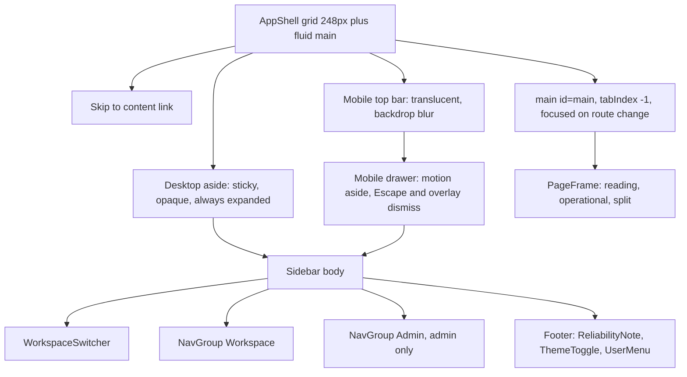

[CodeWiki](../../index.md) / [Artifacts](../index.md) / [UI/UX](index.md)

# Meridian UI Redesign Baseline: Sidebar, Task Workspace, Agent Proposals, and Landing Surface

## Purpose and Scope

This artifact establishes the redesign baseline for the approved follow-on UI/UX work, which asks for a collapsible liquid-glass sidebar, a more capable and professional task workspace, a substantially more compact agent-proposal area so that tasks become visible sooner, and a more polished landing page. It records exactly what the four target surfaces do today, explains why the reported "too simple and empty" impression is produced by the current composition, and identifies the specific behavior-preserving changes that the redesign can safely make.

The audit is deliberately narrow. It covers `frontend/src/layouts/AppShell.tsx`, `frontend/src/routes/TasksPage.tsx`, `frontend/src/tasks/ProposalsPanel.tsx`, `frontend/src/routes/Welcome.tsx`, and the shared tokens and primitives those surfaces depend on. Backend behavior, Supabase schemas and policies, query and mutation semantics, retrieval and ingestion rules, authentication, role enforcement, agent behavior, and the set of routes are all outside the redesign boundary and are treated here as protected contracts rather than change candidates.

This document contains no source changes. Every code block in it is illustrative and non-normative; it exists to show the shape a safe change would take so that implementation can be scheduled and reviewed against a concrete baseline.

## Method and Evidence

The baseline was derived by reading the current implementation directly rather than by relying on previous narrative documentation. The route tree in `frontend/src/App.tsx` was used to confirm which surfaces are mounted where and which frame each authenticated route selects. The shell, the four target surfaces, and the shared primitives they compose were then read in full, followed by the design tokens in `frontend/src/index.css` and the deterministic regression contracts in `frontend/src/__tests__/test_ui_foundations.tsx`.

No authenticated runtime, browser session, or screenshot capture was available during this audit, which matches the limitation already recorded in the saved implementation plan at `kavia-docs/CodeWiki/Artifacts/Plans/meridian-ui-ux-refactor-implementation-plan.md`. Every structural claim below is therefore traceable to source, while all statements about rendered geometry, contrast, perceived density, and measured vertical offsets are explicitly marked as estimates that require live verification.

### Correction to the Previous Audit

The earlier [Meridian UI/UX Baseline and Refactor Audit](meridian-ui-ux-baseline-and-refactor-audit.md) predates the completed refactor and no longer matches the code in two structurally important ways. It describes a 256-pixel desktop sidebar, whereas `AppShell` now uses a 248-pixel grid column, and it describes a universal `max-w-[1080px]` content cap inside `AppShell`, whereas width is now owned per route by `frontend/src/layouts/PageFrame.tsx` through the `reading`, `operational`, and `split` modes. The present document supersedes those two specific observations; the remainder of the older audit's product-identity, trust, accessibility, and motion analysis still applies.

## Current Composition of the Authenticated Shell

The authenticated shell is a two-column CSS grid above the large breakpoint and a top-bar-plus-drawer arrangement below it. The desktop sidebar is a fixed-width, fully opaque, permanently expanded column, and there is no collapse state, no width preference, and no persisted user choice anywhere in the component.

```tsx
<div className="min-h-dvh lg:grid lg:grid-cols-[248px_minmax(0,1fr)]">
  <aside className="sticky top-0 hidden h-dvh border-r border-rule bg-paper lg:block">
    <Sidebar layoutGroup="desktop" />
  </aside>
```

The sidebar body is a vertical flex column with the workspace switcher at the top, a scrollable primary navigation region in the middle, and a footer that stacks the compact reliability note, the theme toggle, and the user menu. Primary navigation is split into a `Workspace` group containing Tasks, Assistant, Notes, Documents, and Members, and an `Admin` group containing Review queue, Audit log, and Pipeline health that renders only when `useWorkspace().isAdmin` is true. Each destination is a `NavLink` with a 40-pixel minimum height, a 14.5-pixel label, an icon that switches to `fill` weight when active, and a shared spring-animated cobalt rail positioned by `layoutId={`nav-meridian-${layoutGroup}`}`.

Two behaviors in the shell are accessibility infrastructure rather than styling. A visually hidden skip link targets `#main`, and a `useEffect` keyed on `location.pathname` moves focus into the main region after every navigation so that screen readers announce the new page.

```tsx
useEffect(() => {
  mainRef.current?.focus({ preventScroll: true })
}, [location.pathname])
```



### Where the "Liquid Glass" Language Does and Does Not Exist Today

The glass treatment the request asks for is currently absent from the desktop sidebar, which is painted with the flat `bg-paper` token and separated from content only by a one-pixel `border-rule` edge. The only translucency in the shell is the mobile top bar, which uses `bg-paper/90` with `backdrop-blur`, and the shared inspector overlay in `frontend/src/components/Inspector.tsx`, which uses `bg-black/25` with `backdrop-blur-[1px]`.

Equally important, `frontend/src/index.css` contains no tokens for translucency, blur radius, glass border, or glass highlight. It defines semantic colors, frame widths, a `--density-row` value of 42 pixels, three motion durations, one easing curve, and four shadow recipes. A liquid-glass sidebar therefore needs new named tokens defined once for light and redefined for dark, rather than ad-hoc opacity utilities scattered through the shell.

## Current Composition of the Tasks Workspace

Tasks is mounted inside an `operational` frame and renders five stacked blocks separated by a `gap-5` column before any work item appears: the operational header, the workspace toolbar, the sprint bar, the agent-proposal panel, and finally the list or board. The drawer for the selected task is rendered last and presented through the shared inspector.

```tsx
<div className="flex flex-col gap-5">
  <OperationalHeader eyebrow="Workspace tasks" title="Tasks" description={...} actions={viewTabs} />
  <WorkspaceToolbar label="Task filters" trailing={...}>...</WorkspaceToolbar>
  <SprintBar board={sprints.data} tasks={allTasks} scope={scope} onScope={...} canManage={isAdmin} />
  ...
  <ProposalsPanel proposals={board.data.proposals} />
```

The page already carries more capability than its appearance suggests. View, sprint scope, and the open task are all URL-backed through `useSearchParams`, so the current arrangement is deep-linkable and shareable. Filtering is client-side over `board.data.tasks` through `scopeTasks`, `filterTasks`, and `buildTree`, the open and done counters are derived from the scoped set, the `/` shortcut focuses the filter field while correctly ignoring events originating inside inputs and dialogs, and `QuickAdd` binds the `n` shortcut with the same guard. Hierarchy, progress, due dates, priority, and assignee are all surfaced by the list row without opening the task.

### The Vertical Prelude Problem

The reported symptom that tasks appear too late is a direct consequence of how much fixed chrome precedes them. Using the class values in the source, the prelude is approximately an eyebrow line plus a 27-to-30-pixel title plus a description line plus 20 pixels of bottom padding for the header, roughly 40 pixels of control height plus 10 pixels of vertical padding for the toolbar, a 36-pixel sprint tab row that grows by a second bordered row whenever an Admin selects a specific sprint, and four 20-pixel gaps between blocks. Before a single proposal is rendered, the estimated offset to the first task row is already in the region of 260 to 300 pixels, and each additional element adds to it. These figures are estimates computed from Tailwind class values and require live measurement.

The second contributor is horizontal rather than vertical. The header reserves `max-w-[72ch]` for identity and description text and pushes the view tabs to the far right, while the toolbar constrains the filter field to `w-[min(20rem,calc(100vw-5rem))]`. On a 1440-pixel-wide operational frame this leaves a wide band of empty surface between the filter controls and the trailing permission hint, which is the most likely source of the "empty" impression on an otherwise dense page.

The third contributor is that none of this chrome is sticky. Once a user scrolls into a long task list, the identity, counters, view tabs, filter field, and sprint scope all scroll away, so the workspace loses exactly the persistent context a professional task tool is expected to keep.

## Current Composition of the Agent-Proposal Area

`ProposalsPanel` returns `null` when there are no proposals, which is correct and should be preserved. When proposals exist, it renders an accent-washed section with a header row and then one fully expanded card per proposal, with no collapse, no truncation, and no cap on how many cards are shown.

```tsx
<li key={proposal.id} className="flex flex-col gap-3 rounded-(--radius-control) border border-rule bg-surface p-4 sm:flex-row sm:items-start">
  <div className="min-w-0 flex-1">
    <p className="flex items-center gap-2 font-medium text-ink">...</p>
    {payload.description && <p className="mt-1 text-sm text-ink-2">{payload.description}</p>}
    <p className="mt-2 text-sm text-ink-2">
      <span className="font-medium text-ink-3">Why: </span>
      {proposal.reasoning}
    </p>
  </div>
```

Each card therefore occupies a title line, an optional multi-line description, and a full and unabbreviated reasoning paragraph, inside 16 pixels of padding, with a 10-pixel gap to the next card. Three proposals with two-line reasoning can plausibly consume 400 or more vertical pixels on their own, which means the first task row can be pushed entirely below the fold on a laptop viewport. This is the single largest cause of the reported complaint that tasks are not visible soon enough.

The panel also carries product-critical semantics that a compaction pass must not lose. Approval and rejection controls render only for Admins, the mutation identity check `approve.variables === proposal.id` scopes the pending state to the row being decided, and the explanatory copy differentiates the Admin case from the Member case.

```tsx
<p className="w-full text-sm text-ink-2 sm:ml-auto sm:w-auto">
  {isAdmin ? 'Nothing is added until you approve it.' : 'Waiting for an Admin to approve or reject.'}
</p>
```

The saved implementation plan records that proposal wording is asserted by `frontend/src/__tests__/test_tasks_page.tsx`, so any compaction that hides or rephrases this sentence must either keep the string reachable in the accessibility tree or update that suite in the same change.

## Current Composition of the Landing Surface

The surface the request calls the landing page is `frontend/src/routes/Welcome.tsx`, the authenticated first-run page mounted at `/welcome` inside `WorkspaceProvider` but outside `RequireWorkspace`. It is not a marketing page and it is not the unauthenticated entry point; `frontend/src/App.tsx` mounts `SignIn` separately at `/signin`. `Welcome` also redirects away as soon as membership exists, so it is only ever seen by a signed-in person who belongs to no workspace.

```tsx
if (!loading && workspaces.length > 0) return <Navigate to="/tasks" replace />
```

Its structure is a slim header holding the wordmark, the theme toggle, and a sign-out control, and a single `max-w-md` column centered by `my-auto` that contains a 34-to-40-pixel display heading, one explanatory paragraph, the workspace creation form inside a bordered panel, and a closing hint that names the signed-in email for people who expect to be invited instead. A loading branch replaces the column with three skeletons.

The emptiness here is structural rather than accidental. A 448-pixel column on a page whose header is constrained to `max-w-5xl` leaves most of a desktop viewport unused, and the page communicates nothing about what Meridian actually does, even though the product's differentiating evidence, its citation-backed answers, visible confidence, human review, and explicit agent approval, is exactly what a first-run page should preview. Every claim such a page makes must be a genuine product behavior; inventing statistics, logos, or testimonials would violate the honest-data rule the rest of the application follows.

## Baseline Summary Table

| Surface | Primary file | Verified current state | Reported gap |
| --- | --- | --- | --- |
| Desktop sidebar | `frontend/src/layouts/AppShell.tsx` | Fixed 248-pixel opaque column, always expanded, no width preference | No collapse affordance and no glass material |
| Mobile navigation | `frontend/src/layouts/AppShell.tsx` | Translucent top bar plus animated drawer with Escape and overlay dismissal | Already acceptable; must not regress |
| Tasks chrome | `frontend/src/routes/TasksPage.tsx` | Five stacked non-sticky blocks before the first row | Work starts too low and desktop width is underused |
| Sprint scope | `frontend/src/tasks/SprintBar.tsx` | Tab row plus a conditional second management row | Adds a variable-height band to the prelude |
| Agent proposals | `frontend/src/tasks/ProposalsPanel.tsx` | Unbounded list of fully expanded cards with full reasoning | Dominates the viewport and delays tasks |
| Landing surface | `frontend/src/routes/Welcome.tsv` | Single 448-pixel column with one form and no product preview | Feels unfinished and unexplained |

The landing-surface row above refers to `frontend/src/routes/Welcome.tsx`; the file extension is given correctly in every other reference in this document.

## Safe, Behavior-Preserving Change Candidates

### Sidebar: Collapse State and Glass Material

The collapse work is safe because the sidebar's contents are already components with their own state and the grid column is the only geometry to parameterize. The recommended approach keeps `AppShell` as the owner of layout and focus, introduces a boolean collapse preference persisted the same way the theme preference is persisted by `ThemeProvider`, and drives the grid through a token so that the collapsed and expanded widths stay in one place.

```tsx
// Illustrative only.
<div
  className="min-h-dvh lg:grid"
  style={{
    gridTemplateColumns: `${collapsed ? 'var(--rail-collapsed)' : 'var(--rail-expanded)'} minmax(0,1fr)`,
  }}
>
```

Collapsing must not remove accessible names. When labels are hidden, each `NavLink` needs an `aria-label` or a tooltip that exposes the same text, because `test_ui_foundations.tsx` queries destinations by their accessible names such as `Review queue`, `Audit log`, and `Pipeline health`. The collapse control itself needs a stable accessible name and an `aria-expanded` state, mirroring the existing `Open navigation` button. The glass material should be expressed as new semantic tokens rather than inline utilities.

```css
/* Illustrative only. */
@theme {
  --rail-expanded: 248px;
  --rail-collapsed: 72px;
  --glass-surface: rgb(244 245 242 / 0.72);
  --glass-blur: 14px;
  --glass-edge: rgb(17 20 24 / 0.08);
}

[data-theme='dark'] {
  --glass-surface: rgb(13 15 18 / 0.66);
  --glass-edge: rgb(255 255 255 / 0.06);
}
```

Three constraints apply. Translucency must keep text contrast acceptable in both themes, so the glass layer needs a sufficiently opaque base rather than a thin tint over arbitrary scrolled content. The collapse transition must be motion-preference aware, which the shell already supports through `useReducedMotion` alongside the global `prefers-reduced-motion` rule in `index.css`. Finally, the `layoutId={`nav-meridian-${layoutGroup}`}` marker must keep distinct desktop and mobile identifiers, because a collapsed rail is still the `desktop` group and sharing an identifier across two mounted sidebars would animate the marker between them.

### Tasks: A Consolidated, Sticky Workspace Bar

The safe change is compositional. Identity, counters, view tabs, filter, completion toggle, and sprint scope can be consolidated into a single sticky workspace bar that occupies one or two rows instead of three or four stacked blocks, while every handler, URL parameter, and derived count continues to come from the existing code in `TasksPage`. Because the toolbar already carries the `bounded-overflow` utility, horizontal compression can be absorbed locally without introducing document-level horizontal scrolling, which `index.css` additionally guards with `overflow-x: clip` on `body`.

```tsx
// Illustrative only: same state, fewer bands, and persistent context.
<div className="sticky top-0 z-20 -mx-[var(--frame-gutter)] px-[var(--frame-gutter)] py-3 backdrop-blur">
  <div className="flex flex-wrap items-center gap-3">
    <h1 className="font-display text-[22px] font-semibold tracking-[-0.03em] text-ink">Tasks</h1>
    <span className="text-sm text-ink-2">
      <span className="font-medium text-ink tabular">{openCount}</span> open ·{' '}
      <span className="font-medium text-ink tabular">{doneCount}</span> done
    </span>
    <div className="ml-auto flex items-center gap-2">{viewTabs}</div>
  </div>
</div>
```

The description sentence that currently names the active workspace should not simply be deleted, because it is the only place the page states its scope. Moving it into the eyebrow line or the sprint scope control keeps the information while removing a dedicated text row. Capability can be added without touching the data layer by making better use of the reclaimed width: a grouping or sort selector over the already-loaded task array, a visible count of matches when a filter is active, and a clearer empty-filter state are all presentation-level additions over `filterTasks` and `buildTree` output.

Three contracts must survive this work. The `/` and `n` shortcuts must keep their existing guard against events originating in inputs, textareas, selects, editable regions, and dialogs. The `view`, `sprint`, and `task` parameters must keep their current names and their `replace` semantics for `view`. The board must keep its bounded horizontal scroll rather than forcing the page to scroll.

### Agent Proposals: Compact by Default, Complete on Demand

The compaction should convert each proposal from a fully expanded card into a single dense row that shows priority, title, and due date, with the description and the `Why` reasoning behind a per-row disclosure. A collapsed panel summary and a cap on simultaneously visible rows, with an explicit control to reveal the remainder, keeps the panel's height bounded no matter how many proposals the agent produces.

```tsx
// Illustrative only: dense row with on-demand reasoning.
<li className="flex min-h-10 items-center gap-2 border-b border-rule/60 px-2 last:border-b-0">
  {payload.priority && payload.priority !== 'none' && <PriorityIcon priority={payload.priority} />}
  <span className="truncate text-sm font-medium text-ink">{payload.title || 'Untitled proposal'}</span>
  {payload.due_date && <span className="font-mono text-xs text-ink-3">due {formatDue(payload.due_date)}</span>}
  <button
    type="button"
    aria-expanded={expanded}
    aria-controls={`proposal-why-${proposal.id}`}
    className="ml-auto cursor-pointer text-xs text-ink-2 underline-offset-2 hover:underline"
  >
    Why
  </button>
</li>
```

The redesign must not make approval feel automatic. Rejection and approval must remain Admin-only and must remain reachable without first expanding a row, because a compaction that buries the decision controls would trade one usability problem for a worse one. The per-proposal pending scoping through `approve.variables` and `reject.variables` must be preserved so that deciding one proposal does not appear to disable all of them. The `null` return for an empty proposal array must stay, since it is what keeps the panel out of the prelude entirely in the common case. The Admin and Member sentences must remain in the accessibility tree, and if they move into a tooltip or summary line, `test_tasks_page.tsx` must be updated in the same change rather than afterwards.

### Landing Surface: A Two-Column First-Run Page

The polish work for `Welcome` is safe because the page has only one behavior: create a workspace, or wait to be invited. The recommended structure keeps the creation form as the primary action in one column and adds a second column that previews genuine product behavior, so the page explains Meridian instead of merely asking for a name. On narrow viewports the columns stack with the form first, preserving the current mobile experience and the `autoFocus` behavior of `CreateWorkspaceForm`.

```tsx
// Illustrative only.
<main className="mx-auto grid w-full max-w-5xl gap-10 py-12 lg:grid-cols-[minmax(0,26rem)_minmax(0,1fr)] lg:items-start">
  <section>{/* heading, paragraph, CreateWorkspaceForm, invite hint */}</section>
  <aside aria-label="What a workspace gives you" className="hidden lg:block">
    {/* citation, confidence, review, and approval evidence drawn from real product behavior */}
  </aside>
</main>
```

Anything the second column claims must correspond to implemented behavior, such as answers citing the exact passage they used, confidence being shown and labelled uncalibrated as `ReliabilityNote` already states, low-confidence or ungrounded answers going to a person for review, and agent-proposed tasks requiring explicit approval. Fabricated metrics, customer names, or screenshots of features that do not exist are out of bounds. The redirect to `/tasks`, the loading skeleton branch, the theme toggle, the sign-out control, and the named-email invite hint must all be retained.

## Protected Behavior and Guardrails

| Contract | Where it lives | Why the redesign must not change it |
| --- | --- | --- |
| Route set, redirects, and deep links | `frontend/src/App.tsx` | The redesign is presentational; navigation surface area is fixed |
| Route-owned frame widths | `frontend/src/layouts/PageFrame.tsx` | `reading`, `operational`, and `split` are asserted by `test_ui_foundations.tsx` |
| Skip link and post-navigation focus | `frontend/src/layouts/AppShell.tsx` | Asserted by name and `href="#main"`, and by focus landing on `main` |
| Admin-only destinations | `frontend/src/layouts/AppShell.tsx` | Asserted present for Admins and absent for Members |
| Mobile drawer dismissal | `frontend/src/layouts/AppShell.tsx` | Asserted through the `Navigation` dialog and link-click dismissal |
| Inspector focus and dismissal | `frontend/src/components/Inspector.tsx` | Asserted for accessible name, description, close control, and Escape |
| URL-backed task state | `frontend/src/routes/TasksPage.tsx` | `view`, `sprint`, and `task` are shareable application state |
| Keyboard shortcuts | `frontend/src/routes/TasksPage.tsx`, `frontend/src/tasks/QuickAdd.tsx` | `/` and `n` must keep their input and dialog guards |
| Approval boundary | `frontend/src/tasks/ProposalsPanel.tsx` | Nothing may imply a proposal already changed workspace data |
| Reduced motion | `frontend/src/index.css`, `useReducedMotion` in the shell | New collapse and panel motion needs a reduced-motion equivalent |
| Touch target floor | Shared controls and `min-h-10` usage | Density must come from alignment and disclosure, not smaller targets |
| Citation color reservation | `--color-mark` in `frontend/src/index.css` | Yellow stays exclusive to cited passages, including on any new surface |

## Risks

| Risk | Concrete failure mode | Mitigation |
| --- | --- | --- |
| Glass contrast | Translucent rail over scrolled content reduces label legibility in one theme | Define per-theme glass tokens and verify contrast in light, dark, and system modes |
| Lost accessible names | A collapsed rail hides labels and breaks name-based queries and screen-reader use | Provide `aria-label` or tooltips, and rerun the foundations suite |
| Hidden decisions | Compacting proposals buries Approve and Reject behind disclosure | Keep decision controls on the collapsed row for Admins |
| Test drift | Proposal wording or navigation names change without updating suites | Treat `test_tasks_page.tsx` and `test_ui_foundations.tsx` as part of the same change |
| Sticky overlap | A sticky workspace bar overlaps the inspector, drawer, or dialogs | Keep the sticky bar below the existing overlay z-indices |
| Overclaiming on landing | New first-run content asserts behavior the product lacks | Restrict copy to verifiable behavior already implemented |
| Unverified geometry | Estimated offsets and densities are mistaken for measured results | Resume live verification at `VAL-03` in the saved plan |

## Validation Criteria for the Redesign

Structural verification should confirm that the collapse preference survives reload, that both collapsed and expanded states expose every destination by accessible name, that the collapse control reports its state, and that the desktop and mobile navigation markers remain independent. On the Tasks route, the first task row should be reachable without scrolling at 1440 and 1024 pixels with a representative dataset and at least three pending proposals, the workspace bar should remain visible while the list scrolls, and only the board or a bounded table may scroll horizontally.

Behavioral verification should confirm that `/` still focuses the filter, that `n` still opens the composer, that both remain inert inside inputs and dialogs, that `view`, `sprint`, and `task` still round-trip through the URL, that Members still see no approval controls, and that deciding one proposal leaves the others actionable. The landing surface should still redirect once membership exists, still show its loading skeletons, and still autofocus the workspace name field.

Accessibility and motion verification should confirm visible focus, focus return after the inspector and drawer close, unchanged 44-pixel effective targets, and a reduced-motion path in which the sidebar collapse, the proposal disclosure, and any new landing motion resolve immediately without losing state. Theme verification should cover light, dark, and system with the glass rail over both sparse and dense content.

As recorded in the saved plan, the deterministic gates `VAL-01`, `VAL-02`, and `VAL-08` have passed for the previous refactor, while `VAL-03` through `VAL-07` remain outstanding. This redesign adds new live-verification obligations on top of that backlog, and `VAL-03` remains the safe resume point once an authenticated runtime with representative Admin and Member workspaces is available.

## Out of Scope and Open Questions

The redesign does not change backend endpoints, Supabase schemas or policies, query keys, mutation payloads, agent behavior, retrieval or ingestion rules, authentication, or the role model. It does not add or remove routes, and it does not alter the Assistant, Notes, Documents, Document Viewer, Members, Review Queue, Audit Log, or Pipeline Health compositions except where they consume a changed shared primitive such as the shell rail.

Three questions remain open and should be settled during implementation rather than assumed here. The collapsed rail width is unknown until icon-only navigation is tested with the existing 18-pixel icons and the 44-pixel target floor, so the 72-pixel value used above is a starting proposal only. The persistence mechanism for the collapse preference is unverified in this audit, since `frontend/src/theme/ThemeProvider.tsx` was not read, and the implementation should follow whatever pattern that provider already establishes. Finally, whether the proposal panel should cap visible rows by count or by height depends on real proposal volume, which cannot be determined from source alone.
