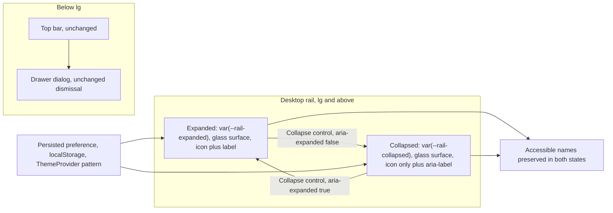

[CodeWiki](../../index.md) / [Artifacts](../index.md) / [UI/UX](index.md)

# Meridian UI Redesign Target and Guardrails: Collapsible Glass Rail, Task Command Bar, Compact Proposals, and First-Run Landing

## Status and Purpose

This document defines the approved, behavior-preserving redesign target for the four surfaces named in the follow-on UI request: the navigation rail, the Tasks workspace, the agent-proposal area, and the authenticated first-run landing surface. It converts the completed [Meridian UI Redesign Baseline](meridian-ui-redesign-baseline-audit.md) from a description of what exists into a decision record of what must be built, what must not change, and how completion will be judged.

The request that motivates this target is explicit about the felt problems rather than the mechanism. The interface reads as too plain, the sidebar is a flat permanent column with no collapse and no material, the Tasks route does not feel like a real task tool, the agent-proposal block consumes so much vertical space that the tasks themselves sit far down the page, and the first page a new person sees is sparse and unexplained. This target therefore commits to four outcomes: a collapsible rail with a genuine glass material expressed as theme-aware tokens, a consolidated and persistent task command bar that keeps working context on screen, an agent-proposal area that is compact by default and complete on demand, and a first-run page that explains Meridian using only behavior the product actually implements.

This is not an implementation plan. It defines the target, the resolved design decisions that the audit deliberately left open, the file-level scope boundary, the protected behavior contract, and the measurable completion criteria. Sequencing, task breakdown, and execution records belong in the [implementation plans](../Plans/index.md) section. Every code block below is illustrative and non-normative; it exists to make the intended shape unambiguous, not to prescribe final syntax.

## Evidence Base and Corrections to the Baseline

This target was written against the current implementation, re-read in full rather than inherited from narrative documentation. The grounding sources are `frontend/src/layouts/AppShell.tsx`, `frontend/src/layouts/PageFrame.tsx`, `frontend/src/routes/TasksPage.tsx`, `frontend/src/tasks/ProposalsPanel.tsx`, `frontend/src/tasks/SprintBar.tsx`, `frontend/src/components/OperationalHeader.tsx`, `frontend/src/components/WorkspaceToolbar.tsx`, `frontend/src/routes/Welcome.tsx`, `frontend/src/theme/ThemeProvider.tsx`, the token definitions in `frontend/src/index.css`, and the two regression suites `frontend/src/__tests__/test_ui_foundations.tsx` and `frontend/src/__tests__/test_tasks_page.tsx`.

The baseline audit's structural observations are confirmed. The desktop rail is a `248px` grid column painted with the flat `bg-paper` token and separated by a single `border-rule` edge, with no collapse state and no persisted width preference anywhere in `AppShell`. The token block in `index.css` defines colors, radii, frame widths, a `--density-row` of `42px`, three durations, one easing curve, and four shadow recipes, and it defines nothing for translucency, blur, glass edges, or rail widths. Tasks still renders five stacked blocks separated by `gap-5` before the first work item, and `ProposalsPanel` still renders one fully expanded card per proposal with an unabbreviated reasoning paragraph and no cap.

### Correction: Proposal Wording Is Not Currently Test-Locked

The baseline audit records that the agent-proposal wording is asserted by `frontend/src/__tests__/test_tasks_page.tsx`, and that assumption must be corrected before implementation relies on it. That suite mocks the panel away entirely:

```tsx
vi.mock('../tasks/ProposalsPanel', () => ({
  ProposalsPanel: () => <p>Proposal evidence</p>,
}))
```

Consequently no existing assertion covers the `Proposed by the agent` heading, the `Nothing is added until you approve it.` Admin sentence, the `Waiting for an Admin to approve or reject.` Member sentence, the Admin-only visibility of Approve and Reject, or the per-proposal pending scoping through `approve.variables`. The practical effect is the opposite of reassuring. Compacting the panel is not blocked by a test, which also means a regression in the approval boundary would pass silently. This target therefore treats new coverage for `ProposalsPanel` as part of the redesign rather than as optional follow-up work, and it treats the approval boundary as a contract enforced by a test that must be written, not by one that already exists.

What `test_tasks_page.tsx` does lock is the surrounding Tasks chrome: the `List` and `Board` tab names and their `aria-selected` state, the `Task board` region, the `Filter tasks` searchbox name, the `New task title` textbox reached by the `n` shortcut, the exact Member sentence `You can change task status. Admins add and edit tasks.`, the absence of an `Add task` button and a `Shortcut: N` label for Members, and the URL round-trip for `view`, `sprint`, and `task`. The `test_ui_foundations.tsx` suite locks the skip link `href="#main"`, post-navigation focus on `main`, the Admin destination accessible names `Review queue`, `Audit log`, and `Pipeline health`, mobile drawer dismissal through the `Navigation` dialog, the inspector's accessible name, description, `Close` control and Escape dismissal, and the `PageFrame` class contract for `reading`, `operational`, and `split`.

One further clarification matters for scoping. `TasksPage.tsx` itself contains no `PageFrame` wrapper; it returns a bare `flex flex-col gap-5` column, and the `operational` canvas is applied by the route element outside the component. Any sticky treatment inside Tasks therefore has to cooperate with a gutter and width it does not own, which is why the target below specifies the sticky band in terms of `--frame-gutter` rather than absolute padding.

## Approved Redesign Target

### Collapsible Liquid-Glass Navigation Rail

The rail remains the single global navigation layer and keeps its present contents in their present order: the workspace switcher, the `Workspace` group containing Tasks, Assistant, Notes, Documents and Members, the conditional `Admin` group, and the footer stack of `ReliabilityNote`, `ThemeToggle` and the user menu. What changes is that the rail acquires two width states, a real material, and a persisted preference.

In the expanded state the rail is visually similar to today at `248px` but is painted with the new glass material instead of flat `bg-paper`. In the collapsed state it becomes an icon rail that shows the same destinations in the same order, with labels removed from the visual layer but retained in the accessibility tree. The collapse control lives in the rail itself, has a stable accessible name, and reports `aria-expanded`, mirroring the existing `Open navigation` pattern in the mobile top bar. The preference survives reload.

The material must be defined once as semantic tokens and redefined for dark, exactly as every other color in the system is, so that no component reaches for ad-hoc opacity utilities:

```css
/* Illustrative only. Tokens belong in the existing @theme block in frontend/src/index.css. */
@theme {
  --rail-expanded: 248px;
  --rail-collapsed: 72px;
  --glass-surface: rgb(244 245 242 / 0.72);
  --glass-raised: rgb(255 255 255 / 0.55);
  --glass-edge: rgb(17 20 24 / 0.08);
  --glass-blur: 14px;
}

[data-theme='dark'] {
  --glass-surface: rgb(13 15 18 / 0.66);
  --glass-raised: rgb(255 255 255 / 0.05);
  --glass-edge: rgb(255 255 255 / 0.06);
}
```

The rail geometry is then driven from those tokens so that the grid column and the aside cannot disagree:

```tsx
// Illustrative only.
<div
  className="min-h-dvh lg:grid"
  style={{
    gridTemplateColumns: `${collapsed ? 'var(--rail-collapsed)' : 'var(--rail-expanded)'} minmax(0,1fr)`,
  }}
>
```

Three properties of the glass treatment are requirements rather than preferences. The material must sit on a base opaque enough that navigation labels keep their contrast when dense content scrolls beneath it, which means a tinted translucent surface plus `backdrop-filter`, not a thin wash. The collapse transition must have a reduced-motion result that changes width immediately without losing state, which the shell already supports through `useReducedMotion` alongside the global `prefers-reduced-motion` rule in `index.css`. The active-destination marker must keep separate `layoutId={`nav-meridian-${layoutGroup}`}` identifiers for the `desktop` and `mobile` groups, because a collapsed rail is still the `desktop` group and a shared identifier across two mounted sidebars would animate the marker between them.



Below the large breakpoint nothing changes. The translucent top bar, the animated drawer, the explicit open and close controls, Escape dismissal and dismissal on link activation all stay as they are, and the collapse preference has no effect on them.

### Task Workspace: One Consolidated, Persistent Command Bar

The Tasks route must stop presenting its controls as four independent stacked blocks. The target replaces the `OperationalHeader` plus `WorkspaceToolbar` plus `SprintBar` prelude with a single command bar of at most two rows that stays visible while the work scrolls, and it reclaims the horizontal band that is currently empty between the filter field and the trailing permission hint.

The first row carries route identity, the derived open and done counters, and the view tabs. The second row carries the filter field, the completed-items toggle, the sprint scope control, and the Admin sprint action. Both rows are part of one sticky container so that a person scrolling a long list never loses the counters, the active view, the active filter or the current sprint scope. Because the route does not own its own gutter, the sticky band must bleed to the frame edge using the existing token rather than an absolute value:

```tsx
// Illustrative only: identical state and handlers, fewer bands, persistent context.
<div className="sticky top-0 z-20 -mx-[var(--frame-gutter)] border-b border-rule bg-[var(--glass-surface)] px-[var(--frame-gutter)] py-2.5 backdrop-blur-[var(--glass-blur)]">
  <div className="flex flex-wrap items-center gap-3">
    <h1 className="font-display text-[22px] font-semibold tracking-[-0.03em] text-ink">Tasks</h1>
    <span className="text-sm text-ink-2">
      <span className="font-medium text-ink tabular">{openCount}</span> open ·{' '}
      <span className="font-medium text-ink tabular">{doneCount}</span> done
    </span>
    <div className="ml-auto flex items-center gap-2">{viewTabs}</div>
  </div>
  <div className="bounded-overflow mt-2 flex items-center gap-3">
    {/* filter field, Show completed, sprint scope, Admin sprint action */}
  </div>
</div>
```

Two details prevent this consolidation from losing information. The workspace name currently appears only inside the header description, so removing that text row must relocate the name rather than delete it; the eyebrow line or the sprint scope control are both acceptable homes. The Member permission sentence `You can change task status. Admins add and edit tasks.` is asserted verbatim and must remain rendered as text with that exact wording somewhere in the command bar.

The request also asks for a workspace that is more capable, not merely tighter. Capability must be added at the presentation layer over data that is already loaded, so the approved additions are a grouping or sort selector applied to the existing `filterTasks` and `buildTree` output, a visible match count while a filter is active, a clearer distinction between "no tasks in this scope" and "no tasks match this filter", and better use of the reclaimed width for existing row metadata such as progress, due date, priority and assignee. New queries, new mutations, new query keys and new server fields are out of bounds.

Sprint scope stays a single row. The conditional `SprintControls` band that appears today whenever an Admin selects a specific sprint must not be allowed to grow the sticky bar by a third row; sprint status, dates and the start, complete and delete actions belong in a disclosure or a menu attached to the scope control, and the `Delete {sprint.name}` accessible name and its confirmation dialog must be preserved.

### Agent Proposals: Compact by Default, Complete on Demand

The agent-proposal area is the single largest cause of the complaint that the tasks sit too far down the page, and it is the surface with the strictest trust requirements. The target converts each proposal from a fully expanded card into one dense row and moves the explanatory material behind per-row disclosure, while keeping the decision itself immediately available.

Each collapsed row shows the priority glyph when the payload has a real priority, the title, the formatted due date when present, a `Why` disclosure control, and, for Admins only, Reject and Approve. The description and the reasoning paragraph appear only when the row is expanded. The panel shows a bounded number of rows and reveals the remainder through an explicit control, so total height is independent of how many proposals the agent produces:

```tsx
// Illustrative only: dense row, on-demand reasoning, decision still on the row.
<li className="flex min-h-11 items-center gap-2 border-b border-rule/60 px-2 last:border-b-0">
  {payload.priority && payload.priority !== 'none' && <PriorityIcon priority={payload.priority} />}
  <span className="truncate text-sm font-medium text-ink">{payload.title || 'Untitled proposal'}</span>
  {payload.due_date && <span className="font-mono text-xs text-ink-3">due {formatDue(payload.due_date)}</span>}
  <button
    type="button"
    aria-expanded={expanded}
    aria-controls={`proposal-why-${proposal.id}`}
    className="ml-auto cursor-pointer text-xs text-ink-2 underline-offset-2 hover:underline"
  >
    Why
  </button>
  {isAdmin && <div className="flex shrink-0 gap-1.5">{/* Reject, Approve */}</div>}
</li>
```

Five properties of the current panel are product semantics and must survive compaction unchanged. The `return null` for an empty proposal array stays, because it is what keeps the panel out of the prelude entirely in the common case. The section keeps its `aria-labelledby="proposals-heading"` association and a heading that still names the agent and the count. Approve and Reject remain Admin-only and remain reachable on the collapsed row, because burying a decision behind disclosure would trade a density problem for a consent problem. The per-proposal pending scoping through `approve.variables === proposal.id` and the equivalent reject check stays, so deciding one proposal must never appear to disable the others. The Admin and Member sentences stay in the accessibility tree; if either moves into a summary line or a tooltip, it must still be reachable as text.

Because no test covers any of this today, the redesign must add a `ProposalsPanel` suite in the same change, asserting the empty-array null result, the Admin-only decision controls, the disclosure wiring, the preserved sentences, and per-row pending isolation.

### First-Run Landing Surface

`frontend/src/routes/Welcome.tsx` is the authenticated first-run page, mounted inside `WorkspaceProvider` but outside `RequireWorkspace`, and it redirects to `/tasks` as soon as membership exists. It is not a marketing page and it is not the unauthenticated entry point, which is `SignIn` at `/signin`. The target keeps that role and fixes the emptiness, which today comes from putting a single `max-w-md` column on a page whose header spans `max-w-5xl`.

The approved structure is a two-column first-run page at desktop widths. The primary column keeps the display heading, the explanatory paragraph, `CreateWorkspaceForm` with its `autoFocus` behavior inside its panel, and the invite hint that names the signed-in email. The secondary column previews what a workspace actually gives the person, using genuine implemented behavior. Below the large breakpoint the columns stack with the form first, which preserves today's mobile experience exactly.

```tsx
// Illustrative only.
<main className="mx-auto grid w-full max-w-5xl gap-10 py-12 lg:grid-cols-[minmax(0,26rem)_minmax(0,1fr)] lg:items-start">
  <section>{/* heading, paragraph, CreateWorkspaceForm autoFocus, invite hint */}</section>
  <aside aria-label="What a workspace gives you" className="hidden lg:block">
    {/* citation, confidence, review and approval evidence drawn from real product behavior */}
  </aside>
</main>
```

The honesty constraint on the second column is absolute. Acceptable content describes behavior the repository implements: answers cite the exact passage they used, confidence is shown and explicitly labelled uncalibrated as `ReliabilityNote` already states, low-confidence or ungrounded answers are routed to a person for review, and agent-proposed tasks require an Admin's explicit approval before anything is added. Fabricated metrics, invented customer names, logos, testimonials, fake screenshots and previews of unbuilt features are prohibited. The redirect once membership exists, the `role="status"` loading branch with its `Loading your workspaces` label and three skeletons, the theme toggle, and the sign-out control are all retained.

## Resolved Design Decisions

The baseline audit deliberately left three questions open. They are resolved here so that implementation does not have to re-litigate them.

### Collapsed Rail Width

The collapsed rail is specified as `--rail-collapsed: 72px` as the starting target, with the `44px` effective touch-target floor treated as the binding constraint rather than the width. With the existing `18px` Phosphor icons, a `72px` rail leaves room for a centered hit area of at least `44px` plus the `px-3` rail padding, and it keeps the active cobalt rail marker visible at the left edge. If live verification shows that the marker, the icon and the focus ring cannot coexist at `72px` without clipping, the width may increase, but the target floor may not decrease and icons may not shrink below `18px` to make a narrower rail fit.

### Collapse Preference Persistence

The collapse preference follows the pattern already established by `frontend/src/theme/ThemeProvider.tsx`: a module-level storage key, a synchronous reader used as the `useState` initializer so the very first React paint already reflects the stored choice, and `try`/`catch` around every storage access so private-browsing failures degrade to an in-memory choice for the visit rather than throwing.

```tsx
// Illustrative only: mirrors readPreference in ThemeProvider.tsx.
const RAIL_KEY = 'meridian-rail'

function readRailCollapsed(): boolean {
  try {
    return localStorage.getItem(RAIL_KEY) === 'collapsed'
  } catch {
    return false
  }
}
```

Two consequences follow. The default is expanded, so an existing user who has never chosen sees exactly today's layout. No change to the pre-paint inline script in `index.html` is required, because the rail is inside the React tree rather than a document-level attribute like `data-theme`; if a one-frame width settle proves visible during verification, extending that script is a permitted follow-up but is not part of the target.

### Proposal Visibility Cap

The panel caps by count rather than by height, showing three rows by default with an explicit control to reveal the rest. Counting is deterministic, it is trivially assertable in a test, and it does not require measurement of variable content. A height-based cap is rejected for now because it depends on real proposal volume and rendered text height, neither of which can be established from source.

## Scope Boundary

### Files This Redesign May Change

| File | Permitted change |
| --- | --- |
| `frontend/src/index.css` | Add rail-width and glass tokens to `@theme` and their dark redefinitions; no changes to existing color, frame, density, duration or shadow values |
| `frontend/src/layouts/AppShell.tsx` | Add the collapse state, the collapse control, the icon-only rail presentation, and the glass material; keep skip link, focus effect, drawer and layout-group identifiers |
| `frontend/src/routes/TasksPage.tsx` | Consolidate the prelude into one sticky command bar; presentation-level grouping, sort and match-count additions over already-loaded data |
| `frontend/src/tasks/ProposalsPanel.tsx` | Convert cards to dense rows with disclosure and a visible-row cap; preserve all approval semantics |
| `frontend/src/tasks/SprintBar.tsx` | Fold scope selection into the command bar and move sprint management into a disclosure or menu |
| `frontend/src/routes/Welcome.tsx` | Adopt the two-column first-run layout with evidence-backed product preview |
| `frontend/src/components/OperationalHeader.tsx`, `frontend/src/components/WorkspaceToolbar.tsx` | Gain compact or sticky variants only if other routes keep their current rendering unchanged |
| `frontend/src/__tests__/test_tasks_page.tsx`, `frontend/src/__tests__/test_ui_foundations.tsx` | Extend in the same change as the UI edits that affect them |
| New test file for `ProposalsPanel` | Add the missing coverage identified above |

New presentational components may be introduced, for example a task command bar or a glass rail primitive, provided they consume semantic tokens and do not duplicate an existing primitive's responsibility.

### Out of Scope

The redesign changes nothing behind the presentation layer. Backend endpoints, Supabase schemas and policies, RLS, retrieval and ingestion rules, parser behavior, agent tool selection, authentication, workspace membership and the role model are untouched. Query keys, mutation payloads and response shapes stay exactly as they are. No route is added, removed or renamed, and no redirect changes.

The Assistant, Notes, Documents, Document Viewer, Members, Review Queue, Audit Log and Pipeline Health routes are not redesigned here. They are affected only through the shared rail, and any change to `OperationalHeader` or `WorkspaceToolbar` must leave their current rendering intact. No new product capability, no sample data, no placeholder metric and no decorative animation is approved by this target.

## Protected Behavior Contract

| Contract | Where it lives | Enforcement today |
| --- | --- | --- |
| Skip link targeting `#main` | `frontend/src/layouts/AppShell.tsx` | Asserted in `test_ui_foundations.tsx` |
| Focus moves to `main` after navigation | `frontend/src/layouts/AppShell.tsx` | Asserted in `test_ui_foundations.tsx` |
| Destination accessible names in both rail states | `frontend/src/layouts/AppShell.tsx` | Asserted by name for Admin destinations; collapsed state needs `aria-label` or tooltip |
| Admin destinations hidden from Members | `frontend/src/layouts/AppShell.tsx` | Asserted present and absent in `test_ui_foundations.tsx` |
| Mobile drawer open, close, Escape and link dismissal | `frontend/src/layouts/AppShell.tsx` | Asserted through the `Navigation` dialog |
| Independent desktop and mobile nav markers | `layoutId` in `AppShell.tsx` | Source convention; must be preserved manually |
| Route-owned frame widths | `frontend/src/layouts/PageFrame.tsx` | Class contract asserted for all three modes |
| Inspector name, description, `Close` and Escape | `frontend/src/components/Inspector.tsx` | Asserted in `test_ui_foundations.tsx` |
| `view`, `sprint` and `task` URL round-trip with `replace` for `view` | `frontend/src/routes/TasksPage.tsx` | Asserted in `test_tasks_page.tsx` |
| `/` focuses the filter and `n` opens the composer, both inert in inputs and dialogs | `TasksPage.tsx`, `frontend/src/tasks/QuickAdd.tsx` | Asserted in `test_tasks_page.tsx` |
| Member permission sentence verbatim | `frontend/src/routes/TasksPage.tsx` | Asserted verbatim in `test_tasks_page.tsx` |
| Member sees no task or sprint creation controls | `TasksPage.tsx`, `SprintBar.tsx` | Asserted in `test_tasks_page.tsx` |
| Empty proposal array renders nothing | `frontend/src/tasks/ProposalsPanel.tsx` | Not asserted; coverage required by this target |
| Admin-only Approve and Reject, reachable without disclosure | `frontend/src/tasks/ProposalsPanel.tsx` | Not asserted; coverage required by this target |
| Per-proposal pending isolation via mutation variables | `frontend/src/tasks/ProposalsPanel.tsx` | Not asserted; coverage required by this target |
| Welcome redirects once membership exists | `frontend/src/routes/Welcome.tsx` | Source behavior; must be preserved manually |
| Loading skeleton branch and workspace-name autofocus | `Welcome.tsx`, `CreateWorkspaceForm` | Source behavior; must be preserved manually |
| Citation yellow reserved for cited passages | `--color-mark` in `frontend/src/index.css` | Design-system rule; applies to every new surface |
| Reduced-motion equivalents for all new motion | `index.css` and `useReducedMotion` | Global rule plus per-component handling |
| 44-pixel effective touch targets | Shared controls and `min-h-10` usage | Design-system rule; density must come from disclosure, not smaller targets |
| Only bounded regions scroll horizontally | `bounded-overflow` utility and `overflow-x: clip` on `body` | Global rule; the sticky bar must not create document overflow |

## Completion Criteria

### Vertical Budget on the Tasks Route

The central measurable outcome is that work becomes visible immediately. The table below states the current source-derived estimates and the budgets the redesign must meet at a 1440-pixel-wide viewport with a representative dataset and at least three pending proposals. The current column is an estimate computed from Tailwind class values, not a measurement, and both columns require live verification.

| Band | Current estimate | Target budget |
| --- | --- | --- |
| Frame top padding | 32 to 40 px | Unchanged |
| Identity, counters and view tabs | ~91 px as a bordered header block | 56 px as the first sticky row |
| Filter, completed toggle and sprint scope | ~96 px across two blocks, plus ~44 px more for the Admin sprint band | 48 px as the second sticky row, with no third row |
| Inter-block gaps | ~80 px from four `gap-5` gaps | 24 px total |
| Agent proposals with three pending | 400 px or more, unbounded | 140 px or less, bounded regardless of count |
| Offset to the first task row | ~660 to 730 px | 320 px or less |

At 1024 pixels the offset budget is 380 pixels or less, and at 768 pixels the command bar must wrap or scroll inside its own bounded region without overlapping content. At 360 pixels navigation remains a drawer, the command bar remains usable at full width, and the proposal rows remain legible with their decision controls reachable.

### Structural and Behavioral Criteria

Rail verification must confirm that the collapse preference survives reload, that both states expose every destination by accessible name, that the collapse control reports `aria-expanded`, that the desktop and mobile markers stay independent, and that the glass material keeps label text at or above a 4.5:1 contrast ratio and icons and edges at or above 3:1 in light, dark and system themes over both sparse and dense scrolled content.

Tasks verification must confirm that the command bar remains visible while a long list scrolls, that it never overlaps the inspector, the drawer or any dialog because its stacking sits below the existing overlay z-indices, that `/` still focuses the filter and `n` still opens the composer while both remain inert inside inputs, textareas, selects, editable regions and dialogs, that `view`, `sprint` and `task` still round-trip through the URL with `view` still using `replace`, that the Member sentence still renders verbatim, and that only the board or a bounded table scrolls horizontally.

Proposal verification must confirm that an empty array still renders nothing, that the panel height stays inside its budget with ten pending proposals, that Admins can reject or approve from a collapsed row, that Members see no decision controls, that deciding one proposal leaves the others actionable, that the `Why` disclosure is wired through `aria-expanded` and `aria-controls`, and that both role-specific sentences remain reachable as text.

Landing verification must confirm the redirect once membership exists, the loading skeletons and their `role="status"` label, the autofocused workspace-name field, the stacked mobile order with the form first, and that every claim in the second column maps to an implemented behavior.

### Accessibility, Motion and Theme Criteria

Keyboard-only traversal must cover the collapse control, both rail states, the workspace switcher, the command bar in full, the proposal rows and their disclosures, the decision controls, the task inspector and the first-run form. Focus must remain visibly styled throughout, and closing the inspector or the drawer must return focus to a meaningful trigger.

Reduced-motion verification must confirm that the rail collapse, the proposal disclosure, the sticky bar and any new landing motion resolve immediately while still communicating the resulting state. No new looping or decorative animation may be introduced, and new transitions should stay within the existing `--duration-quick`, `--duration-panel` and `--duration-emphasized` vocabulary.

Theme verification must cover light, dark and system for all four surfaces, with particular attention to the glass rail over dense content and to the command bar's translucent band over scrolling task rows.

## Validation Gates

| Gate | Requirement | Evidence type |
| --- | --- | --- |
| RD-01 | `test_ui_foundations.tsx` passes with the collapse state added, including both rail states | Deterministic |
| RD-02 | `test_tasks_page.tsx` passes with the consolidated command bar, including shortcuts, URL state and the Member sentence | Deterministic |
| RD-03 | New `ProposalsPanel` suite asserts the null result, Admin-only decisions, disclosure wiring, preserved sentences and pending isolation | Deterministic |
| RD-04 | Collapse preference persists across reload and defaults to expanded | Live |
| RD-05 | Offset to the first task row meets the budget at 1440 and 1024 pixels with at least three proposals | Live, measured |
| RD-06 | Glass rail and sticky bar meet contrast thresholds in light, dark and system themes | Live, measured |
| RD-07 | Reduced-motion path verified for rail collapse, proposal disclosure and landing motion | Live |
| RD-08 | First-run page verified at 1440, 1024, 768 and 360 pixels with loading, error and redirect states | Live |

The deterministic gates `RD-01` through `RD-03` are achievable without a running application. The live gates depend on an authenticated session with representative Admin and Member workspaces, which was unavailable for both the previous refactor and this audit; the saved plan records `VAL-03` as the safe resume point for that live verification backlog, and `RD-04` through `RD-08` are additive to it rather than a replacement.

## Risks and Mitigations

| Risk | Concrete failure mode | Mitigation |
| --- | --- | --- |
| Glass contrast failure | Rail labels lose legibility over dense scrolled content in one theme | Tint the translucent base per theme and measure contrast rather than eyeballing it |
| Lost accessible names | Collapsed rail hides labels and breaks name-based queries and screen-reader use | Provide `aria-label` or tooltips in the collapsed state and rerun the foundations suite |
| Buried decisions | Compacting proposals hides Approve and Reject behind disclosure | Keep decision controls on the collapsed row for Admins and cover it with the new suite |
| Silent approval regression | The untested panel changes behavior without anyone noticing | Add the `ProposalsPanel` suite in the same change, not afterwards |
| Sticky overlap | The command bar overlaps the inspector, drawer or a dialog | Keep its stacking below the existing overlay z-indices and verify with a task open |
| Information loss during consolidation | The workspace name or permission hint disappears with the removed rows | Relocate both explicitly; the Member sentence is verbatim-asserted |
| Token sprawl | Glass effects appear as ad-hoc opacity utilities across components | Define the material once in `@theme` with dark redefinitions and consume tokens only |
| Overclaiming on the landing page | The preview column asserts behavior the product lacks | Restrict copy to implemented, source-verifiable behavior |
| Unverified geometry | Estimated offsets are reported as measured results | Treat `RD-05` and `RD-06` as live-measured gates |

## Definition of Done

The redesign is complete when the rail collapses and expands with a persisted preference and a theme-aware glass material while exposing every destination by accessible name in both states; when the Tasks route presents one persistent command bar that keeps identity, counters, view, filter and sprint scope on screen and brings the first task row inside the stated offset budget; when the agent-proposal area is bounded in height with reasoning behind disclosure and the approval boundary intact and newly covered by tests; and when the first-run page uses its full canvas to explain Meridian using only real behavior.

It is not complete if a surface looks better but loses a protected contract. A passing visual impression combined with a regressed shortcut, a lost URL parameter, a hidden decision control, a broken accessible name, a document-level horizontal scrollbar or an unverifiable product claim counts as a failure of this target, not a partial success.

## Limitations and Remaining Unknowns

Every geometry figure in this document is derived from class values in source rather than from a rendered page, and no authenticated runtime, browser session or screenshot capture was available while it was written. The contrast behavior of the proposed glass tokens, the real height of a compacted proposal row with long titles, the legibility of a `72px` collapsed rail with the existing icons and focus rings, and the perceived quality of the first-run page all require live verification before any of them can be reported as achieved.

Two smaller unknowns remain deliberately open. The exact home of the relocated workspace name, whether the eyebrow line or the sprint scope control, should be chosen once the command bar exists and its horizontal budget is visible. The precise contents of the landing page's preview column should be selected from implemented behavior at authoring time, so that each claim can be cited to the code that implements it rather than chosen in advance here.
