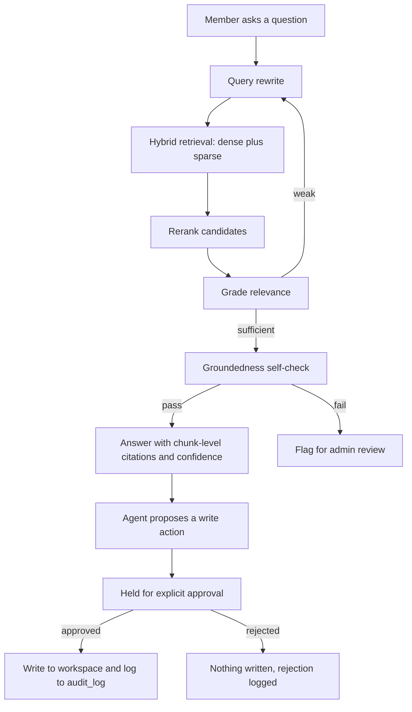

[CodeWiki](../../index.md) / [Forward-looking](../../Forward-looking/index.md) / [Specs](../index.md) / [Other](index.md)

# Meridian PRD v2 — Product Requirements Summary

This page summarizes the product requirements document `Meridian_PRD_v2.pdf` (DigitalT3 Incubation Pod — Week 1 Kavia Build, authored by Esandu Obadaarachchi, Draft v2, last updated 15 September 2026). It is a forward-looking summary: at the time of writing, the repository contains only the PRD attachment and an empty `assets/` folder, so nothing described below has been implemented yet.

## What Meridian Is

Meridian is described as an AI-native workspace in which every answer is grounded, cited and inspectable. Concretely, the Week 1 product is a block-based note editor and task list paired with an agent that answers questions using chunk-level citations and proposes actions that are held for explicit human approval before anything is written to the workspace. Answers that are low-confidence or ungrounded are flagged for human review rather than presented as fact.

The PRD requires a reliability note to appear in the UI, the README and the demo narration: AI-generated answers and agent actions may be incomplete or wrong, every answer carries a chunk-level source citation and a stated but uncalibrated confidence value, and low-confidence or ungrounded answers are routed to human review.

## Problem and Differentiation

The PRD argues that knowledge work is fragmented across separate tools for notes, tasks and documents, and that the current generation of AI layers bolted onto those tools (Notion Agent, ClickUp Brain2, Tana and others) already complete real multi-step actions. Because acting on a user's behalf is no longer a differentiator, Meridian stakes a narrower and provable claim: depth of inspection. The document is explicit that a source link is not the same as a chunk-level citation with character offsets, that a confidence badge is not the same as a stated formula, and that a guardrail claim is not the same as a red-team suite with a published pass rate. The differentiator is only considered real if it is measured rather than asserted, which is why the build gates and evaluation sections exist.

## Scope

The PRD replaces an earlier non-goals list with an explicit MUST / SHOULD / COULD scope. MUST is the spine the Friday demo has to prove, SHOULD is built only if a build gate passes early, and COULD is deliberately out of scope for Week 1.

### MUST — the Week 1 spine

- Google sign-in with workspace-scoped authentication.
- A block-based note editor, with notes stored as a real block tree.
- Document upload for PDF and Word, chunked into a real `chunks` table.
- Hybrid retrieval: dense plus sparse search, reranking, grading, a retry loop, and a groundedness self-check.
- Ask-the-agent with clickable chunk-level citations and a defined, stated confidence value.
- Agent task proposal from a note or conversation, held for explicit approval and written with full reasoning once approved.
- A full audit log and an admin review queue for flagged answers and actions.
- Prompt-injection defence implemented as structural isolation and proven with a red-team suite.
- A pipeline health dashboard backed by a real `retrieval_runs` table.

### SHOULD — only if a gate passes early

- A backlog and sprint board where tasks move between a backlog and a dated sprint and progress through To Do, In Progress and Done.
- Automatic task assignment, where the agent reads the team role on `workspace_members` and proposes an assignee with visible reasoning.
- Undo on agent-written changes using a stored before-state.

### COULD — not built in Week 1

- A whiteboard canvas (Excalidraw-style), on its own timeline once the agent core is proven.
- A flow and diagram view (React Flow-based), on the same terms.
- Google Calendar sync, which first requires a decision on the sync mechanism (poll versus webhook), token storage and OAuth scopes.

## Build Gates and Cut Rules

Two named gates convert scope into decisions rather than hopes.

| Gate | Checked | Pass condition | Cut rule if it fails |
| --- | --- | --- | --- |
| G1 | End of Day 3 | Retrieval answers at least 12 of the 15 golden questions with the correct source chunk cited | Cut the retry loop, ship rerank-only, and state this plainly in the write-up and demo narration |
| G2 | End of Day 4 | The propose-then-approve round trip works end to end for at least one real task | Switch to auto-execute with full reasoning logged, cut the approval UI for Week 1, and carry it forward as a SHOULD |

## Evaluation

Evaluation is specified up front rather than left to impressions. A golden set of fifteen hand-written questions is authored against the uploaded documents, with the correct source chunk labelled by hand before any model runs; retrieval and groundedness are scored against that set. An injection red-team suite of eight documents, each embedding a prompt-injection attempt such as an instruction to ignore the agent's rules and take an action, is run through the full pipeline before Day 5, with a target of eight out of eight caught and the result reported honestly either way. The confidence value is defined as a combination of the reranker score and the grading verdict, displayed in the UI and described in the README as uncalibrated for Week 1 rather than as a probability. The latency budget targets a p50 under eight seconds per question end to end, and the first thing cut if that is missed is the retry loop, matching the Gate G1 cut rule.

## Users and Roles

Two personas are defined. A Member creates notes and tasks, asks the agent questions and reviews cited answers. An Admin reviews flagged or low-confidence answers and actions, inspects the audit log and manages workspace members. Importantly, the Member and Admin authorization roles are scoped per workspace on `workspace_members` rather than stored globally on the user, so the same person can hold different roles in different workspaces.

## Key User Journeys

The MUST-scope journeys are the ask-and-cite flow, the propose-and-approve flow, and admin review. In the first, a Member signs in with Google, has or uploads documents and notes, and asks a question; the agent rewrites the query, retrieves candidates via hybrid search, reranks, grades relevance, retries when the first pass is weak, and runs a groundedness check before responding with clickable citations that link to the exact source chunk alongside a stated confidence value. In the second, the agent proposes a task with its reasoning shown and writes nothing until a Member or Admin approves; approval writes the task and logs it to the audit trail, while rejection writes nothing but is itself logged. In the third, an Admin opens the review panel, works through a queue of low-confidence or flagged answers and pending agent actions, and confirms, corrects or dismisses each one, with corrections available to inform future retrieval tuning.

## Functional Requirements

On the member-facing side the MUST list covers Google sign-in, the block-based note editor backed by a block tree, PDF and Word upload, an ask-the-agent panel with clickable chunk-level citations and a stated confidence value, and a task list that shows both agent-proposed tasks awaiting approval and approved tasks. On the admin-facing side it covers the review queue for low-confidence or flagged answers and pending actions, a timestamped and attributable audit log of predictions, agent actions and admin decisions, workspace member management with invitation and role assignment, and a pipeline health view backed by real `retrieval_runs` data showing retrieval hit rate and groundedness pass rate over time.

At the system level, the retrieval pipeline must run on every question asked, every answer must be stored with its chunk citations, confidence and groundedness-check result, guardrail routing must flag anything below threshold for review instead of showing it as a confident answer, every agent-proposed write action must be held for approval so nothing reaches the workspace unapproved, and structural injection isolation must be active on every ingested document rather than being optional per document.

## AI Approach

Orchestration uses a LangGraph agent loop with a deliberately small tool set: search the workspace, read a task, and propose a task write that is held for approval. Models are routed through a thin, swappable provider gateway with a response cache so repeated demo runs are fast and cheap; a fast low-cost model drives the step-by-step loop while a stronger model handles final answer generation and citation assembly. Retrieval combines dense embeddings with a sparse keyword signal, then reranks, grades whether the retrieved context actually supports the question, retries by re-querying when it does not, and runs a groundedness self-check before the answer is shown. Every contributing chunk is recorded in `answer_citations`, linking the answer to the exact chunk and its character offsets so a citation click opens the precise passage rather than the whole file. Confidence is the combined reranker score and grading verdict, presented as an explicit stated-uncalibrated value. Guardrails are structural: document and tool-returned content is passed to the model as data and never as instructions, and only the user's own turns can trigger a tool call. Parsing covers PDF and Word for Week 1.

## Technical Architecture

The stack is a React frontend deployed to Vercel, a FastAPI backend on Railway handling retrieval and agent orchestration, Supabase for Postgres and Storage with row-level security enforced on every table by `workspace_id`, Supabase Auth with Google OAuth, a managed vector database with hybrid dense and sparse support, and LangGraph behind the provider gateway. The schema structurally supports multiple workspaces per account because RLS is workspace-scoped regardless, but the Week 1 demo exercises a single active workspace per account and multi-workspace switching is not built.

The high-level flow is that an uploaded document is stored in Supabase, chunked, embedded and written to `chunks`; a member question starts the agent loop and records a run in `retrieval_runs`; hybrid retrieval, rerank, grade, optional retry and the groundedness check produce an answer with citations; a proposed agent action is held until approved, with approval or rejection logged to `audit_log`; and an admin review decision is written to `admin_reviews`.

## Data Model

| Table | Fields |
| --- | --- |
| `users` | id, email, created_at |
| `workspaces` | id, name, owner_id, created_at |
| `workspace_members` | id, workspace_id, user_id, auth_role, team_role, joined_at |
| `documents` | id, workspace_id, uploaded_by, file_path, parsed_status, created_at |
| `chunks` | id, document_id, content, char_start, char_end, embedding_ref, created_at |
| `notes` | id, workspace_id, created_by, content (jsonb block tree), updated_at |
| `tasks` | id, workspace_id, sprint_id, title, status, assignee_id, due_date, created_by, source, created_at |
| `sprints` | id, workspace_id, name, start_date, end_date, status, created_at |
| `agent_answers` | id, workspace_id, question, answer, confidence, groundedness_pass, created_at |
| `answer_citations` | id, answer_id, chunk_id, created_at |
| `agent_actions` | id, workspace_id, action_type, target_table, target_id, reasoning, before_state, status, created_at |
| `retrieval_runs` | id, workspace_id, question, candidates_json, rerank_scores_json, grade_outcome, retry_count, latency_ms, created_at |
| `audit_log` | id, actor_id, actor_type, action, target_id, timestamp, details |
| `admin_reviews` | id, review_target_type, review_target_id, reviewer_id, decision, notes, reviewed_at |

Five corrections from the review are called out explicitly. The global `users.role` was removed in favour of `workspace_members.auth_role` because roles are inherently workspace-scoped. The `notes.block_type` column was removed because a block editor needs a block tree, so `content` now holds the full jsonb block structure. The `agent_answers.sources` JSON blob was replaced by the `answer_citations` join table to `chunks`. The `agent_actions.before_state` column was added so the SHOULD-tier undo has something to revert to. Finally, `audit_log.actor_type` (user, agent or system) was added so the agent itself can appear as an actor.

## Core API Endpoints

Member-facing MUST endpoints are `POST /documents/upload` to upload and parse a document, `POST /notes` to create or update a note, `POST /agent/ask` to ask the agent a grounded question, `GET /tasks` to list tasks including pending approvals, and `POST /agent/actions/{id}/approve` and `POST /agent/actions/{id}/reject` to approve a held action (writing and logging it) or reject it (logging it and writing nothing).

Admin-facing MUST endpoints are `GET /admin/review-queue` for flagged answers and pending actions, `POST /admin/reviews/{target_type}/{target_id}` to submit a review decision, `GET /admin/audit-log` for the full audit trail, `GET /admin/pipeline-health` for metrics derived from `retrieval_runs`, and `POST /admin/members` to invite a member and set their auth role.

SHOULD-tier endpoints, built only if a gate passes early, are `PATCH /tasks/{id}` for status, assignee or sprint placement, `GET /sprints` to list sprints and identify the active one, `POST /admin/sprints` to create a sprint, `GET /admin/team` for the roster and roles, `POST /admin/team/{user_id}/role` to set a team role, and `POST /agent/actions/{id}/undo` to revert using `before_state`.

## Guardrails

Every agent answer must show chunk-level citations, with no answer permitted without at least one citation unless it is explicitly marked as general knowledge. The groundedness self-check runs before any answer reaches the user, and failing answers are flagged rather than shown as confident fact. Confidence is a stated, uncalibrated value with a defined formula rather than an unexplained number. Prompt-injection defence is structural, treating document and tool-returned content as data and allowing only the user's own turns to trigger a tool call, and it is proven with the eight-document red-team suite before Day 5. No agent-proposed write action reaches the workspace without explicit approval, and there is no silent auto-execute path in Week 1. A full audit trail records every prediction, every proposed, approved or rejected action, and every admin decision, timestamped and attributable, with agent actions distinguished via `actor_type`.

## Risks and Latency

The five-stage pipeline of rewrite, hybrid retrieve, rerank, grade with retry, and groundedness check risks ten to twenty seconds per question against a p50 target of under eight seconds, and the retry loop is the first thing cut if the target is missed. Separately, a live fifteen-to-twenty-second wait reads badly on camera regardless of the measured number, so the cache is pre-warmed on the exact demo questions. Day 1 spikes are required before committing to the plan: hybrid vector database setup, PDF and Word parsing quality on real documents, and the Google OAuth consent flow. On schedule risk, PRD sign-off and the golden-set write-up both sit on Day 1 alongside the spikes; if either slips, the golden set can move to Day 2 morning at no cost, but sign-off cannot.

## Five-Day Build Plan

| Day | Focus |
| --- | --- |
| 1 | Auth and workspace scaffolding; spikes on hybrid vector DB setup and document parsing quality; fifteen golden questions hand-labelled; scope and gates posted for sign-off |
| 2 | Block-based note editor on mock data; document upload and chunking pipeline live and writing to `chunks`; red-team documents authored |
| 3 | Full retrieval pipeline wired (hybrid search, rerank, grade, retry, groundedness check); Gate G1 checked against the golden set |
| 4 | Agent loop live (propose, hold, approve or reject, write); audit log wired; Gate G2 checked |
| 5 | Admin review queue; pipeline health dashboard from `retrieval_runs`; red-team suite run and scored; bug bash; deploy; cache pre-warmed on demo questions; demo prep |

## Open Decisions

There are no gating open decisions remaining before Day 1: the confidence formula, the approval-not-auto-execute stance and the latency cut rule are all decided in the scope, gates, evaluation and AI approach sections. Two non-gating decisions can wait, namely the final product name (Meridian is the proposal) and which SHOULD item — backlog and sprint, automatic assignment, or undo — is picked up first if a gate passes with room to spare.

## Implementation Status

No application code exists in this repository yet. The base directory currently contains only `Meridian_PRD_v2.pdf` and an empty `assets/` folder, so every capability described above should be treated as planned work rather than current behavior.
